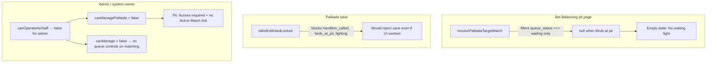

# Bet Balancing Pit and Admin Access Fix

## Problem diagnosis

Two separate bugs cause what you are seeing:



Your screenshot (Fight at **Birds at pit**, **Start fight** visible) confirms the fight is past Waiting, so [`resolvePalitadaTargetMatch`](features/matches/utils.ts) returns `null` and [`matching-pit-client.tsx`](features/matches/components/matching-pit-client.tsx) shows the wrong empty state.

---

## 1. Extend Bet Balancing target through Birds at pit

**Editable window (confirmed):** `waiting`, `handlers_called`, `birds_at_pit` — lock once `fighting`.

### Utils ([`features/matches/utils.ts`](features/matches/utils.ts))

- Add `PALITADA_EDITABLE_QUEUE_STATUSES = ['waiting', 'handlers_called', 'birds_at_pit']`.
- Add `isPalitadaEditLocked(status, queueStatus)` — lock on `fighting`, `settling`, `completed`, `cancelled` only.
- Replace `resolvePalitadaTargetMatch` logic with `resolveBetBalancingTargetMatch`:
  - Filter to editable queue statuses.
  - Priority: `birds_at_pit` > `handlers_called` > `waiting`, then lowest `fight_number`.
- Keep existing `isBetEditHardLocked` unchanged for **pledge amount** edits (still locked after handlers called).

### Server ([`features/matches/palitada-service.ts`](features/matches/palitada-service.ts))

- Switch from `isBetEditHardLocked` to `isPalitadaEditLocked` for add/delete Palitada.
- Update error copy to: lock applies once the fight has **started** (`fighting`).

### UI copy and badges

| File | Change |
|------|--------|
| [`matching-pit-client.tsx`](features/matches/components/matching-pit-client.tsx) | Empty state: “No fight open for Bet Balancing” (not Waiting-only). Show real queue badge via `FIGHT_QUEUE_STATUS_LABELS`. |
| [`matching-active-match-panel.tsx`](features/matches/components/matching-active-match-panel.tsx) | Show **Bet Balancing — Fight #N** link when `canManagePalitada` and target exists (includes Birds at pit). Update helper text. |

---

## 2. Grant admin / system owner operational access

Today [`matching/page.tsx`](app/dashboard/events/[id]/matching/page.tsx) and [`matching/pit/page.tsx`](app/dashboard/events/[id]/matching/pit/page.tsx) compute flags as:

```ts
canOperateAsStaff(profile) && hasPermission(...)
```

That excludes `admin` / `system_owner` even though `getUserPermissionIds` returns `['*']`.

### Auth helper ([`lib/auth/permissions.ts`](lib/auth/permissions.ts))

Add a small shared helper, e.g. `canPerformEventOperation(profile, userId, permissions)`:

- `true` if `isSystemOwnerRole(profile.role)`
- else `canOperateAsStaff(profile) && hasAnyPermission(userId, permissions)`

Apply to:

- `canManage`, `canManagePalitada`, `canSettle` on matching page
- `canManagePalitada` on pit page

Also fix action guards so saves work for admins:

- [`requirePalitadaManage()`](lib/auth/permissions.ts) — bypass `canOperateAsStaff` for system owners
- [`requireMatchSettleManage()`](lib/auth/permissions.ts) — same bypass (settling tab)

Bet Balancing **event tab** already uses `hasAnyPermission` only in [`event-tabs.ts`](lib/auth/event-tabs.ts), so admins can open the tab but hit “Access required” on the page — this fix resolves that.

---

## 3. Admin queue step-back (linear advance + rollback)

**Confirmed scope:** keep the existing advance button; add admin-only step-back.

### Utils ([`features/matches/utils.ts`](features/matches/utils.ts))

- Add reverse map, e.g. `FIGHT_QUEUE_ROLLBACK: Record<FightQueueStatus, FightQueueStatus | null>`:
  - `fighting → birds_at_pit`
  - `birds_at_pit → handlers_called`
  - `handlers_called → waiting`
  - `waiting → null`
- Add `previousQueueStatus(current)` and `isValidFightQueueRollback(current, previous)`.

### Service ([`features/matches/service.ts`](features/matches/service.ts))

- Extend `updateFightQueueStatus` with an optional `allowRollback` flag (or separate internal path).
- When `allowRollback === true`, validate via rollback map instead of forward-only `FIGHT_QUEUE_TRANSITIONS`.
- Only callable when actor is system owner (check `isSystemOwnerRole` in service using actor profile, or pass from action after `requireSystemOwner` / role check).

### UI ([`features/matches/components/matching-shared.tsx`](features/matches/components/matching-shared.tsx))

- Add `canManageQueueOverride: boolean` prop (true for system owners on matching page).
- In `FightQueueAdvanceForm` (or sibling component):
  - Keep existing **advance** button for everyone with `canManage`.
  - When `canManageQueueOverride`, show **Step back** button using `previousQueueStatus` (hidden when no previous).
- Pass `canManageQueueOverride` from [`matching/page.tsx`](app/dashboard/events/[id]/matching/page.tsx) via board → active match panel and fight queue rows.

### Actions ([`features/matches/actions.ts`](features/matches/actions.ts))

- Either reuse `updateFightQueueStatusAction` with hidden `direction: advance | rollback`, or add `rollbackFightQueueStatusAction` gated on system owner.

---

## 4. Tests

| File | Coverage |
|------|----------|
| [`features/matches/utils.test.ts`](features/matches/utils.test.ts) | `resolveBetBalancingTargetMatch` picks Birds at pit over Waiting; `isPalitadaEditLocked` false at birds_at_pit, true at fighting; rollback map |
| New or extend palitada service test | Palitada allowed at birds_at_pit, blocked at fighting |
| [`lib/auth/operational-access.test.ts`](lib/auth/operational-access.test.ts) or permissions test | `canPerformEventOperation` true for admin with implied `*` |

E2E: extend [`e2e/matching-pit-palitada.spec.ts`](e2e/matching-pit-palitada.spec.ts) note — still skipped until fixtures; manual test steps in breakdown.

---

## 5. Manual verification

1. Advance a fight to **Birds at pit** (no Waiting fights left).
2. Open **Bet Balancing** tab — should show that fight, Palitada form enabled, correct status badge.
3. Record Palitada — should save without “after handlers are called” error.
4. Advance to **Fighting** — form disabled; server rejects add/delete.
5. Log in as **admin** — Bet Balancing form works; Active Match shows Bet Balancing link; **Step back** appears and moves Birds at pit → Handlers called.

---

## Files to touch (focused diff)

- [`features/matches/utils.ts`](features/matches/utils.ts) + test
- [`features/matches/palitada-service.ts`](features/matches/palitada-service.ts)
- [`features/matches/components/matching-pit-client.tsx`](features/matches/components/matching-pit-client.tsx)
- [`features/matches/components/matching-active-match-panel.tsx`](features/matches/components/matching-active-match-panel.tsx)
- [`features/matches/components/matching-shared.tsx`](features/matches/components/matching-shared.tsx)
- [`features/matches/service.ts`](features/matches/service.ts) + [`actions.ts`](features/matches/actions.ts)
- [`app/dashboard/events/[id]/matching/page.tsx`](app/dashboard/events/[id]/matching/page.tsx)
- [`app/dashboard/events/[id]/matching/pit/page.tsx`](app/dashboard/events/[id]/matching/pit/page.tsx)
- [`lib/auth/permissions.ts`](lib/auth/permissions.ts)

Docs: optional short update to admin matching guide if present in `docs/admins/`.
