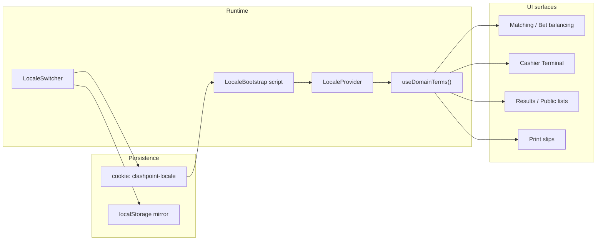

# Bisaya & Tagalog domain terms (v1 i18n)

## Recommendation (locale scope)

Use **per-device locale via cookie** (`clashpoint-locale`) for v1:

- No DB migration or event-settings UI required
- Works on staff tablets immediately; each device can pick its language
- Same cookie drives dashboard, public event pages, and print slips opened in that browser
- Easy to extend later to **event-level** or **profile-level** without rewriting call sites

Default: **English**. Supported: `en`, `ceb` (Bisaya), `tl` (Tagalog).

## Term map (source of truth)

| Key | English | Bisaya (`ceb`) | Tagalog (`tl`) |
|-----|---------|----------------|----------------|
| pledge | Pledge | Parada | Pusta |
| pledges | Pledges | Parada | Pusta |
| betBalancing | Bet Balancing | Palidata | Bet Balancing |
| meron | Meron | Inilog | Meron |
| wala | Wala | Biya | Wala |

Note: internal code keeps existing identifiers (`meron`, `wala`, `meronPalitada`, etc.). Only **display strings** change. Bisaya uses **Palidata** (your spelling) instead of the current UI’s “Palitada”.

## Architecture



Pattern mirrors existing color-mode bootstrap ([`components/ui/color-mode-bootstrap.tsx`](components/ui/color-mode-bootstrap.tsx)): inline script reads cookie before paint to avoid locale flash; React context stays in sync after hydration.

## New files

| Path | Purpose |
|------|---------|
| [`lib/i18n/types.ts`](lib/i18n/types.ts) | `AppLocale`, term key types |
| [`lib/i18n/messages.ts`](lib/i18n/messages.ts) | `DOMAIN_TERMS` map for `en` / `ceb` / `tl` |
| [`lib/i18n/cookie.ts`](lib/i18n/cookie.ts) | Cookie name, parse/serialize, allowed locales |
| [`lib/i18n/server.ts`](lib/i18n/server.ts) | `getLocale()` for Server Components (reads cookie via `next/headers`) |
| [`lib/i18n/context.tsx`](lib/i18n/context.tsx) | `LocaleProvider`, `useLocale()`, `useDomainTerms()` |
| [`lib/i18n/messages.test.ts`](lib/i18n/messages.test.ts) | Vitest: all locales define all keys; Bisaya/Tagalog values match spec |
| [`components/ui/locale-bootstrap.tsx`](components/ui/locale-bootstrap.tsx) | SSR script + `html lang` sync |
| [`components/ui/locale-switcher.tsx`](components/ui/locale-switcher.tsx) | Compact select in dashboard/public headers |

## Provider wiring

1. Wrap app in [`components/chakra/provider.tsx`](components/chakra/provider.tsx):

```tsx
<LocaleProvider>
  <ColorModeProvider>{children}</ColorModeProvider>
</LocaleProvider>
```

2. Add [`LocaleBootstrap`](components/ui/locale-bootstrap.tsx) beside [`ColorModeBootstrap`](components/ui/color-mode-bootstrap.tsx) in [`app/layout.tsx`](app/layout.tsx); set `html lang` from resolved locale (`en`, `ceb`, `fil` for Tagalog is acceptable BCP-47).

3. Add `LocaleSwitcher` next to `ColorModeButton` in:
   - [`components/dashboard/dashboard-shell.tsx`](components/dashboard/dashboard-shell.tsx)
   - [`components/public/public-site-header.tsx`](components/public/public-site-header.tsx)

## UI string replacements (domain terms only)

Replace hardcoded labels with `useDomainTerms()` (client) or `getDomainTerms(locale)` (server if needed):

**Central labels today**

- [`features/matches/schema.ts`](features/matches/schema.ts) — `FIGHT_SIDE_LABELS` stays as English fallback for server errors/audit; UI stops importing it for display
- Duplicate `SIDE_LABELS` in [`match-bird-detail-card.tsx`](features/matches/components/match-bird-detail-card.tsx)

**Matching & bet balancing (~8 files)**

- [`match-bet-balancing-panel.tsx`](features/matches/components/match-bet-balancing-panel.tsx) — panel title, stat labels (`Total Pledges`, `Meron Total`, footers with `Palitada:`)
- [`matching-active-match-panel.tsx`](features/matches/components/matching-active-match-panel.tsx) — “Bet Balancing” tab
- [`matching-desk-panel.tsx`](features/matches/components/matching-desk-panel.tsx) — side labels, “Meron/Wala pledge (₱)”
- [`matching-shared.tsx`](features/matches/components/matching-shared.tsx) — badges, adjust form, list headers
- [`match-outcome-actions.tsx`](features/matches/components/match-outcome-actions.tsx) — “Declare Meron/Wala winner”

**Cashier & payments (~3 files)**

- [`cashier-client.tsx`](features/payments/components/cashier-client.tsx) — “Pledge slip”, “Pledge due”, etc.
- [`payments/schema.ts`](features/payments/schema.ts) — `match_bet: 'Pledge / match bet'` via a `getPaymentCategoryLabel(category, locale)` helper (UI-only path)

**Results & public (~2 files)**

- [`results-entry-client.tsx`](features/results/components/results-entry-client.tsx)
- [`public-matches-list.tsx`](features/public/components/public-matches-list.tsx)

**Print slips (~2 files)**

- [`match-bet-barcode-slip.tsx`](features/printing/components/match-bet-barcode-slip.tsx)
- [`payment-receipt-slip.tsx`](features/printing/components/payment-receipt-slip.tsx)

**Helper composition examples**

- Side label: `terms.meron` / `terms.wala`
- “Pledge due” → `` `${terms.pledge} due` `` (English) / Bisaya/Tagalog equivalent phrasing kept minimal for v1
- Panel title: `` `${terms.pledges} & ${terms.betBalancing}` ``
- Footer palitada amount: `` `${terms.betBalancing}: ${amount}` ``

## Out of scope for v1 (stay English)

- Zod validation messages in schemas (server-side)
- Server action `success` / `error` strings returned from [`features/matches/actions.ts`](features/matches/actions.ts), [`features/payments/actions.ts`](features/payments/actions.ts)
- Audit log descriptions in services
- Full translation of unrelated UI (“Dashboard”, “Cashier Terminal”, form labels)

These can move into the same dictionary in a follow-up pass.

## Tests & docs

- **Vitest**: [`lib/i18n/messages.test.ts`](lib/i18n/messages.test.ts) — required per workspace rules (pure dictionary logic)
- **E2E**: N/A — no new multi-step workflow; language switch is a preference toggle. Manual test: switch locale → open Matching → confirm Inilog/Biya/Parada/Palidata on bet balancing panel and cashier pledge slip
- **User doc**: extend [`docs/users/docs/cashier-terminal.md`](docs/users/docs/cashier-terminal.md) with a short “Language” section (in-app switcher location; domain terms may appear in Bisaya/Tagalog). No CLI in published docs.

## Verification

1. `npm run test:run lib/i18n/messages.test.ts`
2. `npm run build` (type-check)
3. Manual: dashboard header switcher → Matching tab → Bet Balancing panel; Cashier Terminal pledge slip; print a BET slip and confirm side/pledge labels

## Stage / commit (after implementation)

Breakdown in `.cursor/breakdowns/` with explicit `git add` paths for all touched files.
