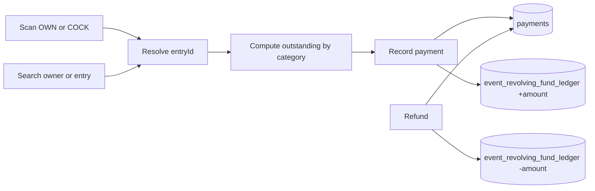

# Cashier: scan-to-dues + revolving fund posts

## Decisions (locked)

- **Scan v1:** `OWN-…` and `COCK-…` only → resolve to an **entry**, then compute outstanding dues. No match barcodes.
- **Outbound winners:** deferred (matches / payouts still separate). Cashier does **collections** now; refunds still deduct the float so the till stays consistent.
- **Route slug:** keep `/dashboard/events/[id]/payments` (stable links/permissions). Tab **label** becomes **Cashier**.

## Current baseline

- Payments UI: [`features/payments/components/payments-ledger-client.tsx`](features/payments/components/payments-ledger-client.tsx) — dropdown entry + category + amount.
- Dues math: [`features/payments/fee-calc.ts`](features/payments/fee-calc.ts) + [`features/events/fee-utils.ts`](features/events/fee-utils.ts).
- Barcode lookup: `lookupOwnerEntryByBarcodeAction` / `lookupRoosterByBarcodeAction` (OWN → `entryId`, COCK → registration → entry).
- Revolving fund: [`features/revolving-fund/service.ts`](features/revolving-fund/service.ts) — `opening` + manual `adjustment` only; **not** tied to payments.

## 1. Schema: typed ledger posts from payments

Migration under `supabase/migrations/`:

- Extend `revolving_fund_entry_type` with `collection` and `refund` (keep `opening`, `adjustment`).
- Add nullable `source_payment_id uuid references payments(id)` on `event_revolving_fund_ledger`.
- Unique partial index on `source_payment_id` where not null (idempotent posts).
- Update [`lib/supabase/database.types.ts`](lib/supabase/database.types.ts) in the same pass.

## 2. Backend: resolve dues + post float

**New / extended in `features/payments/`:**

- `resolveCashierTarget(eventId, rawCodeOrQuery)` — normalize barcode; if `OWN-` / `COCK-` for this event, resolve `entryId` (COCK via registration → `entry_id`); else search owners/entries by name or entry number (reuse existing list patterns).
- `getEntryOutstandingDues(eventId, entryId)` — per category (`registration`, `rooster_entry`, `cash_bond`, plus adjustment lines if unpaid) using existing fee-calc + paid totals; return suggested line items and remaining balance.
- After successful `recordPayment`: call revolving-fund post `+amount_paid`, type `collection`, `source_payment_id = payment.id`, description like `Collection PAY-… — {owner}`.
- After successful `refundPayment`: post `-amount_paid`, type `refund`, same source link (or a distinct refund-row rule if refunds keep the same payment id — post once against that payment’s refund lifecycle; prefer one ledger row per payment state change with clear type).

**In `features/revolving-fund/`:**

- Internal helper e.g. `postRevolvingFundLedgerEntry({ eventId, amount, entryType, description, sourcePaymentId, actorId })` used by payments service (cross-feature via service layer only).
- Manual adjustment UI unchanged; balance still = latest `balance_after`.

**Actions:**

- `lookupCashierTargetAction` for scan/search.
- Existing `recordPaymentAction` / `refundPaymentAction` gain fund side-effects inside the service (no separate client call).

## 3. UI: Cashier station

- Tab label **Cashier** in [`lib/auth/event-tabs.ts`](lib/auth/event-tabs.ts) and [`features/events/components/event-detail-tabs.tsx`](features/events/components/event-detail-tabs.tsx).
- Evolve payments client into a cashier layout (rename component file to `cashier-client.tsx` or keep file and rebrand strings — prefer rename for clarity):
  1. **Scan / search bar** — reuse camera dialog from [`owner-barcode-scanner-dialog.tsx`](features/entries/components/owner-barcode-scanner-dialog.tsx); keyboard wedge into the same input.
  2. On hit → **dues panel** (owner, entry #, category balances, total outstanding).
  3. **Collect** form prefilled from suggested dues (staff can still choose category / partial amount).
  4. Header shows **current revolving fund balance** (read from `getRevolvingFundBalance`).
  5. Keep recent payment ledger + refund + receipt print links.
- Deep-link: support `?barcode=` on the payments page (same pattern as owners/inspection).

## 4. Docs, tests, breakdown

| Deliverable | Action |
|-------------|--------|
| Admin docs | Add/extend cashier guide under `docs/admins/docs/` (in-app paths only; no CLI). Wire `sidebars.ts`. |
| User docs | N/A — staff/operator flow. |
| Vitest | Resolve target prefixes; outstanding dues math; collection/refund signed fund posts (mocked Supabase). |
| E2E | Happy path: open Cashier → select/search entry → record payment → see success / receipt path; optional guard for wrong-event barcode. Note fund assertion if UI shows balance. |
| Breakdown | `.cursor/breakdowns/YYYYMMDD-HHMM-cashier-breakdown.md` per plan-implementation rules. |

## Explicitly out of scope

- Match / matching barcodes and match-related dues
- Winner cash-out from Cashier (Payouts tab unchanged for now; no auto-deduct on `recordPayout` yet)
- Non-cash payment methods
- Merging or removing the Revolving fund tab (stays for opening balance + manual adjustments + full ledger view)
