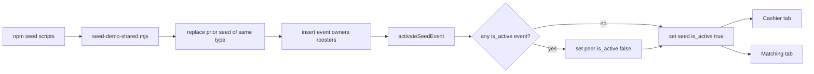

# Classic and Derby Demo Seeders

## Goal

Two npm commands that load realistic practice data for **cashier dues** and **manual matching**, following the existing pattern in [`scripts/seed-first-admin.mjs`](scripts/seed-first-admin.mjs) (env load + service-role Supabase client).

| Command | Creates |
|---------|---------|
| `npm run seed:classic-demo` | One classic event, 16 owners × 1 cock |
| `npm run seed:derby-demo` | One 3-cock derby event, 10 owners × 3 cocks + prize structure |

**Default readiness (both):** event `status: ready_for_matching`, roosters lineup `verified` + weighing `passed`, registration/approval in matchable states. Fees enabled with **mixed unpaid / partial / paid** so Cashier has work and Matching still has a full eligible pool (`entry_fee_payment_required` left off / no blocking policy).

**Active event (required on every run):** After seeding, the new demo event becomes the sole staff active event (`events.is_active`), matching the unique partial index in [`supabase/migrations/202607192230_events_is_active.sql`](supabase/migrations/202607192230_events_is_active.sql). Unlike the UI [`setEventActive`](features/events/service.ts) (which errors if another event is already active), the seeder **clears any current active event first**, then activates the seeded one.

## Approach

- **Direct service-role inserts** (not Server Actions): `createEntry` only allows `open` events; seeders need `ready_for_matching` end state. Bypass Zod/catalog strictness used by `createRoosterForEntry`.
- **Shared helper** [`scripts/lib/seed-demo-shared.mjs`](scripts/lib/seed-demo-shared.mjs): env loading (copy from first-admin), client factory, actor resolution, teardown-by-name, **`activateSeedEvent`**, insert helpers.
- **Two thin entrypoints:**
  - [`scripts/seed-classic-demo.mjs`](scripts/seed-classic-demo.mjs)
  - [`scripts/seed-derby-demo.mjs`](scripts/seed-derby-demo.mjs)
- **Wire in** [`package.json`](package.json):
  - `"seed:classic-demo": "node scripts/seed-classic-demo.mjs"`
  - `"seed:derby-demo": "node scripts/seed-derby-demo.mjs"`

Prerequisite: run `npm run seed:first-admin` (or have any `system_owner` / organizer profile). Seeds resolve `created_by` from `SEED_FIRST_ADMIN_EMAIL` (default `ruelluna@gmail.com`) via Auth Admin API, then `profiles`.

## Data shape

### Classic (`[SEED] Classic Cashier Matching`)

| Field | Value |
|-------|--------|
| `event_type` | `classic` |
| `cocks_per_entry` | `1` |
| `derby_format` / `derby_type` | `null` |
| Fees | **Enabled for practice** (registration ₱500, rooster ₱300) even though UI create clears classic fees — seeder sets columns directly |
| `require_rooster_entry_approval` | `false` |
| `physical_inspection_required` / `weight_verification_required` | `false` |
| Owners | 16 named farms; barcodes `OWN-…`; mix payment_status ≈ 8 unpaid / 4 partial / 4 paid |
| Roosters | 1 each; weights ~1900–2200 g clustered for pairing; `status: verified`, `registration_status: approved`, `approval_status: approved`, `eligibility_status: eligible`, `reg_payment_status` aligned with entry dues |
| Weighings | 1:1 with `weight_status: passed`, official weight set |

### Derby (`[SEED] Derby Cashier Matching`)

| Field | Value |
|-------|--------|
| `event_type` | `derby` |
| `derby_format` | `3_cock` |
| `derby_type` (age) | `open_derby` |
| `cocks_per_entry` | `3` |
| Fees | registration ₱1,000 + rooster ₱500 + cash bond ₱2,000 |
| `prize_structures` | fixed tiers (Champion / Runner-up) |
| `fee_snapshot` on entries | from fee settings (same shape as [`features/events/fee-utils.ts`](features/events/fee-utils.ts)) |
| Owners | 10; 3 roosters each (30 cocks → up to 15 fights) |
| Same matching-ready rooster/weighing states as classic |

### Idempotency + active event handoff

On each run:

1. Find events where `name` equals the seed name (or starts with `[SEED] Classic` / `[SEED] Derby` as configured).
2. Soft-delete or hard-delete cascade children if needed (prefer delete event row if FKs cascade; otherwise delete matches → weighings → registrations → payments → entries → prize_structures → event).
3. Insert the new seed event with `is_active: false` initially (avoids unique-index races while building children).
4. Call shared **`activateSeedEvent(eventId)`**:
   - Query any non-deleted row with `is_active = true` (may be another seed or a real ops event).
   - If found and not the new seed id: `update is_active = false` on that peer; log its name/id as displaced.
   - Set the seed event `is_active = true`.
   - Log clearly: previous active (or “none”) → new active seed event.
5. Print event id, confirmation it is now the active event, dashboard URLs (`/dashboard/events/{id}/payments`, `.../owners`, matching route), and a short tally (owners / unpaid / roosters).

No matches pre-created — pairing practice starts empty.

## Implementation notes

- Reuse barcode helpers conceptually: `OWN-{prefix}-{seq}`, `COCK-{prefix}-{seq}` (mirror [`features/entries/schema.ts`](features/entries/schema.ts) generators; duplicate small pure helpers in the shared script to avoid importing `server-only` modules).
- Skip registry `roosters` / catalog breeds (`registry_rooster_id: null`, simple `color_marking` / band strings) — matching uses registration ids.
- Venue: read `system_settings` default venue if present; else `"Seed Arena"`.
- `event_date`: today (ISO).
- Env required: `NEXT_PUBLIC_SUPABASE_URL`, `SUPABASE_SERVICE_ROLE_KEY`.
- Active-event helper must tolerate the unique index `events_one_active_idx` (clear peer before set; never leave two `true` rows).

## Docs / tests

| Item | Plan |
|------|------|
| Admin/User Docusaurus | **N/A** — engineer CLI; no operator-facing product change (no shell commands in published docs) |
| Breakdown | Create `.cursor/breakdowns/YYYYMMDD-HHMM-classic-derby-seeders-breakdown.md` with commands + manual verify steps |
| Vitest | **N/A** — Node scripts, no business-module logic |
| E2E | **N/A** — not a UI flow |

## Manual verify after implement

1. Optionally set some other event as active in the UI first.
2. `npm run seed:classic-demo` — console reports displaced active (if any) and that the classic seed is now active; dashboard focuses that event.
3. Open Payments (Cashier) — scan/select unpaid owner, record payment.
4. Open Matching — see eligible roosters, pair Meron/Wala.
5. `npm run seed:derby-demo` — displaces the classic seed as active; derby becomes the sole active event.
6. Re-run either command — replaces prior seed of that type and re-asserts active.
