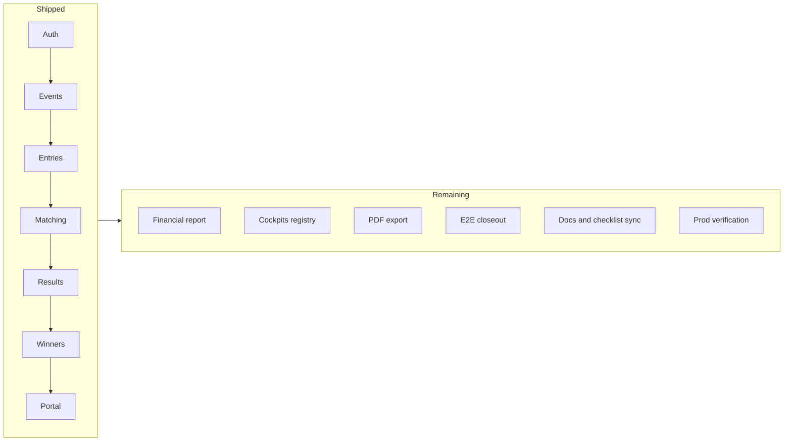

# Clash Point Completion Roadmap Document

## Verdict from research

The investment checklist ([`docs/investment/MILESTONE_CHECKLIST.md`](docs/investment/MILESTONE_CHECKLIST.md)) has **every item unchecked**, but that file was never used as a live status tracker. Against the codebase, **Dev Phases 1–10 feature work is largely shipped**:

- Auth/RBAC, users, audit, settings, promoters
- Events (derby + classic), rooster entries, weighing, inspection, matching/bets/queue
- Results, standings, winners, prizes, payouts, settlement, revolving fund
- Public pages + promoter portal
- Reports hub with **CSV** for most types (11 report types, not just 8)
- Strong Vitest coverage (~57 test files); E2E solid through matching, thin after results

**True remaining gaps** (not “unchecked because forgotten”):

| Gap | Investment source | Severity |
|-----|-------------------|----------|
| `cockpits` venue registry table | Phase 1 DB | Medium — venue is free-text today |
| Financial report query + UI | Phase 9 | Medium — type exists, not wired |
| PDF export (event summary + financial) | Phase 9 / General | Low-Medium — CSV is baseline |
| Unified `transactions` ledger | Phase 8 DB | Low — payouts/settlements work without it |
| Realtime leaderboard/queue | Optional MVP+ | Low — defer |
| E2E: results → winners → payouts → settlement → portal | Phases 7–10 tests | High for acceptance |
| Checklist + investment docs synced to shipped schema | DATABASE_DESIGN divergence note | High for investor clarity |
| Admin/user Docusaurus guides | plan-implementation / documentation rules | Medium for handoff |
| Prod deploy/ops verification | General Requirements | High for “done” |

**Explicitly out of scope (do not schedule):** betting/odds, streaming, native mobile, automated pairing, QR check-in, SMS, offline, digital signatures.

---

## Deliverable

Write one master guide:

**[`docs/investment/COMPLETION_ROADMAP.md`](docs/investment/COMPLETION_ROADMAP.md)**

Audience: you (solo builder / investor acceptance). Style: prioritizable work packages with exit criteria, evidence paths, and suggested order — not a rehash of the full architecture docs.

Also lightly update [`MILESTONE_CHECKLIST.md`](docs/investment/MILESTONE_CHECKLIST.md) header note pointing to the new roadmap and clarifying that checkboxes are acceptance items to verify (not “not built”).

---

## Document structure (what will be written)

### 1. Current state snapshot

Short honest status: ~fight-day + closeout features exist; finish work is **verify, close gaps, test, document, deploy**.

Include a Mermaid overview of the shipped workflow vs remaining gaps:



### 2. Priority tiers (how to decide what to do next)

| Tier | Meaning | Rule |
|------|---------|------|
| **P0** | Acceptance blockers | Must pass for investment “MVP complete” claim |
| **P1** | Checklist exit criteria still open | Blocks marking Phase N done |
| **P2** | Polish / investor-facing completeness | Improves demo and compliance |
| **P3** | Optional / post-MVP | Only after P0–P2 |
| **X** | Confirmed out of scope | Never schedule |

### 3. Work packages (atomic deliverables)

Each package gets: ID, tier, estimate band (S/M/L), depends-on, exit criteria, key files, test command.

#### P0 — Prove the product (acceptance)

1. **P0-1 Checklist reconciliation pass**
   Walk Phases 1–10 against running app; mark `[x]` for verified items; leave open only real gaps. Update checklist statuses in the same pass as the roadmap.

2. **P0-2 Fight-day closeout E2E**
   New Playwright specs covering: record/verify result → standings update → finalize winners → payout → settlement settled. Files under `e2e/` (e.g. `fight-day-closeout.spec.ts`).

3. **P0-3 Public + portal E2E guards**
   Public standings hide PII; promoter sees only assigned events/settlement. Extend or add `e2e/public-*.spec.ts` / portal spec.

4. **P0-4 Classic event happy-path E2E**
   Classic `event_type` through register → weigh → pair → result → standings (payment gate per current product rules, not legacy checklist wording if deprecated).

5. **P0-5 Manual UAT script**
   One-page operator walkthrough (URLs + clicks) for derby and classic demos — lives inside the roadmap as an appendix.

#### P1 — Close open checklist features

6. **P1-1 Financial report**
   Implement `getFinancialReport()` using existing [`FinancialReportRow`](features/reports/types.ts); wire into [`features/reports/actions.ts`](features/reports/actions.ts) + [`reports-hub-client.tsx`](features/reports/components/reports-hub-client.tsx); Vitest aggregation test; E2E download CSV.

7. **P1-2 Cockpits / venue registry**
   Migration + `features/cockpits/` (or settings-linked registry) + event form venue picker; soft delete; RLS. Alternative if you want minimal scope: keep free-text venue and **formally waive** cockpits in checklist with investor note — roadmap will recommend **implementing** the table to match Phase 1, not waiving.

8. **P1-3 Storage uploads (if still required)**
   Event document / payment receipt file upload via Supabase Storage where checklist requires it; receipt number-only is partial today.

9. **P1-4 Investment doc sync**
   Align [`DATABASE_DESIGN.md`](docs/investment/DATABASE_DESIGN.md) “target vs shipped” so investor docs match `entries` / `matches` / eligibility tables; update timeline “current day” and M1/M2 status to July 2026 reality.

#### P2 — Completeness and handoff

10. **P2-1 PDF export** for event summary + financial (library choice: browser print CSS or server PDF — pick **print-to-PDF / HTML print stylesheet** to avoid new heavy deps unless you already prefer a package).

11. **P2-2 Nested operator docs**
   Clone/update `docs/admins` and `docs/users` guides for rooster-entries → matching → results → payouts → portal (no CLI in published docs).

12. **P2-3 Vitest gap fill** for settlement/winners/results services where checklist names specific math tests not yet covered.

13. **P2-4 Deploy checklist**
   Vercel env vars, Supabase migrations on staging/prod, preview deploys, smoke test URLs.

#### P3 — Optional MVP+

14. **P3-1 Realtime** `leaderboard:{eventId}` + `queue:{eventId}` per `.cursor/rules/realtime.mdc` (polling fallback).

15. **P3-2 Unified `transactions` ledger** only if finance reporting needs a single append-only money trail beyond payments + prize_payouts + promoter_settlements.

16. **P3-3 Schema rename** (`montons`/`fight_pairs` naming) — **do not do**; document shipped names as canonical instead.

### 4. Suggested sequencing (calendar-agnostic)

```text
Week A: P0-1 → P0-2 → P0-3 → P0-4 → P0-5   (acceptance proof)
Week B: P1-1 → P1-2 → P1-4 → P1-3           (checklist close)
Week C: P2-1 → P2-2 → P2-3 → P2-4           (handoff)
Later:  P3-* only if capacity
```

### 5. Prioritization matrix (for you to reorder)

Table columns: Package ID | Tier | Value to investor | Effort | Risk if skipped | Recommended order #.

Default recommended order is the Week A/B/C sequence above. Packages are independent enough that you can pull P1-1 ahead of P0-4 if a demo needs the financial CSV first.

### 6. Definition of “project finished”

All of:

- P0 packages done and passing
- P1 packages done (or explicitly waived in writing in the roadmap appendix)
- MILESTONE_CHECKLIST checkboxes reflect verified reality
- Staging/prod smoke passed (P2-4)
- MVP exclusions still excluded

P2 improves handoff quality; P3 is not required for “finished.”

### 7. Appendices in the doc

- A: Feature module inventory (DONE / PARTIAL / MISSING) with file pointers
- B: E2E coverage map (existing 12 specs vs missing closeout)
- C: Manual UAT scripts
- D: Suggested commit themes when implementing each package (no auto-commit)

---

## Implementation approach (after you approve this plan)

1. Author `docs/investment/COMPLETION_ROADMAP.md` with full package detail (not just this skeleton).
2. Add a short pointer at the top of `MILESTONE_CHECKLIST.md` to the roadmap; do **not** mass-check every box until a real verification pass (P0-1) — unless you want the roadmap’s Appendix A statuses copied into the checklist in the same PR.
3. No application code changes in that pass — documentation-only finish-guide.

## Out of scope for the doc-writing pass

- Implementing P0–P3 packages
- Running Playwright
- Deploying to Vercel/Supabase
- Committing nested doc repos
