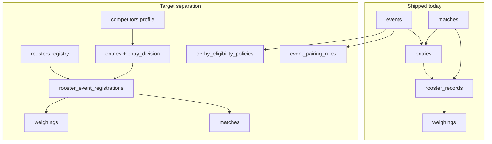
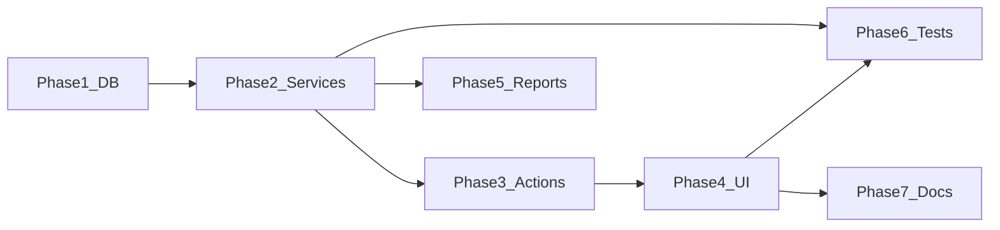

# Derby Eligibility, Entry Approval & Competitive Classification

## Current state (what exists today)

ClashPoint already has event-scoped registration and matching, but **collapses multiple concerns into a few fields**:

| Concern | Shipped today | Gap |
|---------|---------------|-----|
| Registry | None — birds only exist as `rooster_records` tied to an event | No permanent rooster profile |
| Eligibility | `weighings.weight_status` vs `events.min_weight`/`max_weight` (kg, often null) | No age/band/origin/experience policies |
| Approval | `rooster_records.status` (`lineup_status`) + auto-`verified` on create | No review queue, no separate approval |
| Matchmaking | Manual board; `verified` + `passed` weight only | No class/division/level matrices, no suggestions |

**Key files today:**
- DB: [`supabase/migrations/202607041400_lineups_weighing.sql`](supabase/migrations/202607041400_lineups_weighing.sql), [`202607041500_matches.sql`](supabase/migrations/202607041500_matches.sql)
- Entries: [`features/entries/service.ts`](features/entries/service.ts) — `createEntryWithRooster()` auto-verifies rooster + weighing
- Matching: [`features/matches/utils.ts`](features/matches/utils.ts), [`features/matches/service.ts`](features/matches/service.ts)
- Permissions: coarse keys like `entries.manage`, `matches.manage` in [`supabase/migrations/202607041000_rbac_system_settings.sql`](supabase/migrations/202607041000_rbac_system_settings.sql)



---

## Schema conflicts and resolution strategy

| Conflict | Resolution |
|----------|------------|
| `rooster_records.category` (free text, often "Stag") | **Do not delete.** Add `age_class` enum; backfill from `category` where mappable; keep `category` read-only/deprecated in UI |
| `rooster_records.status` (`lineup_status`) | **Repurpose gradually.** New `registration_status` + `approval_status` on event registration; map `verified` → `approved` when `require_rooster_entry_approval = false` |
| `entries.registration_status` | **Keep for team-level entry** — separate from per-rooster registration approval |
| `events.derby_type` = format (`2_cock`…`custom`) | **Rename column** to `derby_format`; add new `derby_type` enum for age profile (`stag_derby`, `cock_derby`, …) per spec Part 7 |
| `events.cocks_per_entry` | Alias as `required_roosters_per_entry` in app layer; keep DB column name initially |
| Weight stored as `numeric(6,2)` kg | Migrate to **integer grams** (`official_weight_grams`, etc.) with `×1000` data migration; UI shows kg with conversion helper |
| `band_number` on rooster row | Move to **`rooster_bands`** table; keep denormalized `band_number` on registration during transition for reports/matches |
| No `owners`/`competitors`/`gamefarms`/`breeders` | Add normalized tables; keep `entries.owner_name` for backward compat until UI migrates |
| `matches.meron_rooster_id` FK | **Keep UUIDs stable** — evolve `rooster_records` in place into registrations (rename table at end of migration chain) so match FKs do not break |
| Investment doc uses `montons` | **Codebase keeps `entries`** — document mapping in breakdown only |

**Backward compatibility defaults (Part 33):**
- `events.require_rooster_entry_approval` default **`false`** for existing rows
- `events.eligibility_enforcement_enabled` default **`false`**
- `events.classification_matching_enabled` default **`false`**
- New derby events default all three to **`true`**
- When enforcement off: existing behavior preserved (`verified` + `passed` weight ⇒ matchable)

---

## Phase 1 — Database foundations (migrations)

Split into ordered migrations under `supabase/migrations/` using existing `YYYYMMDDHHMM_description.sql` pattern. Regenerate [`lib/supabase/database.types.ts`](lib/supabase/database.types.ts) after apply.

### 1A — Enums and reference entities

New Postgres enums (Zod mirrors in `features/*/schema.ts` with `*_LABELS`):

- `age_class`: `stag`, `bullstag`, `cock`, `unknown`
- `competition_class`: `class_a`, `class_b`, `class_c`, `unclassified`
- `experience_status`: `maiden`, `one_time_winner`, `two_time_winner`, `multi_winner`, `winless`, `unknown`
- `competitor_level`: `novice`, `intermediate`, `advanced`, `veteran`, `unrated`
- `entry_division`: `division_a`, `division_b`, `division_c`, `open`, `unassigned`
- `derby_age_type` (stored as `derby_type` after rename): `stag_derby`, `bullstag_derby`, `cock_derby`, … `custom`
- `registration_workflow_status`, `approval_status`, `eligibility_status`, `band_level`, `band_location`, `band_verification_status`, `origin_type`, `breeding_relationship`, `entry_rooster_role`, `pairing_status`, `unknown_value_handling`, `policy_status`, `rejection_category`, etc.

New tables:

| Table | Purpose |
|-------|---------|
| `competitors` | Profile-level entity (owner/team/farm rep); holds `competitor_level*` fields |
| `gamefarms`, `breeders` | Optional FK targets on registry rooster |
| `roosters` | Permanent registry (`rooster_code`, `age_class`, `competition_class*`, experience fields, origin fields) |
| `rooster_bands` | Structured band records per registry rooster |
| `rooster_classification_history` | Audit trail for class/level/division changes |
| `associations` + `competitor_associations` | For association-only events |

Add nullable `competitor_id` to `entries`; add `entry_division*` columns to `entries`.

### 1B — Event configuration

Extend `events`:

- Rename `derby_type` → `derby_format` (enum values unchanged)
- Add `derby_type` (age profile), `allowed_age_classes` (jsonb text[])
- Add `match_weight_tolerance_grams`, `weight_verification_required`
- Add approval flags: `require_rooster_entry_approval`, `require_separate_entry_approver`, `conditionally_approved_match_handling`, `eligibility_enforcement_enabled`, `classification_matching_enabled`
- Expose existing `min_weight`/`max_weight` as gram integers (migrated)

New tables:

- `derby_eligibility_policies` (1:1 or versioned per `event_id`) — all policy fields from Part 12
- `event_pairing_rules` — matrix rows from Part 21
- `event_approval_config` (jsonb checklist + role allowlists) — or columns on `events` if simpler

### 1C — Event registration evolution

**Evolve `rooster_records` → `rooster_event_registrations`** (table rename as final step in this migration group):

Add columns to existing table before rename:

- `registry_rooster_id` FK → `roosters`
- `entry_rooster_role`
- `registration_status`, `approval_status`, `eligibility_status`, `inspection_status`, `payment_status` (registration-scoped)
- `eligibility_snapshot` jsonb, `eligibility_checked_at/by`
- Submit/review/approve/reject/withdraw/disqualify audit columns
- Override columns (`eligibility_override_*`)
- Weight fields on registration: `declared_weight_grams`, `official_weight_grams`, `weight_verified`, etc.

**Data migration:**
1. For each `rooster_records` row → insert `roosters` row (generate `rooster_code`)
2. Set `registry_rooster_id`
3. Map `category` → `roosters.age_class` where possible
4. Set registration `approval_status = approved`, `registration_status = approved` when `status = verified` and event has `require_rooster_entry_approval = false`
5. Copy weighing weights to grams

**Weighings:** add `weighing_history` support (new rows on reweigh; void flag); keep current row as latest.

### 1D — Overrides and duplicate-band warnings

- `entry_eligibility_overrides`
- `matchup_overrides` (links to `matches.id` when fight created)
- `band_duplicate_warnings` (investigation records, non-blocking)

### 1E — Permissions seed

Extend [`permissions`](supabase/migrations/202607041000_rbac_system_settings.sql) with spec Part 30 keys; map to `event_organizer` preset; add staff modules in [`lib/auth/modules.ts`](lib/auth/modules.ts):

- `rooster-registry`, `registration-review`, `derby-eligibility`, `classification`, `banding`, `inspection`

---

## Phase 2 — Core services (business logic)

Follow existing pattern: Zod in `schema.ts`, rules in `service.ts`, orchestration in `actions.ts`.

### New feature modules

```
features/roosters/          # permanent registry CRUD
features/registrations/     # rooster_event_registrations workflow
features/eligibility/       # evaluateDerbyEligibility()
features/classification/    # assign class/level/division + pairing matrices
features/banding/           # rooster_bands + duplicate detection
features/inspection/        # physical inspection records (new)
features/compatibility/     # evaluateMatchCompatibility(), isRoosterRegistrationMatchable()
```

### Central services

**`evaluateDerbyEligibility(event, rooster, registration, competitor)`** ([`features/eligibility/service.ts`](features/eligibility/service.ts)):
- Load active `derby_eligibility_policies` for event
- Run checks: age class, weight, banding, experience, origin, association, documents, payment, inspection
- Return structured result (Part 13); persist snapshot on registration
- Revalidate pending registrations when policy changes (service method + audit)

**`isRoosterRegistrationMatchable(registration)`** ([`features/compatibility/matchability.ts`](features/compatibility/matchability.ts)):
- Gate on approval + eligibility + conditions + event status + not withdrawn/disqualified/matched

**`evaluateMatchCompatibility(event, regA, regB)`** ([`features/compatibility/service.ts`](features/compatibility/service.ts)):
- Full 25-step sequence from Part 23
- Symmetric pairing matrix lookup helper
- Unknown-value handling per event config

### Extend existing services

| File | Changes |
|------|---------|
| [`features/entries/service.ts`](features/entries/service.ts) | Stop auto-`verified`; create draft registration; link registry rooster; trigger eligibility eval |
| [`features/weighing/service.ts`](features/weighing/service.ts) | Grams, void/reweigh history, re-run eligibility on weight change |
| [`features/matches/service.ts`](features/matches/service.ts) | Call compatibility service before insert; block prohibited; log attempts |
| [`features/matches/queries.ts`](features/matches/queries.ts) | `suggestMatchOpponents()` — ranked candidates with explanations |
| [`features/audit/service.ts`](features/audit/service.ts) | New entity types/actions from Part 31 |

### Experience calculation

`features/roosters/experience.ts` — derive `calculated_experience_status` from `fight_results` + `matches` history inside ClashPoint only; never rewrite historical fights.

---

## Phase 3 — Workflows and server actions

### Registration workflow (Part 15)

State machine in `features/registrations/workflow.ts`:

```
draft → submitted → pending_review → (pending_weighing | pending_inspection | pending_documents | pending_band_verification)
  → conditionally_approved | approved | rejected
approved → matched → completed
approved → withdrawn | disqualified
```

Actions (each with `requirePermission` + audit + `revalidatePath`):

- `submitRegistrationAction`, `approveRegistrationAction`, `conditionallyApproveRegistrationAction`, `rejectRegistrationAction`, `revokeApprovalAction`, `withdrawRegistrationAction`, `disqualifyRegistrationAction`
- Enforce blank-rejection guard, separation of duties, override reason validation

### Override workflows (Parts 26–27)

- `requestEligibilityOverrideAction` / `approveEligibilityOverrideAction`
- `requestMatchupOverrideAction` / `approveMatchupOverrideAction`

### Policy management

- `upsertEligibilityPolicyAction`, `activateEligibilityPolicyAction` (revalidate pending + audit)
- `upsertPairingRulesAction` (symmetry normalization on write)

---

## Phase 4 — UI (Chakra dashboard)

Use [`chakra-ui-builder` skill](.claude/skills/chakra-ui-builder/SKILL.md) and existing layout primitives (`PageStack`, `PanelCard`, `EventPageLayout`).

### New / updated screens

| Route | Component | Purpose |
|-------|-----------|---------|
| `/dashboard/roosters` | Registry list + profile | Part 29 registry sections + participation history table |
| `/dashboard/roosters/new`, `/[id]` | Registry form | Permanent profile (no global approval) |
| `/dashboard/events/[id]/rooster-entries` | Refactor list | Entry summary counts (approved/pending/matchable) |
| `/dashboard/events/[id]/registrations` | **New review queue** | Filters + review cards + approve/reject actions |
| `/dashboard/events/[id]/registrations/[regId]` | Registration detail | Eligibility checks + approval panel |
| `/dashboard/events/[id]/event-setup` or extend edit form | Derby Eligibility + Approval + Matching sections | Part 29 event setup |
| `/dashboard/events/[id]/matching` | Enhanced board | Suggestions panel, compatibility breakdown, override request |
| `/dashboard/events/[id]/inspection` | Inspection station | New module |
| `/dashboard/events/[id]/reports/*` | New report types | Part 32 reports |

**Entry form changes** ([`features/entries/components/entry-form-client.tsx`](features/entries/components/entry-form-client.tsx)):
- Split "create registry rooster" vs "submit to event"
- Replace free-text `category` with `age_class` select
- Weight input in grams (display kg helper)
- Show eligibility preview after submit (read-only until reviewed)

**Matching board** ([`features/matches/components/matching-board-client.tsx`](features/matches/components/matching-board-client.tsx)):
- Add suggestion list with compatibility status badges (text + icon, not color-only)
- Show blocked reasons before create button enables

---

## Phase 5 — Reports

Extend [`features/reports/`](features/reports/):

| Report | Type key |
|--------|----------|
| Rooster Entry Approval | `entry_approval` |
| Derby Eligibility Summary | `eligibility_summary` |
| Classification Exceptions | `classification_exceptions` |
| Band Verification | `band_verification` |

Add filters from Part 32 to hub + CSV export in [`features/reports/queries.ts`](features/reports/queries.ts).

Fix event-scoped audit report to include `entity_type` in (`rooster_event_registration`, `match`, `entry`, …).

---

## Phase 6 — Tests

### Vitest (required per workspace rules)

Colocated `*.test.ts` next to services:

| Module | Coverage |
|--------|----------|
| `features/eligibility/service.test.ts` | Tests 24–40 (eligibility rules) |
| `features/compatibility/service.test.ts` | Tests 41–48, 49–61 |
| `features/registrations/workflow.test.ts` | Tests 1–23 |
| `features/banding/service.test.ts` | Tests 62–67 |
| `features/classification/history.test.ts` | Tests 68–74 |
| Extend [`features/matches/utils.test.ts`](features/matches/utils.test.ts) | Conflict + matchability guards |

Target: all **74** acceptance tests from Part 34 mapped to Vitest cases.

### Playwright E2E (required — multi-step workflow)

Update [`e2e/rooster-entries-weighing-matching.spec.ts`](e2e/rooster-entries-weighing-matching.spec.ts) and add `e2e/registration-approval-matching.spec.ts`:

Happy path from Part 35 manual test script with `@auth` organizer fixture.

---

## Phase 7 — Documentation

Admin/user Docusaurus repos are **not cloned** in this workspace ([`docs/README.md`](docs/README.md)). When repos are available, add/update:

**Admin** (`docs/admins/docs/`):
- Extend `phase-03-events/derby-rules-and-prizes.md` — eligibility policy + pairing matrices
- New `phase-04-registration-payments/rooster-registry-and-approval.md`
- Extend `phase-05-lineup-weighing/official-weighing.md` — grams, void/reweigh
- Extend `phase-06-matching-fight-queue/match-pairing.md` — compatibility + overrides
- Extend `phase-09-reports/event-reports.md` — new report types

**User** (`docs/users/docs/`):
- `phase-04-registration/understanding-rooster-approval.md` (organizer-facing, no admin cross-links)

Update `sidebars.ts` for each site. No CLI or `.cursor/` references in published docs.

Also update investment reference [`docs/investment/DATABASE_DESIGN.md`](docs/investment/DATABASE_DESIGN.md) to reflect shipped naming (`entries`, registrations table).

---

## Implementation order (recommended)



Deploy migrations before Vercel app deploy. No new env vars expected.

---

## Assumptions

1. **`entries` remains the derby entry table** — not renamed to `montons`.
2. **Weight migration**: existing values are kg → multiply by 1000 for grams storage.
3. **`category` backfill**: case-insensitive map (`stag`, `bullstag`, `cock`) → `age_class`; else `unknown`.
4. **Registry dedup**: initial migration creates one registry rooster per existing `rooster_records` row (no cross-event dedup until staff links manually).
5. **Inspection** starts as a minimal pass/fail record table; rich checklist UI can follow in same phase if timeboxed.
6. **Gamefarm/breeder** tables are lightweight (name + contact); full CRM is out of scope.
7. **Match suggestions** are server-ranked lists, not auto-pairing — human confirms fight creation.

---

## Manual test script (post-implementation)

1. Create event with `require_rooster_entry_approval = true` and active eligibility policy
2. Create competitor + registry rooster (permanent profile)
3. Create derby entry with entry division
4. Submit rooster event registration (draft → submitted)
5. Record/verify weight and band
6. Run eligibility — confirm checks in UI
7. Approve registration as authorized reviewer (not submitter if separation enabled)
8. Confirm matchable count increments
9. Open matching — verify suggestion shows compatibility breakdown
10. Attempt prohibited pairing — blocked server-side
11. Request/approve matchup override — fight creates
12. Assign Meron/Wala on confirmed match
13. Repeat on legacy event with enforcement off — immediate matchable behavior unchanged
