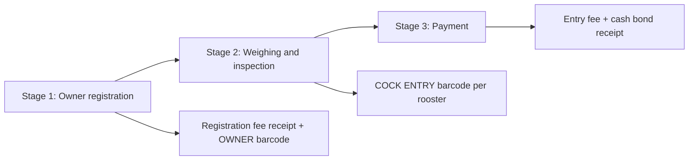
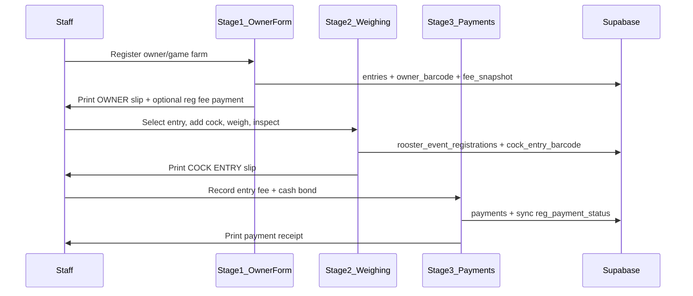

# Derby fees, staged registration, and barcodes

## Context

Today derby events use a **single combined form** ([`entry-form-client.tsx`](features/entries/components/entry-form-client.tsx)) that requires owner + at least one rooster + weight in one submit. A single [`entry_fee`](features/events/components/event-form-client.tsx) on `events` drives the payments ledger [`amount_due`](features/payments/service.ts).

You confirmed the **target derby flow** is three separate staff UIs:



**Barcode format:** Code128 (linear, thermal-printer friendly).

**Classic events:** unchanged combined form; fee/barcode/staging applies to `event_type = 'derby'` only.

---

## Phase 1 — Event fee settings (DB + form + edit rules)

### Schema migration

New migration (e.g. `supabase/migrations/YYYYMMDD_derby_fee_settings.sql`):

| Column | Type | Purpose |
|--------|------|---------|
| `registration_fee_enabled` | boolean default false | Toggle owner/game-farm fee |
| `registration_fee_amount` | numeric(12,2) default 0 | Per owner/entry |
| `rooster_entry_fee_enabled` | boolean default false | Toggle per-cock fee |
| `rooster_entry_fee_amount` | numeric(12,2) default 0 | Per rooster |
| `cash_bond_enabled` | boolean default false | Toggle cash bond |
| `cash_bond_amount` | numeric(12,2) default 0 | Basis for matching (validation later) |

**Data migration:** where legacy `entry_fee > 0`, set `registration_fee_enabled = true` and `registration_fee_amount = entry_fee`. Keep `entry_fee` temporarily as a computed/read alias in queries, then remove from form once migrated (or deprecate column in a follow-up migration).

**Fee adjustment audit table** `event_fee_adjustments`:

- `event_id`, `changed_by`, `changed_at`
- `previous_settings` / `new_settings` (jsonb)
- `entries_with_payments_count`, `total_refund_due`, `total_collect_due` (aggregates)
- Per-entry detail in `entry_fee_adjustment_lines`: `entry_id`, `previous_amount_due`, `new_amount_due`, `delta` (negative = refund, positive = collect)

**Edit rules** in [`updateEvent`](features/events/service.ts):

1. If event has **zero payment rows** with `amount_paid > 0` → allow free edit of all fee toggles/amounts.
2. If any payments exist → still allow edit, but:
   - Compute per-entry deltas using snapshotted fee basis on each entry (see below).
   - Insert adjustment record; surface summary on event edit page and payments tab (“₱X to refund / ₱Y to collect across N entries”).
   - Do **not** auto-mutate historical payment rows; staff resolves via refund/collect in ledger.

**Entry fee snapshot** on `entries` (jsonb `fee_snapshot`):

```json
{
  "registrationFee": { "enabled": true, "amount": 500 },
  "roosterEntryFee": { "enabled": true, "amount": 200 },
  "cashBond": { "enabled": true, "amount": 1000 }
}
```

Set at owner registration (stage 1). Basis for delta math when event settings change later.

### App layer

- Extend [`features/events/schema.ts`](features/events/schema.ts): toggles + amounts with Zod refinements (amount required and > 0 when toggle enabled; derby-only).
- Update [`event-form-client.tsx`](features/events/components/event-form-client.tsx): three optional fee sections (checkbox + amount field) replacing the single “Registration entry fee” input.
- Update [`features/events/service.ts`](features/events/service.ts), [`queries.ts`](features/events/queries.ts), [`database.types.ts`](lib/supabase/database.types.ts).
- Add [`features/events/fee-utils.ts`](features/events/fee-utils.ts) + Vitest:
  - `computeRegistrationAmountDue(feeSettings)`
  - `computePaymentStageAmountDue(feeSettings, roosterCount)`
  - `computeFeeAdjustmentDelta(oldSnapshot, newSettings, roosterCount, amountPaid)`

---

## Phase 2 — Stage 1: Owner-only registration

### Split entry creation

[`entryMetadataSchema`](features/entries/schema.ts) already exists without roosters. Changes:

- New `createOwnerEntrySchema` = metadata only (no `roosters.min(1)`).
- New `createOwnerEntryAction` → `createEntry()` (already supports owner-only insert in [`service.ts`](features/entries/service.ts)).
- Keep `createEntryWithRoosters` for classic events and backward compatibility.

### Barcode on owner register

Add to `entries`:

- `owner_barcode` text NOT NULL (unique per event)
- Generator in [`features/entries/schema.ts`](features/entries/schema.ts) (pattern like `OWN-{eventPrefix}-{seq}`), assigned in `createEntry`.

### UI + print

| Item | Path |
|------|------|
| Owner intake form | `app/dashboard/events/[id]/owners/new/page.tsx` + `features/entries/components/owner-entry-form-client.tsx` |
| Post-submit print | `app/dashboard/events/[id]/owners/[entryId]/print/page.tsx` |

**Print slip content** (new `features/printing/`):

- Label: **OWNER** (large, above barcode)
- Code128 encoding `owner_barcode`
- Event name, date, entry #, owner/game farm name, handler, registration fee amount (if enabled)
- “Print” button + `@media print` layout (no nav chrome)

**Optional stage-1 payment:** if `registration_fee_enabled`, show amount on slip and allow immediate “Record registration payment” shortcut (calls existing [`recordPayment`](features/payments/service.ts) with `payment_type = 'registration'` — see Phase 4).

**Derby routing:** for derby events, `/rooster-entries/new` redirects to `/owners/new`. Classic keeps combined form.

**Event tabs:** add **Owners** tab (or rename Rooster Entries hub to show owner-first queue) in [`event-detail-tabs.tsx`](features/events/components/event-detail-tabs.tsx).

---

## Phase 3 — Stage 2: Weighing, inspection, cock entry barcode

### Restore weighing route

Replace redirect in [`app/dashboard/events/[id]/weighing/page.tsx`](app/dashboard/events/[id]/weighing/page.tsx) with a real page mounting existing [`WeighingStationClient`](features/weighing/components/weighing-station-client.tsx).

Enhancements:

- Entry picker lists owners registered in stage 1 (`can_add_rooster` until `cocks_per_entry` reached — logic already in [`listWeighingEntrySummaries`](features/weighing/queries.ts)).
- On rooster create ([`createRoosterForEntry`](features/weighing/service.ts)):
  - Assign `cock_entry_barcode` on `rooster_event_registrations` (pattern `COCK-{eventPrefix}-{seq}`).
  - When event requires weight verification, **do not** auto-verify weight on create; leave `pending_weighing` path for staff to record/verify via existing actions.
- After create → redirect/open **COCK ENTRY print slip** (same printing module, label **COCK ENTRY**, Code128, band #, entry name, owner).

### Inspection

Wire [`features/inspection/service.ts`](features/inspection/service.ts) into stage 2:

- New route `app/dashboard/events/[id]/inspection/page.tsx` (or sub-panel on weighing page when `physical_inspection_required`).
- Advance `registration_status` via existing [`submitRegistration`](features/registrations/service.ts) / workflow in [`workflow.ts`](features/registrations/workflow.ts).

**MATCH barcode:** defer — reserve label constant and barcode column pattern for a future matching phase.

---

## Phase 4 — Stage 3: Payment (rooster entry fee + cash bond)

### Restore payments route

Replace redirect in [`app/dashboard/events/[id]/payments/page.tsx`](app/dashboard/events/[id]/payments/page.tsx); mount [`PaymentsLedgerClient`](features/payments/components/payments-ledger-client.tsx).

### Extend payments model

Migration additions to `payments`:

- `payment_category` enum: `registration` | `rooster_entry` | `cash_bond` | `adjustment`
- `rooster_registration_id` nullable FK (for per-cock line items if needed later)

**Amount due logic** (replace flat `event.entry_fee` in [`recordPayment`](features/payments/service.ts)):

| Stage | Due |
|-------|-----|
| Registration (stage 1) | `registration_fee_amount` if enabled |
| Payment (stage 3) | `(rooster_entry_fee_amount × active cock count)` + `cash_bond_amount` if enabled |

Use entry’s `fee_snapshot` + live rooster count from `rooster_event_registrations`.

**Sync fix:** when recording payment, update both `entries.payment_status` and `rooster_event_registrations.reg_payment_status` (today eligibility reads `reg_payment_status` but ledger only updates `entries` — gap noted in exploration).

**Payment receipt print:** after stage-3 payment, printable slip listing line items (entry fees per cock, cash bond), totals, payment reference — no new barcode type unless you want receipt # encoded (optional).

**Fee adjustments UI:** on payments page, banner when `event_fee_adjustments` has unresolved deltas; actions to record refund (`refundPayment`) or additional collection.

---

## Phase 5 — Printing module (shared)

New feature folder [`features/printing/`](features/printing/):

- Dependency: `jsbarcode` (+ `@types/jsbarcode` if needed)
- `components/barcode-label.tsx` — Code128 SVG/canvas from payload string
- `components/print-slip-layout.tsx` — shared print CSS, event header, footer timestamp
- `components/owner-barcode-slip.tsx`, `cock-entry-barcode-slip.tsx`, `payment-receipt-slip.tsx`
- `utils/format-barcode-payload.ts` — prefix validation (`OWN-`, `COCK-`)

Staff flow: submit → redirect to print page → browser print dialog. Re-print from entry detail / rooster registration detail.

---

## Phase 6 — Tests, docs, E2E

| Area | Work |
|------|------|
| Vitest | `fee-utils.test.ts`, schema tests for fee toggles, barcode generators |
| E2E | New `e2e/derby-staged-registration.spec.ts`: create derby event with fees → owner stage → weigh → pay → verify print pages render labels OWNER / COCK ENTRY |
| Admin doc | `docs/admins/docs/derby-registration-fees-admin.md` — in-app paths only (Events → Fees, Owners, Weighing, Payments) |
| User doc | N/A (staff-operated flow) unless public online registration is updated later |
| Breakdown | `.cursor/breakdowns/YYYYMMDD-HHMM-derby-fees-barcodes-breakdown.md` |

**Public online registration:** out of scope for this pass; keep blocked or show “visit venue” message for staged derby. Can follow same 3-stage model in a later iteration.

---

## Architecture summary



---

## Key files to touch

- Migrations: new fee columns, barcodes, payment_category, adjustment tables
- [`features/events/schema.ts`](features/events/schema.ts), [`service.ts`](features/events/service.ts), [`event-form-client.tsx`](features/events/components/event-form-client.tsx)
- [`features/entries/schema.ts`](features/entries/schema.ts), [`service.ts`](features/entries/service.ts), [`actions.ts`](features/entries/actions.ts)
- [`features/weighing/service.ts`](features/weighing/service.ts), [`weighing-station-client.tsx`](features/weighing/components/weighing-station-client.tsx)
- [`features/payments/service.ts`](features/payments/service.ts), [`payments-ledger-client.tsx`](features/payments/components/payments-ledger-client.tsx)
- New: `features/printing/*`, owner/print routes under `app/dashboard/events/[id]/`
- [`lib/supabase/database.types.ts`](lib/supabase/database.types.ts)

---

## Out of scope (explicit)

- MATCH # barcode generation (matching phase)
- Cash bond validation at matching time
- Public self-service 3-stage registration
- Removing legacy `entry_fee` column (can deprecate after migration stabilizes)
