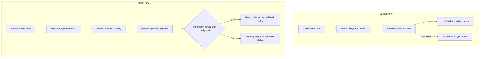

# Rooster entry eligibility conformance

## Problem

Derby eligibility is fully configured on events ([`derby-eligibility-config-panel.tsx`](features/eligibility/components/derby-eligibility-config-panel.tsx)) and evaluated in [`features/eligibility/service.ts`](features/eligibility/service.ts), but **rooster entry registration** ([`entry-form-client.tsx`](features/entries/components/entry-form-client.tsx), [`createRoosterForEntry`](features/weighing/service.ts)) does not use it:

- Form collects only band, weight, free-text category, color — registry defaults to `unknown` / `maiden`
- Weight uses legacy event `min_weight`/`max_weight` (kg), not policy grams
- `evaluateDerbyEligibility` is called on create but **result is discarded**; `eligibility_status` is hardcoded
- Edit path never re-evaluates eligibility
- No user-facing error when rules fail

## Design decisions (confirmed)

- **Enforcement ON + hard `fail`:** block save and return which checks failed
- **Enforcement ON + `pending` / `approval_required`:** allow save, set `pending_review` / `conditionally_eligible` workflow (inspection, payment, band verification, unknown values per `unknown_value_handling`)
- **Enforcement OFF:** still evaluate and persist snapshot for staff visibility; do not block
- **Classic events:** unchanged simple form (no derby policy)
- **Association rules:** deferred — when `association` is enabled, evaluator may return `fail`/`pending` if no `competitor_id`; document as known gap until competitor picker ships

## Implementation

### 1. Shared eligibility helpers

Add [`features/eligibility/registration-bridge.ts`](features/eligibility/registration-bridge.ts) (name TBD):

- **`getEntryFormEligibilityContext(eventId)`** — loads `event_type`, `eligibility_enforcement_enabled`, policy row via [`getDerbyEligibilityPolicy`](features/eligibility/queries.ts); returns enabled fields, allowed presets (reuse [`AGE_CLASS_PRESETS`](lib/derby/eligibility-fields.ts), etc.), weight min/max grams, unknown handling
- **`formatEligibilityErrors(evaluation)`** — maps failed checks to a single user-facing string for action `error` state
- **`applyRegistrationEligibility(actorId, eventId, registrationId)`** — extract/move logic from [`persistEligibilitySnapshot`](features/registrations/service.ts):
  - call `evaluateDerbyEligibility`
  - persist `eligibility_status`, `eligibility_snapshot`, `eligibility_checked_at/by`
  - derive `registration_status` / `approval_status` using [`resolvePostEligibilityTargetStatus`](features/registrations/workflow.ts) + event workflow config (wire the currently unused helper)
  - return `{ evaluation, error?, blocked?: boolean }` where `blocked` = enforcement on && status `ineligible`

Refactor [`features/registrations/service.ts`](features/registrations/service.ts) to call the shared helper (no behavior change for submit/approve).

### 2. Policy-aware schema validation

Extend [`features/entries/schema.ts`](features/entries/schema.ts) and [`features/weighing/schema.ts`](features/weighing/schema.ts):

- Add optional structured rooster fields when policy requires them:
  - `ageClass` — enum select (`stag` | `bullstag` | `cock`) replacing ambiguous `category` when `age_class` enabled; keep `category` as optional legacy/display field or map category → ageClass only when age rules off
  - `originType`, `breedingRelationship`, `experienceStatus` — optional enums when respective fields enabled
  - Band metadata (`bandLevel`, `bandOrganization`, `bandYear`, `bandSeason`) when `banding` enabled
- Add **`validateRoosterAgainstPolicy(input, context)`** pure function (Vitest):
  - weight in policy gram range when `weight` enabled (use [`evaluateWeightEligibility`](features/eligibility/schema.ts))
  - age class in `allowed_age_classes` when `age_class` enabled and `unknown_value_handling === 'prohibit'`
  - required band fields when `banding_required`

Call from `createEntryAction` / `updateEntryAction` after Zod parse, before service (fast fail before DB writes).

### 3. Wire evaluation into rooster create/update

**[`features/weighing/service.ts`](features/weighing/service.ts) — `createRoosterForEntry`:**

- Load derby context; skip eligibility wiring for `classic` events
- Pass collected `ageClass` / origin / experience into [`createRooster`](features/roosters/service.ts) instead of hardcoded `unknown`
- Insert `rooster_bands` row when band metadata provided
- After registration + weighing insert, call `applyRegistrationEligibility`
- If `blocked`, delete registration + weighing + registry rooster and return formatted errors
- Remove hardcoded `eligibility_status: 'eligible'`; use evaluation result
- Only auto-approve (`registration_status: approved`) when evaluation is `eligible` and no pending workflow requirements

**[`features/entries/service.ts`](features/entries/service.ts) — `updateEntryRoosters`:**

- Update `declared_weight_grams` / `official_weight_grams` on weight change (currently missing)
- Update registry rooster `age_class` (and origin/experience if provided) when category/fields change
- After each rooster update, call `applyRegistrationEligibility`; if blocked on enforcement, return error (no partial silent failure)

### 4. Policy-driven entry UI (derby events only)

**Pages** — load context and pass to clients:

- [`app/dashboard/events/[id]/rooster-entries/new/page.tsx`](app/dashboard/events/[id]/rooster-entries/new/page.tsx)
- [`app/dashboard/events/[id]/rooster-entries/[entryId]/edit/page.tsx`](app/dashboard/events/[id]/rooster-entries/[entryId]/edit/page.tsx)

**[`entry-form-client.tsx`](features/entries/components/entry-form-client.tsx) / [`entry-edit-client.tsx`](features/entries/components/entry-edit-client.tsx):**

- New prop `eligibilityContext` (null for classic)
- When `age_class` enabled: **Age class** `NativeSelect` filtered to `allowed_age_classes` (required if prohibit unknown)
- When `weight` enabled: show policy min/max in kg helper text (convert grams via existing `kgToGrams` inverse)
- When `banding` enabled: show band level/org/year/season fields constrained to policy accepted lists
- When `origin` / `experience` enabled: show enum selects filtered to allowed values
- Show read-only **eligibility status** + failed check summary on edit when snapshot exists
- Surface server `formState.error` with multi-line rule failures

Reuse Chakra patterns from [`derby-eligibility-config-panel.tsx`](features/eligibility/components/derby-eligibility-config-panel.tsx) (`FormField`, `NativeSelect`).

### 5. Tests and E2E

**Vitest** (required per workspace rules):

- `features/eligibility/registration-bridge.test.ts` — error formatting, block vs allow paths
- `features/entries/schema.test.ts` — policy-aware validation cases (weight range, required age class)

**Playwright** — extend [`e2e/rooster-entries-weighing-matching.spec.ts`](e2e/rooster-entries-weighing-matching.spec.ts) or add `e2e/rooster-entry-eligibility.spec.ts`:

- Create derby event with `age_class` + `weight` rules + enforcement ON
- Happy path: allowed age + in-range weight → entry saves
- Failure path: wrong age or weight → save blocked with visible error message

### 6. Documentation

- **User:** extend closest sibling in `docs/users/docs/` (rooster entry / event registration guide) — what fields appear when rules are enabled, what errors mean
- **Admin:** extend eligibility admin doc — enforcement now applies at **Events → Rooster Entries → New entry**, not only at registration review

### 7. Breakdown

Create `.cursor/breakdowns/YYYYMMDD-HHMM-entry-eligibility-conformance-breakdown.md` on completion.

## Files to touch (primary)

| Area | Files |
|------|-------|
| Eligibility bridge | `features/eligibility/registration-bridge.ts`, `service.ts` (export eval context builders if needed) |
| Registrations refactor | `features/registrations/service.ts` |
| Entry schema/actions | `features/entries/schema.ts`, `actions.ts`, `service.ts` |
| Rooster create | `features/weighing/service.ts`, `schema.ts`, `features/roosters/service.ts` |
| UI | `entry-form-client.tsx`, `entry-edit-client.tsx`, rooster-entries `new` + `edit` pages |
| Tests | `*.test.ts`, `e2e/rooster-entry-eligibility.spec.ts` |
| Docs | `docs/users/docs/`, `docs/admins/docs/` |

## Out of scope (this pass)

- Competitor picker / `entries.competitor_id` linkage (association rules remain best-effort pending)
- `checkDocuments()` implementation in evaluator
- `entry_eligibility_overrides` table usage
- `policy_status` (`draft`/`locked`) gating
