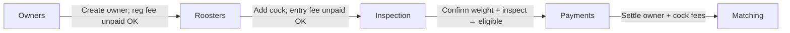

# Event registration tab refactor (Owners → Roosters → Inspection → Payments)

## Target workflow

Applies to **both derby and classic** events (per your confirmation).



| Tab | Purpose | Payment behavior |
|-----|---------|------------------|
| **Owners** | Register owner/game farm only; OWNER barcode slip (derby) | `entries.payment_status = unpaid` when registration fee enabled; **does not block** create |
| **Roosters** | Add cocks to an existing entry; COCK ENTRY slip (derby); **single cock list with statuses** | `reg_payment_status = unpaid` when rooster entry fee enabled; **does not block** add |
| **Inspection** | Staff confirms **official weight** + physical inspection; marks cock **eligible** | No payment here |
| **Payments** | Settle all pending owner/rooster/bond fees | Existing ledger + categories |

**Remove from event tabs:** Weighing, Rooster Entries, Registrations ([`lib/auth/event-tabs.ts`](lib/auth/event-tabs.ts), [`event-detail-tabs.tsx`](features/events/components/event-detail-tabs.tsx) `DEFAULT_TABS`).

**Remove from left sidebar:** global **Roosters** nav item (`/dashboard/roosters`) in [`lib/dashboard/nav.ts`](lib/dashboard/nav.ts) + update [`lib/dashboard/nav.test.ts`](lib/dashboard/nav.test.ts). Routes under `/dashboard/roosters/*` can remain for deep links from profiles; they just won’t appear in nav.

---

## Tab order and routes

| Tab | Route | Replaces |
|-----|-------|----------|
| Owners | `/dashboard/events/[id]/owners` | (extend to classic — remove derby-only `notFound` in [`owners/page.tsx`](app/dashboard/events/[id]/owners/page.tsx)) |
| Roosters | `/dashboard/events/[id]/roosters` | [`/weighing`](app/dashboard/events/[id]/weighing/page.tsx), [`/rooster-entries`](app/dashboard/events/[id]/rooster-entries/page.tsx) list |
| Inspection | `/dashboard/events/[id]/inspection` | current lightweight inspection + **weight confirm/verify** from weighing station |
| Payments | `/dashboard/events/[id]/payments` | unchanged hub |

**Redirects (keep bookmarks working):**
- `/weighing` → `/roosters`
- `/weighing/[registrationId]/print` → `/roosters/[registrationId]/print`
- `/rooster-entries` → `/roosters`
- `/rooster-entries/new` → `/owners/new` (classic no longer uses combined form in-event)
- `/registrations` → `/roosters`
- `/registrations/[regId]` → `/roosters?highlight=[regId]` or inline drawer on list (prefer query param + scroll/highlight)

---

## Roosters tab (new primary UI)

**New feature surface:** `features/event-roosters/` (or extend `features/entries/` + `features/weighing/` — prefer a dedicated client to avoid growing `weighing-station-client`).

**Data:** Reuse [`listRegistrationsByEvent`](features/registrations/queries.ts) — already returns cock-level rows with `registration_status`, `eligibility_status`, `inspection_status`, `reg_payment_status`, entry metadata.

**UI (adapt from [`registration-review-client.tsx`](features/registrations/components/registration-review-client.tsx) + create form from [`weighing-station-client.tsx`](features/weighing/components/weighing-station-client.tsx)):**
- Header: “Roosters” + **Add rooster** (entry picker + band + optional declared weight/metadata)
- Table: Entry #, Owner, Cock #, Band, **Payment**, **Registration**, **Eligibility**, **Inspection**, **Weight**, actions (print COCK slip, delete if allowed)
- Filters by status (reuse badge patterns from registration review)

**Service changes in [`createRoosterForEntry`](features/weighing/service.ts):**
- Do **not** auto-verify weight at create (`weight_verified: false`, `official_weight_grams: null`, no `weighings` row yet, or weighing row with `pending` status only)
- Set `registration_status: 'pending_inspection'` (or `submitted` + `pending_inspection` workflow note)
- Set `reg_payment_status: 'unpaid'` when event `rooster_entry_fee_enabled`; `'not_required'` otherwise
- Keep derby `cock_entry_barcode` + print redirect to `/roosters/[id]/print`
- Optional: accept **declared weight** at add without making it official

**Owners tab copy:** Update description (“add roosters on **Roosters** tab”); show `payment_status` badge (already present). [`createEntry`](features/entries/service.ts) already inserts `payment_status: 'unpaid'` — verify no UI/action blocks owner create when registration fee is on.

---

## Inspection tab (weight + physical inspection)

Merge responsibilities currently split across [`weighing-station-client.tsx`](features/weighing/components/weighing-station-client.tsx) (record/verify weight) and [`inspection-station-client.tsx`](features/inspection/components/inspection-station-client.tsx) (pass/fail).

**Per-cock workflow on one page:**
1. Select cock from queue (pending inspection / unverified weight)
2. **Record official weight** → reuse [`recordWeight`](features/weighing/service.ts) / [`verifyWeight`](features/weighing/service.ts)
3. **Physical inspection** pass/fail → reuse [`recordInspection`](features/inspection/service.ts)
4. On pass: set `eligibility_status: 'eligible'`, advance `registration_status` toward `approved` (respect [`require_rooster_entry_approval`](features/weighing/service.ts) / eligibility policy via existing [`registration-bridge`](features/eligibility/registration-bridge.ts) where possible)
5. On fail: `eligibility_status: 'ineligible'`, `inspection_status: 'failed'`

**Permissions:** Tab visible with `inspection.record` OR `entries.manage`; actions gated by `weighing.record` / `weighing.verify` / `inspection.record` / `inspection.approve` (staff with inspection module gets weight verify per existing [`inspection`](lib/auth/modules.ts) module — add `weighing.record` + `weighing.verify` to that module, or rename to “Inspection & weigh-in”).

**Remove Weighing tab** from [`EVENT_TAB_DEFINITIONS`](lib/auth/event-tabs.ts).

---

## Permissions and Users modules

Update [`lib/auth/modules.ts`](lib/auth/modules.ts):

| Module | Change |
|--------|--------|
| `derby-weighing` | Rename label to **Derby roosters** (id can stay or become `derby-roosters` with backfill migration for stored module IDs in user prefs — prefer **label-only** change to avoid migration) |
| `inspection` | Add `weighing.record`, `weighing.verify` so inspection staff can confirm weight |
| `rooster-entries` | Deprecate from docs; keep permissions for classic `entries.manage` fallback or merge into owner/rooster modules |
| `registration-review` | No longer drives a tab; approve/reject moves to Inspection or inline on Roosters if still needed |

Update [`lib/auth/event-tabs.ts`](lib/auth/event-tabs.ts):

```ts
// Target derby + classic registration tabs (in order)
{ slug: 'owners', label: 'Owners', permissions: ['owner_registration.manage', 'entries.manage'] },
{ slug: 'roosters', label: 'Roosters', permissions: ['cock_entry.manage', 'entries.manage'] },
{ slug: 'inspection', label: 'Inspection', permissions: ['inspection.record', 'weighing.verify', 'entries.manage'] },
{ slug: 'payments', label: 'Payments', permissions: ['payments.manage'] },
// Remove: weighing, rooster-entries, registrations
```

---

## Cleanup and reference updates

**Pages to add/change:**
- Add [`app/dashboard/events/[id]/roosters/page.tsx`](app/dashboard/events/[id]/roosters/page.tsx) + `[registrationId]/print/page.tsx` (move from weighing print)
- Refactor [`inspection/page.tsx`](app/dashboard/events/[id]/inspection/page.tsx) to combined weight + inspection client
- Add redirect stubs under old paths (`weighing`, `rooster-entries`, `registrations`)

**Revalidate paths / links** — bulk update grep hits (~30 files):
- [`weighing/actions.ts`](features/weighing/actions.ts), [`registrations/actions.ts`](features/registrations/actions.ts), [`public/actions.ts`](features/public/actions.ts)
- [`reports-hub-client.tsx`](features/reports/components/reports-hub-client.tsx) (`viewHref: 'roosters'`)
- [`rooster-profile-client.tsx`](features/roosters/components/rooster-profile-client.tsx) registration links → event roosters tab
- [`e2e/rooster-entries-weighing-matching.spec.ts`](e2e/rooster-entries-weighing-matching.spec.ts) → rename/update URLs

**Deprecate (keep internally for online combined registration if still used):**
- [`entry-form-client.tsx`](features/entries/components/entry-form-client.tsx) / `createEntryWithRoosters` — not linked from in-app classic flow; note in breakdown, don’t delete yet

**Classic owners:** Remove derby-only guards on [`owners/new`](app/dashboard/events/[id]/owners/new/page.tsx) and [`owners/page`](app/dashboard/events/[id]/owners/page.tsx); OWNER barcode optional when `event_type !== 'derby'`.

---

## Tests and docs

| Area | Action |
|------|--------|
| Vitest | Update [`lib/auth/modules.test.ts`](lib/auth/modules.test.ts), [`lib/dashboard/nav.test.ts`](lib/dashboard/nav.test.ts); add service test for rooster create → pending payment + pending inspection |
| E2E | Update/replace `e2e/rooster-entries-weighing-matching.spec.ts` with owners → roosters → inspection → payments happy path |
| Admin doc | Update/create `docs/admins/docs/derby-registration-fees-admin.md` (or sibling) with new tab names and “payment pending does not block intake” |
| Breakdown | New `.cursor/breakdowns/` entry for this refactor |

**Build:** Fix pre-existing `owner-form-client.tsx` type error if it still blocks `npm run build` (orthogonal but should be resolved in same pass).

---

## Out of scope (unchanged)

- Public online combined registration form (still may call `createEntryWithRoosters` until separately redesigned)
- Global `/dashboard/roosters` registry pages (hidden from nav only)
- Matching / results tabs
