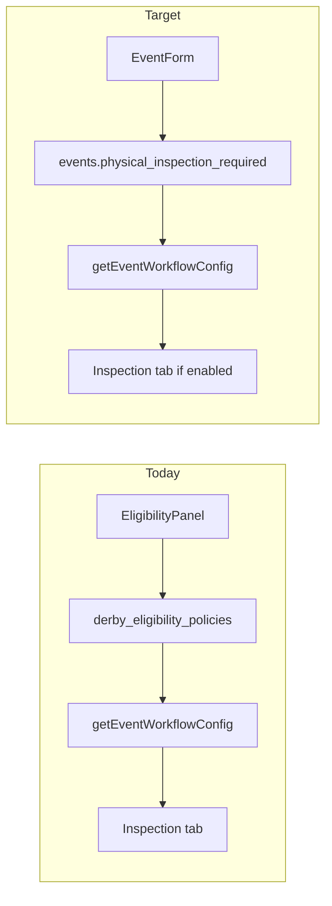

# Event inspection and settings refactor

## Goals (from your answers)

| Topic | Decision |
|-------|----------|
| Tax | **Two fields:** `tax_per_fight` (defaults **50** classic / **100** derby) + new **`tax_commission`** (management/montón per fight) |
| Prize pool | **Read-only** sum of collected **registration** + **cock entry** fees (live on edit; ₱0 on create) |
| Revolving fund | **Initial amount field** + **basic per-event ledger** (opening entry + manual adjustments) |
| Legal auth | **Auto `true`** on create/save; remove UI checkbox and draft→open gate |
| Promoter | **Inline quick-add** (name + phone) on derby event form |
| Inspection | **Toggle on main event form** (classic + derby); **Inspection tab hidden** when disabled |

---

## Current state

- Event form: [`features/events/components/event-form-client.tsx`](features/events/components/event-form-client.tsx)
- Inspection today lives inside **Derby eligibility rules** (`physical_inspection_required` on `derby_eligibility_policies`), read via [`features/eligibility/registration-bridge.ts`](features/eligibility/registration-bridge.ts) → `getEventWorkflowConfig()`
- Tax: only `events.tax_per_fight` exists
- Revolving fund: **does not exist**
- Defaults: derby format UI state is `5_cock`; schema default `cocksPerEntry` is `5`
- Six publish/legal checkboxes at bottom of form; `legal_authorized` blocks `draft → open` in [`features/events/service.ts`](features/events/service.ts)



---

## 1. Database migration

New migration under [`supabase/migrations/`](supabase/migrations/):

**`events` columns**
- `physical_inspection_required boolean not null default false`
- `tax_commission numeric(12,2) not null default 0`
- `revolving_fund_initial numeric(12,2) not null default 0`

**Backfill:** set `events.physical_inspection_required = true` where a linked `derby_eligibility_policies` row has `physical_inspection_required = true` and `'inspection'` in `enabled_eligibility_fields`.

**New table `event_revolving_fund_ledger`**
- `id`, `event_id` (FK), `entry_type` enum (`opening`, `adjustment`)
- `amount` (signed numeric — positive = credit, negative = debit)
- `balance_after`, `description`, `created_by`, `created_at`
- RLS aligned with `payments.manage` / `events.manage`
- Index on `event_id, created_at`

Update [`lib/supabase/database.types.ts`](lib/supabase/database.types.ts) in the same pass.

---

## 2. Event schema, actions, and service

**[`features/events/schema.ts`](features/events/schema.ts)**
- Add `physicalInspectionRequired`, `taxCommission`, `revolvingFundInitial`
- Defaults: `derbyFormat`/`cocksPerEntry` → **2-cock**; `legalAuthorized` → **`true`**
- Type-aware default helper for `taxPerFight` (50 classic / 100 derby) used in form + Zod `.default()` where practical

**[`features/events/actions.ts`](features/events/actions.ts)**
- Parse new fields; stop reading removed checkboxes from FormData
- Force `legalAuthorized: true` on every create/update

**[`features/events/service.ts`](features/events/service.ts)**
- Persist new columns in `toEventInsert` / update path
- Remove `legal_authorized` check in `transitionStatus()` (line ~339)
- On **create**: insert opening ledger row (`entry_type: opening`, `amount: revolvingFundInitial`, `balance_after: revolvingFundInitial`)

**[`features/events/utils.ts`](features/events/utils.ts)**
- Change `resolveCocksPerEntry` null derby fallback from `5` → **`2`**

---

## 3. Event form UI restructure

**[`features/events/components/event-form-client.tsx`](features/events/components/event-form-client.tsx)**

**Remove entirely**
- Legal authorization, public listing, publish matches/standings/winners/prize amounts checkboxes

**Reorder / add (high level)**
1. Event name, date, **event type**
2. **Derby format + Derby age profile** (derby only) — immediately after type
3. **Tax per fight + Tax commission** (both classic & derby); when event type changes, prefill tax per fight to 50/100 if user has not overridden
4. **Physical inspection required** switch (both classic & derby)
5. **Revolving fund (initial)** amount (both types)
6. Derby-only block: deadline, promoter, fees, cocks/entry, prize structure, registration rules, eligibility
7. **Prize pool (read-only)** row in derby section — show formatted total + helper text

**Defaults in client state**
- `derbyType`: `'2_cock'` (was `'5_cock'`)
- `taxPerFight`: 100 derby / 50 classic on type switch

**Promoter inline create**
- Small dialog: **Name** + **Phone** (maps to `promoters.name` + `promoters.phone`)
- New lightweight action e.g. `quickCreatePromoterAction` in [`features/promoters/actions.ts`](features/promoters/actions.ts) with `quickCreatePromoterSchema` (commission defaults `none`, no login)
- On success: `router.refresh()` and auto-select new promoter in the dropdown

**Edit mode extras**
- Pass `prizePoolTotal` prop from server (computed query) into form for read-only display

---

## 4. Prize pool calculation

New util in [`features/events/fee-utils.ts`](features/events/fee-utils.ts) or [`features/payments/fee-calc.ts`](features/payments/fee-calc.ts):

```ts
// Sum amount_paid for payment_category in ('registration', 'rooster_entry')
// where payment_status in ('paid', 'partial') — use amount_paid as collected
```

Expose via [`features/events/queries.ts`](features/events/queries.ts) → `getEventPrizePoolCollected(eventId)` for edit page + optional overview display.

---

## 5. Move inspection off eligibility panel

**Event form** owns the toggle → `events.physical_inspection_required`.

**[`features/eligibility/registration-bridge.ts`](features/eligibility/registration-bridge.ts)**
- `getEventWorkflowConfig()`: read `physical_inspection_required` from **`events`**, not policy
- `getEntryFormEligibilityContext()`: same for derby entry form hints

**[`features/eligibility/components/derby-eligibility-config-panel.tsx`](features/eligibility/components/derby-eligibility-config-panel.tsx)**
- Remove inspection `FieldToggle` block

**[`lib/derby/eligibility-fields.ts`](lib/derby/eligibility-fields.ts)**
- Remove from `ELIGIBILITY_FIELD_KEYS`: `inspection`, `experience`, `origin`, `association`, `payment`
- Keep DB policy columns for legacy rows; UI no longer exposes them

**Eligibility panel removals (UI only)**
- Policy status, Unknown values dropdowns
- Experience, Origin & breeding, Association membership, Entry fee payment toggles

**Server defaults when saving policy** ([`features/eligibility/policy-form.ts`](features/eligibility/policy-form.ts)): `policy_status = 'active'`, `unknown_value_handling = 'approval_required'` when omitted from form.

---

## 6. Inspection tab visibility

**[`components/dashboard/event-page-layout.tsx`](components/dashboard/event-page-layout.tsx)**
- Load event flag `physical_inspection_required`
- Filter out `inspection` tab from [`lib/auth/event-tabs.ts`](lib/auth/event-tabs.ts) results when disabled

**[`app/dashboard/events/[id]/inspection/page.tsx`](app/dashboard/events/[id]/inspection/page.tsx)**
- Guard: redirect to overview or show “Inspection not enabled” if flag is false

---

## 7. Revolving fund ledger (basic)

New module slice: `features/revolving-fund/` (or under `features/events/` if kept small)

| File | Role |
|------|------|
| `schema.ts` | `recordAdjustmentSchema` (signed amount + description) |
| `service.ts` | List entries, compute current balance, append adjustment with running `balance_after` |
| `actions.ts` | `recordRevolvingFundAdjustmentAction` |
| `queries.ts` | List ledger for event |
| `components/revolving-fund-client.tsx` | Table + “Record adjustment” form |

**UI placement:** new event tab **Revolving fund** (permission: `payments.manage` or `events.manage`) — keeps Payments ledger separate.

Opening balance row created automatically on event create; adjustments are manual only in this pass (no auto tax/fight posting yet).

---

## 8. Tests and E2E

**Vitest**
- [`features/events/schema.test.ts`](features/events/schema.test.ts): new defaults, tax commission, inspection field
- New `features/revolving-fund/service.test.ts`: balance math for opening + adjustments
- Prize pool sum util test with mocked payment rows

**E2E** — update specs that check `legalAuthorized`:
- [`e2e/public-registration.spec.ts`](e2e/public-registration.spec.ts)
- [`e2e/event-owners.spec.ts`](e2e/event-owners.spec.ts)
- [`e2e/event-roosters-owner-scan.spec.ts`](e2e/event-roosters-owner-scan.spec.ts)

Add focused spec for event create: defaults (2-cock, tax 100), inspection toggle visible for classic, derby prize pool row present.

---

## 9. Documentation and breakdown

- **User doc:** extend/create [`docs/users/docs/creating-an-event.md`](docs/users/docs/creating-an-event.md) — new field layout, inspection toggle, revolving fund, inline promoter (no CLI)
- **Admin doc:** N/A unless internal ops need revolving fund tab documented
- Breakdown: `.cursor/breakdowns/YYYYMMDD-HHMM-event-settings-refactor-breakdown.md`

---

## Out of scope (follow-ups)

- Auto-posting fight tax/commission into revolving fund ledger
- Changing classic events to allow promoters (still `promoter_id: null` for classic in service)
- Removing deprecated policy columns from DB
- Wiring `tax_commission` into fight settlement / promoter settlement (field stored; settlement math unchanged this pass)

---

## Suggested commit

**Summary:** Refactor event settings form and add revolving fund ledger

**Body:** Moves physical inspection to a global event flag, simplifies derby eligibility UI, adds tax commission and revolving fund with a basic ledger, updates defaults (2-cock derby, tax 50/100), and enables inline promoter creation during event setup.
