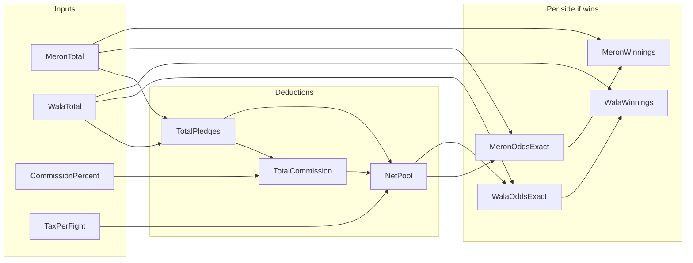

# Fix Winnings Odds Calculation

## Problem analysis

Current logic in [`features/matches/bet-balancing.ts`](features/matches/bet-balancing.ts):

```ts
netPool = totalPledges - commission - tax
meronOdds = round(netPool / meronTotal, 2dp)
walaOdds  = round(netPool / walaTotal, 2dp)
meronWinningsPotential = netPool   // same for both sides
```

Using the screenshot fixture (Meron ₱84,258 / Wala ₱84,582, 10% commission, ₱100 tax):

| Value | Correct (exact) | Current UI |
|-------|-----------------|------------|
| Net pool | ₱151,856 | ₱151,856 |
| Meron odds | **1.802** | **1.80** (rounded) |
| Wala odds | **1.795** | **1.80** (rounded — hides imbalance) |
| Footer `total × 1.80` | Meron ₱151,664 / Wala ₱152,248 | Shown in footer |
| Card winnings value | Should match footer | **₱151,856** (netPool) |

**Three bugs:**

1. **Display inconsistency** — Card shows `netPool`, footer shows `sideTotal × roundedOdds`; these disagree (e.g. ₱151,856 vs ₱151,664).
2. **Odds rounding masks imbalance** — Meron and Wala both display **1.80** even though exact odds differ after commission/tax; the lesser side should show **higher** odds.
3. **Winnings definition mixed** — Code stores `netPool` as “winnings potential” but UI copy implies `pledge × odds`.

**Commission model (confirmed):** `tax_commission` = **% of total pledges**; `tax_per_fight` = **fixed ₱ per fight** (e.g. ₱100). No change to deduction order.

## Correct parimutuel formula (v1)

For each side *if that side wins*:

```
totalPledges = meronTotal + walaTotal
totalCommission = totalPledges × (commissionRate / 100)
netPool = totalPledges - totalCommission - taxPerFight

meronOddsExact = netPool / meronTotal   (if meronTotal > 0)
walaOddsExact  = netPool / walaTotal    (if walaTotal > 0)

meronWinningsPotential = roundMoney(meronTotal × meronOddsExact)  // === netPool
walaWinningsPotential  = roundMoney(walaTotal × walaOddsExact)   // === netPool
```

When sides are imbalanced, **the smaller side gets higher exact odds** — as you specified.



## Implementation

### 1. Update [`bet-balancing.ts`](features/matches/bet-balancing.ts)

- Add `meronOddsExact` / `walaOddsExact` (full precision, not rounded) to `BetBalancingSnapshot`.
- Keep `meronOdds` / `walaOdds` as **display** values (recommend **3 decimal places** when sides differ, or 2 with banker's rounding — prefer **3dp** so 1.802 vs 1.795 are visible when imbalanced).
- Set winnings from exact odds:

```ts
meronWinningsPotential = roundMatchMoney(meronTotal * meronOddsExact)
walaWinningsPotential  = roundMatchMoney(walaTotal * walaOddsExact)
// Both equal netPool (within money epsilon)
```

- Add helper `computeSidePayout(netPool, sideTotal)` returning `{ exactOdds, displayOdds, winnings }`.

### 2. Update [`match-bet-balancing-panel.tsx`](features/matches/components/match-bet-balancing-panel.tsx)

- Primary card value: **winnings potential** = `roundMatchMoney(sideTotal × exactOdds)`.
- Footer (odds as secondary): use **display odds** and show formula that **matches** the primary value, e.g.
  `Odds 1.802 · ₱84,258 × 1.802 = ₱151,856`
  Or split: display odds to 2dp in label, show 3dp in formula when needed.
- Optional label tweak: **“Winner pool if Meron wins”** to clarify meaning (optional, only if you want clearer copy).

### 3. Fix tests in [`bet-balancing.test.ts`](features/matches/bet-balancing.test.ts)

Update screenshot fixture expectations:

| Field | New expectation |
|-------|-----------------|
| `meronOdds` | ~1.802 (3dp) or 1.80 at 2dp with separate exact field |
| `walaOdds` | ~1.795 (must **differ** from meron when imbalanced) |
| `meronWinningsPotential` | 151856 |
| `walaWinningsPotential` | 151856 |
| Consistency | `sideTotal × exactOdds` rounds to winnings; both winnings === `netPool` |

Add tests:

- Imbalanced sides → meron odds **>** wala odds (smaller side higher payout rate).
- Balanced sides → meron odds === wala odds.
- Zero side total → odds 0, winnings 0 (guard).

### 4. No schema / migration

Commission % and tax ₱ already come from event settings via [`matching/page.tsx`](app/dashboard/events/[id]/matching/page.tsx). No DB change.

## Out of scope (later)

- Palitada adjusting totals before odds (still 0 until workflow ships).
- Spectator betting pool separate from handler pledges.
- Alternative commission models (commission on losing side only).

## Manual verification

After fix, with Meron ₱84,258 / Wala ₱84,582, 10%, ₱100 tax:

- Meron odds **higher** than Wala odds (~1.802 vs ~1.795).
- Both winnings cards show **₱151,856**.
- Footer multiplication matches card value (no ₱151,664 drift).

## Files to change

| File | Change |
|------|--------|
| [`features/matches/bet-balancing.ts`](features/matches/bet-balancing.ts) | Exact odds, consistent winnings, helpers |
| [`features/matches/bet-balancing.test.ts`](features/matches/bet-balancing.test.ts) | Updated + new consistency/imbalance tests |
| [`features/matches/components/match-bet-balancing-panel.tsx`](features/matches/components/match-bet-balancing-panel.tsx) | Footer uses exact/display odds aligned with winnings |

Vitest required. E2E N/A (calculation-only). Docs N/A.
