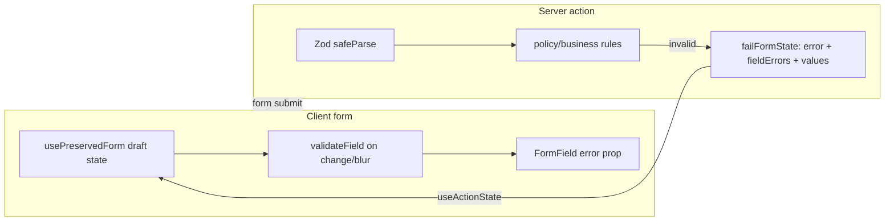

# Real-Time Validation and Preserve-on-Error (All Forms)

## Problem

Today, validation runs **only on Save** in server actions ([`features/*/actions.ts`](features/entries/actions.ts)). Errors surface as a **single global string**; [`FormField`](components/dashboard/form-field.tsx) supports an `error` prop but it is **never used**. Forms rely on uncontrolled inputs (`defaultValue`), so values may be lost when the route re-renders after a server action — especially on **create** flows with no server defaults.

Weight limits are event/policy-driven (grams in DB; kg in help text via [`gramsToKg`](lib/derby/enums.ts)), not hardcoded. Policy errors today say `"Weight is below the event minimum."` — we will align with the requested format: *"Weight is not valid. Please enter a value between X kg and Y kg."*

## Target architecture



## Phase 1 — Shared infrastructure (`lib/form/`)

Create a small, framework-agnostic layer (no react-hook-form):

| File | Responsibility |
|------|----------------|
| [`lib/form/types.ts`](lib/form/types.ts) | `FormActionState<TValues>` with `error?`, `success?`, `fieldErrors?`, `values?` |
| [`lib/form/serialize.ts`](lib/form/serialize.ts) | `serializeFormData(formData)` → `Record<string, string>` |
| [`lib/form/zod-errors.ts`](lib/form/zod-errors.ts) | `zodFieldErrors(error)` — first message per field from `flatten().fieldErrors` |
| [`lib/form/action-state.ts`](lib/form/action-state.ts) | `failFormState(formData, { error, fieldErrors })` helper used by all actions |
| [`lib/form/use-preserved-form.ts`](lib/form/use-preserved-form.ts) | Hook: controlled draft state, merges `formState.values` after failed save, exposes `setField` |
| [`lib/form/use-field-validation.ts`](lib/form/use-field-validation.ts) | Hook: local `clientErrors` merged with server `fieldErrors`; `validate(name, value, validator)` on change/blur |
| [`lib/form/weight-validation.ts`](lib/form/weight-validation.ts) | `validateWeightGramsInput(raw, { minGrams, maxGrams })` using existing [`weightGramsSchema`](features/entries/schema.ts) + [`evaluateWeightEligibility`](features/eligibility/schema.ts); `weightRangeErrorMessage(min, max)` for user-facing copy |

Add Vitest colocated tests: `lib/form/weight-validation.test.ts`, `lib/form/zod-errors.test.ts`, `lib/form/serialize.test.ts`.

Update [`features/entries/policy-validation.ts`](features/entries/policy-validation.ts) to use `weightRangeErrorMessage` instead of generic below/above messages.

## Phase 2 — Reusable field components

| Component | Path | Notes |
|-----------|------|-------|
| `WeightGramsField` | [`features/entries/components/weight-grams-field.tsx`](features/entries/components/weight-grams-field.tsx) | Controlled grams input; real-time range check; passes `error` to `FormField`; shows kg range in help text |
| `ContactNumberField` | [`features/entries/components/contact-number-field.tsx`](features/entries/components/contact-number-field.tsx) | Wire existing `isInvalid` to `FormField error` |
| `ValidatedInput` (thin wrapper) | [`components/dashboard/validated-input.tsx`](components/dashboard/validated-input.tsx) | Generic controlled text/number/textarea bound to `usePreservedForm` + `useFieldValidation` |

Export new dashboard primitives from [`components/dashboard/index.ts`](components/dashboard/index.ts).

## Phase 3 — Server actions (all modules)

Standardize every action `*ActionState` type to extend `FormActionState` and return `failFormState(formData, …)` on validation/business-rule failure instead of `{ error: string }` only.

**Pattern** (replace current first-issue-only returns):

```ts
if (!parsed.success) {
  return failFormState(formData, {
    error: parsed.error.issues[0]?.message ?? 'Invalid input',
    fieldErrors: zodFieldErrors(parsed.error),
  })
}
```

**Action files to update** (17 modules):

- [`features/entries/actions.ts`](features/entries/actions.ts) — enhance [`parseCreateEntryFromFormData`](features/entries/schema.ts) / roster parsers to return `{ fieldErrors: Record<string,string> }` keyed to actual input `name`s (e.g. `rooster_1_weight`, `weight_{roosterId}`, `contactNumber`); map policy failures to the offending slot’s weight field
- [`features/public/actions.ts`](features/public/actions.ts)
- [`features/weighing/actions.ts`](features/weighing/actions.ts)
- [`features/events/actions.ts`](features/events/actions.ts)
- [`features/roosters/actions.ts`](features/roosters/actions.ts)
- [`features/competitors/actions.ts`](features/competitors/actions.ts)
- [`features/promoters/actions.ts`](features/promoters/actions.ts)
- [`features/eligibility/actions.ts`](features/eligibility/actions.ts)
- [`features/lineups/actions.ts`](features/lineups/actions.ts)
- [`features/matches/actions.ts`](features/matches/actions.ts)
- [`features/results/actions.ts`](features/results/actions.ts)
- [`features/registrations/actions.ts`](features/registrations/actions.ts)
- [`features/payments/actions.ts`](features/payments/actions.ts)
- [`features/payouts/actions.ts`](features/payouts/actions.ts)
- [`features/promoter-settlements/actions.ts`](features/promoter-settlements/actions.ts)
- [`features/winners/actions.ts`](features/winners/actions.ts)
- [`features/settings/actions.ts`](features/settings/actions.ts)
- [`features/auth/actions.ts`](features/auth/actions.ts) — login/first-user (object/FormData as applicable)

**N/A for field-level validation:** delete-only actions (`deleteEntryAction`, `deactivateUserAction`, etc.) — keep global error only; no draft preservation needed.

## Phase 4 — Form clients (all `useActionState` consumers)

Apply `usePreservedForm` + per-field `FormField error` wiring. Priority tiers:

### Tier A — Multi-field data entry (full validation)

| Client | Key changes |
|--------|-------------|
| [`entry-form-client.tsx`](features/entries/components/entry-form-client.tsx) | Controlled metadata; `WeightGramsField` in slots |
| [`entry-edit-client.tsx`](features/entries/components/entry-edit-client.tsx) | Same + existing rooster defaults |
| [`public-entry-form-client.tsx`](features/public/components/public-entry-form-client.tsx) | Same pattern |
| [`rooster-entry-slots.tsx`](features/entries/components/rooster-entry-slots.tsx) | Accept `draft` + `fieldErrors` props; replace weight `Input` with `WeightGramsField` |
| [`owner-picker-field.tsx`](features/entries/components/owner-picker-field.tsx) | Controlled `ownerName`/`competitorId` in draft; inline error for required owner |
| [`event-form-client.tsx`](features/events/components/event-form-client.tsx) | Preserve scalar fields + weight gram limits; map Zod paths (`min_weight_grams`, dates, prize fields) |
| [`derby-eligibility-config-panel.tsx`](features/eligibility/components/derby-eligibility-config-panel.tsx) | Live min/max weight cross-check |
| [`rooster-form-client.tsx`](features/roosters/components/rooster-form-client.tsx) | Reference comboboxes + registry fields |
| [`owner-form-client.tsx`](features/competitors/components/owner-form-client.tsx) | Already controlled — add `fieldErrors` display |
| [`promoter-form-client.tsx`](features/promoters/components/promoter-form-client.tsx) | All four sub-forms |
| [`weighing-station-client.tsx`](features/weighing/components/weighing-station-client.tsx) | Controlled create/record forms; fix kg label vs grams schema mismatch while touching weight field |
| [`lineups-client.tsx`](features/lineups/components/lineups-client.tsx) | Declared weight positive + optional event range |

### Tier B — Transactional / fewer fields

| Client | Key changes |
|--------|-------------|
| [`login-form.tsx`](features/auth/components/login-form.tsx), [`first-user-form.tsx`](features/auth/components/first-user-form.tsx) | Email/password inline errors + preserve |
| [`settings-page-client.tsx`](features/settings/components/settings-page-client.tsx) | |
| [`users-page-client.tsx`](features/users/components/users-page-client.tsx) | Invite/role/modules forms |
| [`payments-ledger-client.tsx`](features/payments/components/payments-ledger-client.tsx) | Record + refund |
| [`payouts-client.tsx`](features/payouts/components/payouts-client.tsx) | |
| [`matching-board-client.tsx`](features/matches/components/matching-board-client.tsx) | Bet + create match forms |
| [`fight-queue-client.tsx`](features/matches/components/fight-queue-client.tsx) | |
| [`results-entry-client.tsx`](features/results/components/results-entry-client.tsx) | |
| [`registration-detail-client.tsx`](features/registrations/components/registration-detail-client.tsx) | Review note fields |
| [`settlement-client.tsx`](features/promoter-settlements/components/settlement-client.tsx) | |
| [`winners-client.tsx`](features/winners/components/winners-client.tsx) | |

### Tier C — Imperative dialog forms

| Client | Key changes |
|--------|-------------|
| [`create-owner-dialog.tsx`](features/entries/components/create-owner-dialog.tsx) | Return `fieldErrors`; preserve dialog fields on error |
| [`create-reference-value-dialog.tsx`](features/reference-values/components/create-reference-value-dialog.tsx) | Same |

**UX rules (all tiers):**

- Validate on **change** for numeric/range fields (weight); **blur** for text/email/contact
- Show **field error** under the input; keep **global `formState.error`** as summary/fallback
- On failed save: merge `formState.values` into draft — inputs never clear
- On success: existing redirect/success behavior unchanged

## Phase 5 — Tests, E2E, docs

### Vitest

- New `lib/form/*.test.ts` (required per workspace rules)
- Extend [`features/entries/schema.test.ts`](features/entries/schema.test.ts) for field-keyed parse errors
- Extend [`features/entries/policy-validation`](features/entries/policy-validation.ts) tests if present, or add focused test for new weight message

### E2E ([`e2e/rooster-entry-eligibility.spec.ts`](e2e/rooster-entry-eligibility.spec.ts))

Add scenarios:

1. Enter weight below minimum → inline error appears before Save
2. Submit invalid entry → band/name/weight values remain in inputs

### Documentation

- **User:** update [`docs/users/docs/`](docs/users/docs/) entry registration guide (inline validation, corrected fields only)
- **Admin:** update closest sibling for rooster entry ops in [`docs/admins/docs/`](docs/admins/docs/) (in-app behavior only — no CLI)
- **Breakdown:** `.cursor/breakdowns/YYYYMMDD-HHMM-form-validation-breakdown.md`

### Build verification

Run `npm run build` after action type changes propagate.

## Rollout order (within one implementation pass)

1. `lib/form/*` + tests + `WeightGramsField`
2. Entries/public actions + forms (reference implementation)
3. Remaining action modules + matching clients (Tier A → B → C)
4. E2E + docs + breakdown

## Risk notes

- **Event form** ([`event-form-client.tsx`](features/events/components/event-form-client.tsx)) has complex controlled sub-state (prizes, derby config) — serialize only scalar `FormData` fields in `values`; leave JSON state in existing `useState` hooks
- **Weighing kg/grams mismatch** — align create form to grams (consistent with schema) or document conversion; fix while editing weighing forms
- **Combobox hidden inputs** — ensure `ReferenceValueCombobox` / `OwnerPickerField` draft values stay in sync with visible input on error recovery
