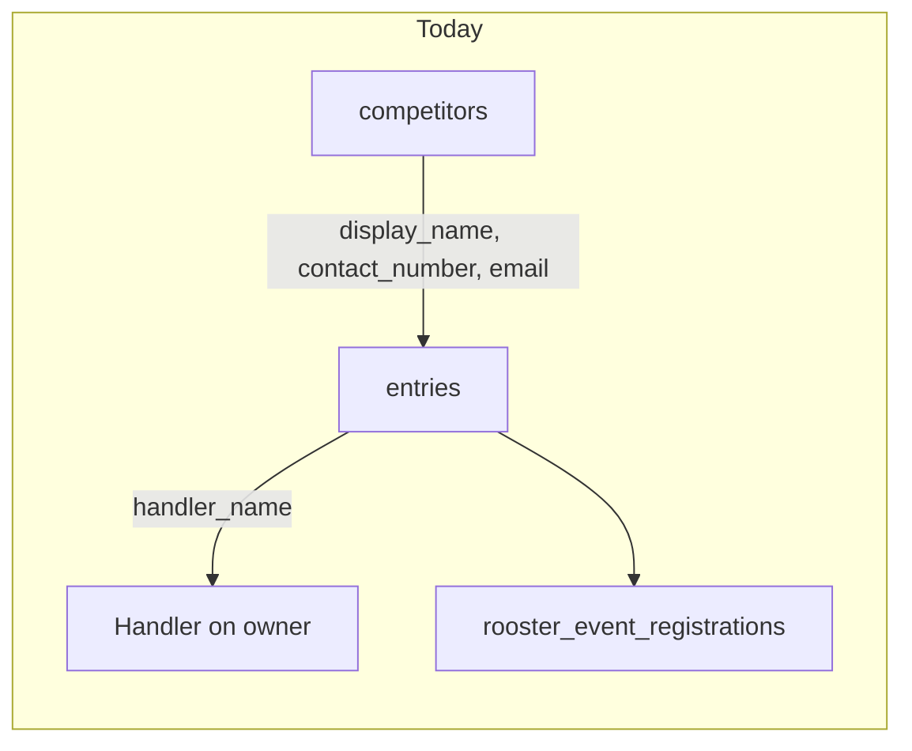
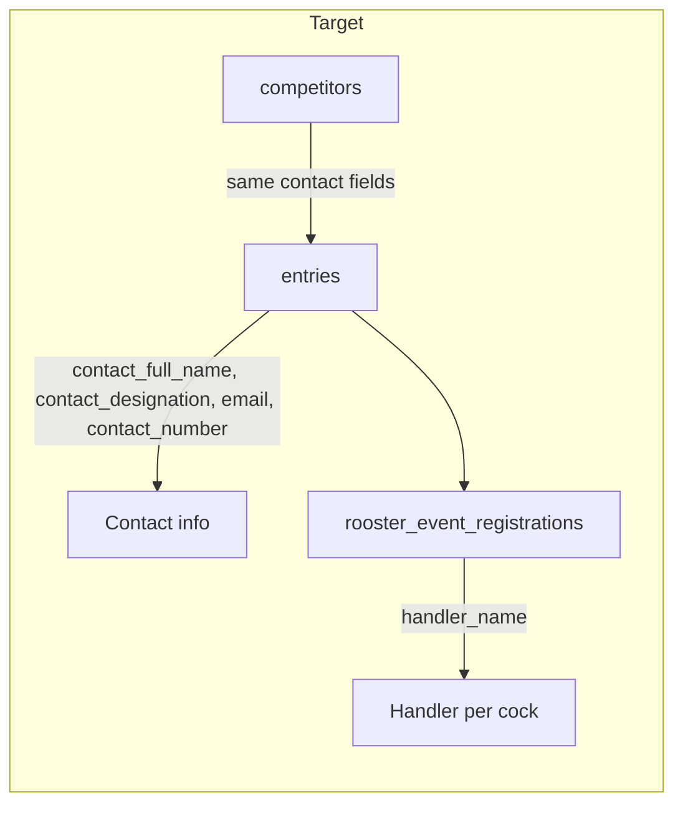

# Move handler to rooster entry; add owner contact fields

## Current state



- `handler_name` lives on [`entries`](features/entries/schema.ts) (`entryMetadataSchema.handlerName`).
- Owner forms ([`owner-entry-form-client.tsx`](features/entries/components/owner-entry-form-client.tsx), [`entry-form-client.tsx`](features/entries/components/entry-form-client.tsx), public form) collect handler at owner level.
- Rooster slots ([`rooster-entry-slots.tsx`](features/entries/components/rooster-entry-slots.tsx)) have no handler field.
- Roosters are inserted in [`features/weighing/service.ts`](features/weighing/service.ts) via `createRoosterForEntry`.
- Saved owners ([`competitors`](features/competitors/schema.ts)) have `display_name`, `contact_number`, `email`, `address` — no contact person name or designation.

## Target state



**Confirmed with you:**
- **Full Name** is the contact person, separate from **Owner Name / Game Farm** (`owner_name` / `display_name`).
- Contact fields sync to both event entry and saved owner profile (`competitors`).

---

## 1. Database migration

Add new migration (e.g. `supabase/migrations/202607142100_handler_to_rooster_contact.sql`):

| Table | Add | Remove |
|-------|-----|--------|
| `entries` | `contact_full_name text`, `contact_designation text` | `handler_name` (after data copy) |
| `competitors` | `contact_full_name text`, `contact_designation text` | — |
| `rooster_event_registrations` | `handler_name text` | — |

**Data migration (before drop):**
```sql
update rooster_event_registrations r
set handler_name = e.handler_name
from entries e
where r.entry_id = e.id
  and e.handler_name is not null
  and r.handler_name is null;
```

Then `alter table entries drop column handler_name`.

Update [`lib/supabase/database.types.ts`](lib/supabase/database.types.ts) in the same pass.

---

## 2. Zod schemas and form parsing

### Owner metadata — [`features/entries/schema.ts`](features/entries/schema.ts)

- Remove `handlerName` from `entryMetadataSchema`.
- Add:
  - `contactFullName: optionalText(200)`
  - `contactDesignation: optionalText(200)`
- Keep `contactNumber` (Phone) and `email`.
- Update `parseCreateEntryFromFormData`, `parseCreateOwnerEntryFromFormData`, and [`features/public/schema.ts`](features/public/schema.ts) parsers.

### Rooster item — same file + [`features/weighing/schema.ts`](features/weighing/schema.ts)

- Add `handlerName: optionalText(200)` to `roosterEntryItemSchema`, `entryRoosterEditItemSchema`, `updateEntryRosterItemSchema`, and `createRoosterSchema`.
- Extend `parseRoosterSlotFromForm` / `parseUpdateEntryRosterFromForm` to read `handlerName_{slotKey}` fields.

### Competitors — [`features/competitors/schema.ts`](features/competitors/schema.ts)

- Add `contactFullName` and `contactDesignation` to `competitorProfileFields`.

---

## 3. Service layer

| File | Change |
|------|--------|
| [`features/entries/service.ts`](features/entries/service.ts) | `createEntry` / `updateEntry`: persist `contact_full_name`, `contact_designation`; stop writing `handler_name`. Pass `handlerName` through `toCreateRoosterInput`. |
| [`features/weighing/service.ts`](features/weighing/service.ts) | Insert/update `handler_name` on `rooster_event_registrations`. |
| [`features/entries/service.ts`](features/entries/service.ts) `updateEntryRoosters` | Include `handler_name` in rooster update payload. |
| Competitor service | Persist new contact fields on create/update; return them in search/list queries. |
| `resolveOrCreateCompetitor` (entries service) | When linking/creating competitor, sync contact fields from entry input. |

Remove or slim deprecated `assertOwnerHandlerNotAlreadyRegistered` and unused `isSameEntryIdentity` in [`features/entries/utils.ts`](features/entries/utils.ts).

---

## 4. Queries and types

Update types and selects in:

- [`features/entries/types.ts`](features/entries/types.ts) — swap `handler_name` for `contact_full_name`, `contact_designation` on `EntryRow` / `EntryListItem`
- [`features/entries/queries.ts`](features/entries/queries.ts) — select/map new entry columns; add `handler_name` to `EntryRoosterEditItem`
- [`features/competitors/types.ts`](features/competitors/types.ts) + queries — new contact fields
- [`features/registrations/types.ts`](features/registrations/types.ts) — `handler_name` on rooster row
- [`features/reports/queries.ts`](features/reports/queries.ts) / [`features/reports/types.ts`](features/reports/types.ts) — move handler column from entry to rooster report rows

---

## 5. UI changes

### Shared contact block (new small component)

Extract a reusable **Contact information** field group used by:
- [`owner-entry-form-client.tsx`](features/entries/components/owner-entry-form-client.tsx)
- [`entry-form-client.tsx`](features/entries/components/entry-form-client.tsx) / [`entry-edit-client.tsx`](features/entries/components/entry-edit-client.tsx)
- [`public-entry-form-client.tsx`](features/public/components/public-entry-form-client.tsx)

Fields: Full Name, Designation, Phone (`ContactNumberField`), Email.

Remove handler input from all owner-level forms. Rename section headings from "Owner / handler" → "Owner" + "Contact information".

### Owner picker sync — [`owner-picker-field.tsx`](features/entries/components/owner-picker-field.tsx)

Extend `OwnerProfileValues` with `contactFullName`, `contactDesignation`. When a saved owner is picked or created via [`create-owner-dialog.tsx`](features/entries/components/create-owner-dialog.tsx), prefill contact fields from competitor profile.

### Competitor profile — [`owner-profile-fields.tsx`](features/competitors/components/owner-profile-fields.tsx)

Add Full Name and Designation fields below game farm name; keep Phone/Email/Address.

### Rooster slots — [`rooster-entry-slots.tsx`](features/entries/components/rooster-entry-slots.tsx)

Add optional **Handler name** input per cock slot (create + edit), wired to form field names parsed in schema.

### List / detail / print

| Component | Change |
|-----------|--------|
| [`owners-list-client.tsx`](features/entries/components/owners-list-client.tsx) | Show contact name/designation; remove handler; update search placeholder |
| [`owner-detail-client.tsx`](features/entries/components/owner-detail-client.tsx) | Contact section; show handler per rooster in registrations list |
| [`entries-list-client.tsx`](features/entries/components/entries-list-client.tsx), [`rooster-entries-client.tsx`](features/entries/components/rooster-entries-client.tsx) | Same display updates |
| [`owner-barcode-slip.tsx`](features/printing/components/owner-barcode-slip.tsx) | Contact person on slip; handler removed from owner slip (or show on cock slip if separate) |
| [`app/events/[id]/register/page.tsx`](app/events/[id]/register/page.tsx) | Fix stale copy: "one registration per owner" (not owner+handler pair) |

---

## 6. Tests

### Vitest (required)

- [`features/entries/schema.test.ts`](features/entries/schema.test.ts) — owner metadata + rooster handler parsing
- [`features/entries/utils.test.ts`](features/entries/utils.test.ts) — remove handler-pair assertions; keep owner-only duplicate tests
- [`features/public/schema.test.ts`](features/public/schema.test.ts) — drop `isSameEntryIdentity` tests; update public entry fixtures
- Competitor schema tests if present (or add minimal coverage)

### E2E (required)

- [`e2e/event-owners.spec.ts`](e2e/event-owners.spec.ts) — register owner with contact fields; add rooster with handler on Roosters tab
- [`e2e/public-registration.spec.ts`](e2e/public-registration.spec.ts) — contact fields on owner section; handler per rooster slot

### Build

Run `npm run build` after type updates.

---

## 7. Documentation and breakdown

- **Admin doc**: update closest sibling (event registration / owner management guide) with new owner contact fields and per-rooster handler.
- **User doc**: update public registration guide — contact block + handler on each cock.
- Create `.cursor/breakdowns/YYYYMMDD-HHMM-handler-rooster-contact-breakdown.md` per plan-implementation rules.

---

## Field mapping reference

| UI label | Zod (camelCase) | DB column | Table |
|----------|-----------------|-----------|-------|
| Owner name / game farm | `ownerName` / `displayName` | `owner_name` / `display_name` | `entries` / `competitors` |
| Full Name | `contactFullName` | `contact_full_name` | `entries` / `competitors` |
| Designation | `contactDesignation` | `contact_designation` | `entries` / `competitors` |
| Phone | `contactNumber` | `contact_number` | `entries` / `competitors` |
| Email | `email` | `email` | `entries` / `competitors` |
| Handler name | `handlerName` | `handler_name` | `rooster_event_registrations` |
