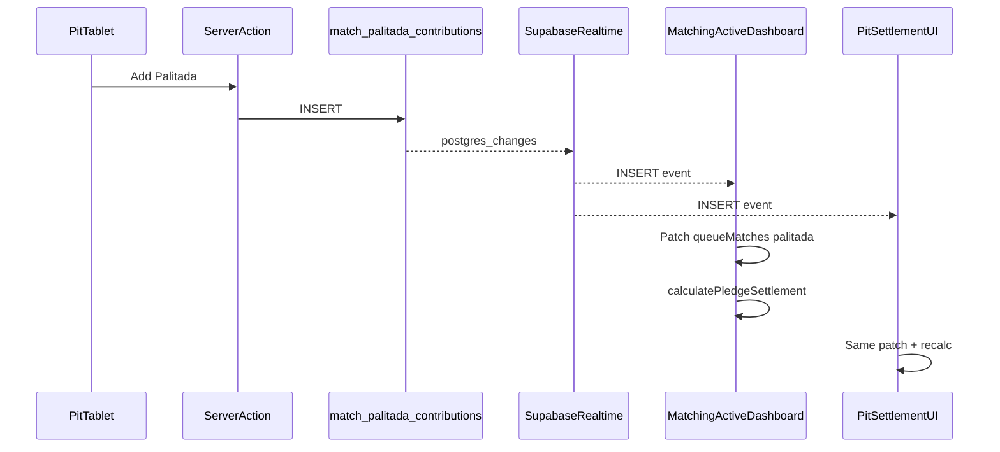

# Bet Balancing / Palitada — Pit Route + Dedicated Permission

## Decision update (from your feedback)

- **No new `masyador` role** — pit users remain **`staff`** with module grants.
- **New granular permission:** `matches.palitada.manage` (“Bet Balancing & Palitada”).
- **`matches.manage`** stays for full Matching (desk, queue advance, outcomes, pledge edits).
- Pit-only staff get **`matches.palitada.manage` + `events.view`** only — not full matching.

---

## What we discussed (unchanged intent)

1. Handler pledges may leave a **Difference** between Meron and Wala.
2. **Staff at the pit (tablet)** record **VIP Palitada** from people accepting the difference.
3. If VIPs do not cover the gap, **Monton revolving fund** can cover the remainder.
4. After Palitada, **inside odds and payouts** must be correct (proportional handler / VIP / Monton split).
5. VIP cash at Cashier is **later**; record-only now, but win/loss/draw outcomes must show what each VIP owes or receives.

**Already built:** [`pledge-settlement.ts`](features/matches/pledge-settlement.ts), Palitada CRUD, DB tables, settlement on result, accounting UI fix (Monton + side win = gross pool).

**Critical bug (still applies):** Palitada is editable only while `queue_status === 'waiting'`, but the **Bet Balancing dialog** lives on **Active Match** (`handlers_called`+), so it is **disabled in normal flow**. The pit route targets **`waiting`** fights.

**Realtime requirement (new):** When pit staff add/remove Palitada, the **Matching Active dashboard** (and pit screen) must update **immediately** — Difference, totals, inside odds, Winnings Potential, and contributor lines — without manual refresh. ClashPoint has **no Realtime usage today**; this plan introduces it for Palitada.

---

## Realtime — pit entries → Active dashboard

### Problem

- Pit records Palitada on a **`waiting`** fight.
- Matchmakers watch **Active Match** (`handlers_called` → `fighting`) for the fight at the pit.
- These can be **different fight numbers** at the same time (Fight #4 active, Fight #5 being balanced).
- Server-rendered [`matching/page.tsx`](app/dashboard/events/[id]/matching/page.tsx) passes static `queueMatches`; pit mutations only `revalidatePath` — other browsers/tabs do not update until reload.

### Architecture



### Database (migration)

Add table to Realtime publication (same migration as permission or separate):

```sql
alter publication supabase_realtime add table public.match_palitada_contributions;
```

RLS already restricts who can read rows; Realtime respects RLS for authenticated subscribers.

### Client hook + live state

New files:

| File | Role |
|------|------|
| [`features/matches/hooks/use-event-palitada-realtime.ts`](features/matches/hooks/use-event-palitada-realtime.ts) | Subscribe `postgres_changes` on `match_palitada_contributions` filtered by `event_id=eq.{eventId}` |
| [`features/matches/components/matching-live-sync-provider.tsx`](features/matches/components/matching-live-sync-provider.tsx) | Context holding live `queueMatches`; merges palitada on INSERT/UPDATE/DELETE |
| [`features/matches/client-queries.ts`](features/matches/client-queries.ts) | Browser Supabase fetch: palitada rows for one `match_id` (or full `MatchListItem` patch) — mirrors server [`loadPalitadaByMatchIds`](features/matches/queries.ts) |

**Subscription filter:** `event_id=eq.{eventId}` (indexed) — one channel per event tab open.

**On change handler:**

1. Receive `{ eventType, new, old }` from Realtime payload.
2. Patch `meron_palitada` / `wala_palitada` on the affected match in `queueMatches` state (or refetch palitada for that match if patch is error-prone).
3. Downstream components re-render; [`MatchBetBalancingPanel`](features/matches/components/match-bet-balancing-panel.tsx) already calls `calculatePledgeSettlement()` from props — **no math change**, only fresh props.

**Optimistic UI on pit:** keep server action + Realtime as confirmation (dedupe if own client already patched).

**Cleanup:** unsubscribe on unmount; single channel per provider instance.

### Where live data flows

Wrap both surfaces in the same provider:

```
MatchingBoardClient
└── MatchingLiveSyncProvider (initial queueMatches from server)
    ├── MatchingSubTabs → Active Match → MatchBetBalancingPanel (live match)
    ├── MatchingFightQueuePanel (optional: Difference badge per row)
    └── …

matching/pit/page.tsx
└── MatchingLiveSyncProvider (same event, same queueMatches source)
    └── MatchingPitClient → settlement preview
```

### Active Match — show balancing for the fight being worked

Because pit works on **`waiting`** fights while Active Match highlights **`handlers_called`+**, add a **live “Bet Balancing — next fight”** section on Active Match when:

- There is a `waiting` fight with `Difference > 0`, or
- Pit staff are actively recording on a selected waiting fight

| Section | Shows |
|---------|--------|
| **Active fight** (existing) | Birds, queue advance, outcome, balancing for called/in-progress fight (read-only once locked) |
| **Bet Balancing — Fight #N** (new, live) | Full [`MatchBetBalancingPanel`](features/matches/components/match-bet-balancing-panel.tsx) for the **waiting** fight pit staff are balancing; updates via Realtime |

Matchmakers see odds/Difference change **as VIP Palitada is entered on the tablet**, even while a different fight is active at the pit.

Resolver helper (Vitest): `resolvePalitadaTargetMatch(queueMatches)` — lowest fight number, `waiting`, pledges settled, prefer imbalanced.

### Pit tablet

- Pit uses the **same** `MatchingLiveSyncProvider` + `queueMatches` state (not a separate fetch loop).
- After local form submit succeeds, Realtime from other tablets still merges in.

### Server actions

Keep `revalidatePath` for SSR/cache consistency; Realtime handles **multi-client live UX**. No broadcast from server action required.

### Vitest

- `applyPalitadaRealtimePatch(queueMatches, payload)` — INSERT/DELETE updates correct side array; idempotent on duplicate events.

### E2E (extend)

- Two browser contexts: pit staff adds Palitada → matchmaker Active Match sees updated **Difference** and **Total winning pool** without reload (Playwright + Realtime against local Supabase or mocked channel if CI lacks Realtime).

### Admin doc note

- Realtime requires Supabase Realtime enabled on hosted project (already in [`supabase/config.toml`](supabase/config.toml) locally). No operator CLI steps in user/admin guides.

---

## Permission model

### New permission (migration)

| Key | Description |
|-----|-------------|
| `matches.palitada.manage` | Record/remove Palitada, open pit Bet Balancing screen, read settlement preview |

Seed in new migration (e.g. `20260721XXXX_matches_palitada_permission.sql`):
- Insert into `public.permissions`
- **Do not** add to `event_organizer` preset automatically if they already have `matches.manage` (organizers inherit pit access via `matches.manage`)
- Grant to staff via **module checkbox** only

### New staff access module

Add to [`lib/auth/modules.ts`](lib/auth/modules.ts):

```ts
{
  id: 'bet-balancing',
  label: 'Bet Balancing & Palitada',
  permissions: ['matches.palitada.manage', 'events.view'],
}
```

Add `'bet-balancing'` to [`MODULE_EVENT_TAB_ACCESS_IDS`](lib/auth/module-ui-groups.ts) so admins can assign it on the Users page.

### Access matrix

| Capability | `matches.manage` | `matches.palitada.manage` |
|------------|------------------|---------------------------|
| Matching Desk / Fight Queue / outcomes | Yes | **No** |
| Pit Bet Balancing route | Yes | **Yes** |
| Add/delete Palitada | Yes | **Yes** |
| Read match pledges + settlement preview | Yes (via `events.view` read RLS) | Yes (`events.view`) |
| Active Match dialog (existing) | Yes | **No** (pit is their surface) |

**Gate helper** (new in [`lib/auth/permissions.ts`](lib/auth/permissions.ts) or matches feature):

```ts
requirePalitadaManage() // requireAnyPermission(['matches.palitada.manage', 'matches.manage']) + canOperateAsStaff
```

Use in Palitada actions only — not for create match / queue advance.

### RLS updates (same migration)

Update [`match_palitada_contributions`](supabase/migrations/202607210200_match_pledge_settlement.sql) policies:

- **SELECT:** admin OR `events.view` OR `matches.manage` OR `matches.palitada.manage`
- **INSERT/UPDATE/DELETE:** admin OR `matches.manage` OR `matches.palitada.manage`

No change needed for `matches` **SELECT** (already allows `events.view`). Palitada staff cannot mutate matches rows.

### Event tab / navigation

Add event tab in [`lib/auth/event-tabs.ts`](lib/auth/event-tabs.ts):

| Slug | Label | Permissions |
|------|-------|-------------|
| `matching/pit` | Bet Balancing | `matches.palitada.manage`, `matches.manage`, `events.view` |

Tab visible if user has **`matches.palitada.manage` OR `matches.manage`** (plus `events.view` for event context).

- **Palitada-only staff:** see **Bet Balancing** tab → pit route only
- **Matching staff:** see **Matching** tab + link to pit from matching header

---

## Pit route (tablet UI)

**Route:** `/dashboard/events/[id]/matching/pit`
**Permission:** `requirePalitadaManage()` + `canOperateAsStaff`

### Fight selection

- Default: lowest **fight number** with `queue_status === 'waiting'` and pledges settled.
- Fight picker if multiple waiting fights.
- Empty state if none ready.

### Screen sections

1. **Header** — Fight #N · Meron vs Wala · Balanced / Needs Palitada
2. **Difference** — Meron/Wala totals, **Difference**, underdog, **remaining capacity**
3. **Record Palitada** (inline, touch-friendly `size="md"`)
   - Contributor name · VIP | Monton · Amount · **Add Palitada**
   - **Cover remainder with Monton** (one tap)
   - Side locked to underdog
4. **Recorded contributions** — list + Remove
5. **Settlement preview** — reuse slim [`MatchBetBalancingPanel`](features/matches/components/match-bet-balancing-panel.tsx) sections
6. **VIP projected outcome** per contributor: win payout / loss stake / draw refund
7. **Balanced banner** — “Ready to call handlers” (staff with only palitada permission cannot advance queue — message points matchmaker to Fight Queue)

### Components

```
app/dashboard/events/[id]/matching/pit/page.tsx
features/matches/components/matching-pit-client.tsx
features/matches/components/matching-pit-fight-panel.tsx
features/matches/components/match-palitada-record-form.tsx  (extract from dialog)
```

Refactor [`match-palitada-balancing-dialog.tsx`](features/matches/components/match-palitada-balancing-dialog.tsx) to share form; dialog remains for **`matches.manage`** on Active Match (optional — or remove dialog and link matchmakers to pit too).

---

## Backend changes

| File | Change |
|------|--------|
| [`features/matches/actions.ts`](features/matches/actions.ts) | `addPalitadaContributionAction` / `deletePalitadaContributionAction` → `requirePalitadaManage()` |
| [`features/matches/palitada-service.ts`](features/matches/palitada-service.ts) | No rule changes; still locks after handlers called |
| New migration | Permission seed + RLS policy update |
| [`lib/auth/modules.ts`](lib/auth/modules.ts) | New `bet-balancing` module |
| [`lib/auth/event-tabs.ts`](lib/auth/event-tabs.ts) | New Bet Balancing tab |
| Pit + Palitada actions | `revalidatePath` for `/matching/pit` and `/matching` |
| Realtime migration | `alter publication supabase_realtime add table match_palitada_contributions` |
| Live sync | `MatchingLiveSyncProvider`, `useEventPalitadaRealtime`, client palitada fetch/patch |
| Active Match UI | Live “Bet Balancing — Fight #N” panel for waiting fight + Realtime-driven `MatchBetBalancingPanel` |

**Out of scope this pass:** Monton RF ledger on record/win; Cashier VIP collection; Realtime on `match_bets` / queue status (Palitada only for now).

---

## Tests & docs

| Item | Action |
|------|--------|
| Vitest | Permission helper; pit fight resolver (`waiting` + settled) |
| Vitest | Optional: RLS/policy covered via service tests with mocked auth |
| E2E | `e2e/matching-pit-palitada.spec.ts` — pit add + **Active Match dashboard updates live** (two contexts) |
| E2E fixture | Extend [`e2e/helpers/test-users.ts`](e2e/helpers/test-users.ts) — `createBetBalancingStaffTestUser` + matchmaker user |
| Vitest | `applyPalitadaRealtimePatch` unit tests |
| Admin doc | `docs/admins/docs/match-palitada-admin.md` — assign module, pit workflow, VIP vs Monton |
| User doc | `docs/users/docs/match-palitada-matching.md` — staff pit steps |
| Breakdown | `.cursor/breakdowns/YYYYMMDD-HHMM-bet-balancing-pit-breakdown.md` |

---

## Implementation order

1. **Migration + RBAC** — permission, RLS, module, event tab, `requirePalitadaManage`, **Realtime publication**
2. **Realtime layer** — hook, patch helper, `MatchingLiveSyncProvider`, client palitada fetch
3. **Actions** — swap Palitada action gates; revalidate pit + matching paths
4. **Extract** shared Palitada record form
5. **Pit route + tablet UI** (wired to live provider)
6. **Active Match live panel** — “Bet Balancing — Fight #N” for waiting fight; wrap matching board in provider
7. **Navigation** — Bet Balancing tab; link from Matching for `matches.manage`
8. **Tests, E2E (pit → dashboard sync), docs, breakdown**

---

## Explicitly out of scope

- New app role or “Masyador” label in RBAC (UI copy may say “pit” / “Bet Balancing” only)
- Palitada-only staff advancing fight queue or declaring results
- Native app / offline mode
- Realtime on pledge payments or queue status (Palitada table only in this pass)
- Cashier VIP Palitada collection (later phase)
