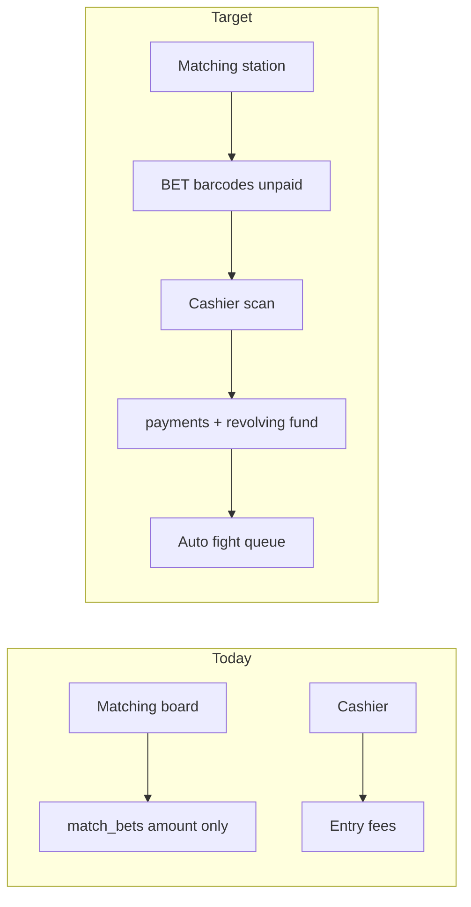
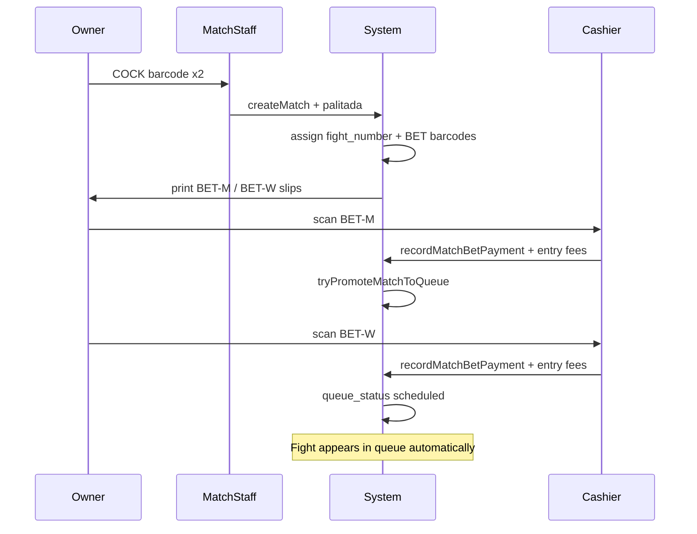

# Matching Desk + Palitada Payment Flow

## Current state (what we build on)

The app already has substantial matching infrastructure — we are **extending**, not greenfield:

| Area | Exists today | Gap vs your spec |
|------|--------------|------------------|
| Pairing | [`features/matches/service.ts`](features/matches/service.ts) — meron/wala, compatibility, `fight_number` | Dropdown-only UI; no barcode scan at desk |
| Bets | [`match_bets`](supabase/migrations/202607121400_match_bets.sql) — amount per side | No payment status, no barcodes, no cashier link |
| Queue | `queue_status` on matches; manual **Lock match list** | Queues all locked matches regardless of payment |
| Cashier | [`features/payments/`](features/payments/) — OWN/COCK scan, receipts, revolving fund | Entry fees only; no BET- barcode |
| Role | `matchmaker` + `matches.manage` | Sufficient for dedicated matching staff |



---

## Your confirmed decisions

- **Queue gate:** Both sides must pay **enabled event fees (if any) + their palitada** before entering fight queue
- **Palitada:** Independent amounts per side; **both must be > 0**
- **Desk UX:** Scan COCK barcodes with search/select fallback
- **Bet barcodes:** Generated immediately at pairing; owners take printed slips to cashier
- **Queue promotion:** Auto-promote when fully paid (no manual lock required)
- **Zero bets:** Not allowed — both sides positive
- **Cancellation:** Matchmaker can cancel unpaid matches freely; refund logic only after payment (future pass if one-side-paid edge case)

---

## Recommended additions (beyond your spec)

These are worth including in the same pass:

1. **Two-tab matching board** — *Awaiting Payment* vs *Fight Queue* so staff see unpaid pairings separately from scheduled fights
2. **Lock bet edits after first payment** — amounts frozen once either side pays (prevent desk disputes)
3. **Combined cashier slip on BET scan** — show palitada due **and** that entry's outstanding registration/rooster/bond fees in one view (one trip to cashier)
4. **Cancel unpaid match action** — with rooster release back to eligible pool
5. **Print both slips at once** — meron + wala bet slips after pairing (reuse [`features/printing/components/barcode-label.tsx`](features/printing/components/barcode-label.tsx))
6. **Set rooster `registration_status` → `matched`** on pairing (aligns with existing enum in [`lib/derby/enums.ts`](lib/derby/enums.ts))
7. **Optional event minimum bet** — floor per side in event settings (organizer policy)
8. **Deprecate bulk Lock match list** — hide or repurpose as "batch review only"; auto-queue replaces it for payment-gated events

**Defer to a follow-up:** one-side-paid-never-shows refund workflow (you chose cancel-free for unpaid; partial-paid refund is a separate settlement feature).

---

## Data model changes

### Migration: extend `match_bets`

Add to [`match_bets`](supabase/migrations/202607121400_match_bets.sql):

```sql
-- new enum
match_bet_payment_status: unpaid | paid | refunded | waived

-- columns on match_bets
barcode text not null unique          -- BET-{eventPrefix}-{fightNum4}-{M|W}
payment_status match_bet_payment_status not null default 'unpaid'
payment_id uuid references payments(id)
printed_at timestamptz
```

### Migration: extend `payments`

```sql
-- payment_category enum: add 'match_bet'
-- optional FK columns (prefer match_bet_id as single source)
match_bet_id uuid references match_bets(id)
match_id uuid references matches(id)   -- denormalized for reporting
fight_side fight_side                  -- meron | wala
```

Update [`lib/supabase/database.types.ts`](lib/supabase/database.types.ts) in the same pass.

### Match queue semantics

- New matches: `status = 'draft'`, `queue_status = null`
- **Queue-ready check** (pure function in `features/matches/utils.ts`):
  - Meron: `computeEntryOutstandingDues(meron_entry)` → 0 **and** meron bet `payment_status = paid`
  - Wala: same for wala side
- When ready: set `queue_status = 'scheduled'`, `status = 'locked'` (reuse existing queue transitions)
- Cancelled unpaid: `status = 'cancelled'`, release roosters from used set

### Barcode format

Mirror existing OWN/COCK pattern in [`features/entries/schema.ts`](features/entries/schema.ts):

- `BET-{8-char event UUID prefix}-{4-digit fight_number}-{M|W}`
- Example: `BET-00000000-0042-M`

---

## Service / business logic

### 1. Matching station — [`features/matches/`](features/matches/)

**Schema** ([`schema.ts`](features/matches/schema.ts)):
- Require `meronBet > 0` and `walaBet > 0` on `createMatchSchema`
- Add `lookupRoosterForMatchingSchema` (COCK barcode → eligible rooster)
- Add `cancelMatchSchema` (only when no bet payments recorded)

**Service** ([`service.ts`](features/matches/service.ts)):
- On `createMatch`: generate both bet barcodes, set `payment_status: unpaid`, assign `fight_number` (existing auto-increment)
- Add `lookupEligibleRoosterByBarcode(eventId, barcode)`
- Add `cancelUnpaidMatch(matchId)` — status cancelled, bets voided
- Add `tryPromoteMatchToQueue(matchId)` — called after any payment affecting match/entries
- Block bet amount edits if any `match_bets.payment_status !== 'unpaid'`

**Queries** ([`queries.ts`](features/matches/queries.ts)):
- Split lists: `getAwaitingPaymentMatches`, `getQueuedMatches` (queue_status not null)
- Include bet payment status + barcode on `MatchListItem`

### 2. Bet payments — [`features/payments/`](features/payments/)

**Schema** ([`schema.ts`](features/payments/schema.ts)):
- Add `match_bet` to `paymentCategorySchema`
- Add `recordMatchBetPaymentSchema` (bet barcode or matchBetId, tender, session)

**Dues / resolve** ([`dues.ts`](features/payments/dues.ts), [`service.ts`](features/payments/service.ts)):
- Extend `classifyCashierQuery` with `BET-` prefix → `{ kind: 'match_bet', barcode }`
- New `resolveMatchBetCashierTarget(eventId, barcode)` returning:
  - Match context (fight #, side, rooster, owner)
  - Palitada due (bet amount if unpaid)
  - Entry outstanding lines (reuse `computeEntryOutstandingDues` for that side's entry)
- `recordMatchBetPayment()`:
  - Insert `payments` row (`category: match_bet`, `match_bet_id`, tender/change)
  - Update `match_bets.payment_status = paid`, link `payment_id`
  - Post revolving fund `collection` (same pattern as entry fees in [`features/revolving-fund/service.ts`](features/revolving-fund/service.ts))
  - Call `tryPromoteMatchToQueue(match_id)`

**Receipt** ([`features/printing/components/payment-receipt-slip.tsx`](features/printing/components/payment-receipt-slip.tsx)):
- Add palitada section: fight #, side (Meron/Wala), bet amount, match barcode

### 3. Matching desk UI — [`matching-board-client.tsx`](features/matches/components/matching-board-client.tsx)

Replace/enhance create form:

```
[Meron] Scan COCK / search eligible ──► rooster card
[Wala]  Scan COCK / search eligible ──► rooster card
Compatibility preview (existing)
Meron palitada (₱) | Wala palitada (₱)  — both required > 0
[Create match & print slips]
```

- Reuse scan row pattern from [`features/inspection/components/rooster-barcode-scan-row.tsx`](features/inspection/components/rooster-barcode-scan-row.tsx)
- After create: link to print route for both bet slips

### 4. Bet slip printing — new in [`features/printing/`](features/printing/)

- `match-bet-barcode-slip.tsx` — fight #, side label, owner/cock info, amount due, CODE128 barcode
- Route: `app/dashboard/events/[id]/matching/[matchId]/print/page.tsx` (both slips, print-friendly)

### 5. Cashier UI — [`cashier-client.tsx`](features/payments/components/cashier-client.tsx)

When BET barcode resolved:
- Show match header (Fight #N · Meron/Wala · owner name)
- Outstanding palitada line (primary action)
- Collapsible entry-fee lines if any (secondary — same session)
- Collect → receipt print (existing flow)

---

## Permissions & roles

No new permission required:
- Matching desk: existing `matches.manage` (`matchmaker` role)
- Bet collection: existing `payments.manage` (cashier role)

---

## Testing

| Layer | File | Coverage |
|-------|------|----------|
| Vitest | `features/matches/schema.test.ts` | Positive bet validation, barcode format |
| Vitest | `features/matches/utils.test.ts` | `isMatchQueueReady`, promote logic |
| Vitest | `features/payments/dues.test.ts` | `classifyCashierQuery` BET- prefix |
| Vitest | `features/matches/service.test.ts` (new) | create → pay both → auto queue |
| E2E | `e2e/matching-palitada.spec.ts` (new) | pair → print → cashier pay both → appears in queue |

Manual test path (breakdown):
1. Event `in_progress`, two verified roosters with optional unpaid entry fees
2. Matching tab → scan both COCK codes → enter palitada → create
3. Print both BET slips
4. Cashier → scan BET-M → pay palitada (+ entry fees if shown)
5. Cashier → scan BET-W → pay
6. Match auto-appears in Fight Queue with `scheduled` status

---

## Documentation

| Audience | File |
|----------|------|
| Admin/organizer | `docs/admins/docs/matching-palitada-admin.md` — desk workflow, queue rules, cancel |
| User (handlers) | `docs/users/docs/matching-and-bets.md` — bring cock slip to matching, then bet slip to cashier |

Update respective `sidebars.ts`. No CLI in published docs.

---

## Implementation order

1. **DB migration** — match_bets payment fields, payments FK, `match_bet` category
2. **Barcode + schema validation** — format helpers, positive bet rules
3. **Match service** — barcode on create, cancel unpaid, queue promotion
4. **Payment service** — BET resolve, record, revolving fund, promotion hook
5. **Print slips** — bet barcode slips
6. **Matching desk UI** — scan + search + awaiting-payment tab
7. **Cashier UI** — BET scan target view
8. **Tests + E2E + docs + breakdown**

---

## Architecture (target flow)


