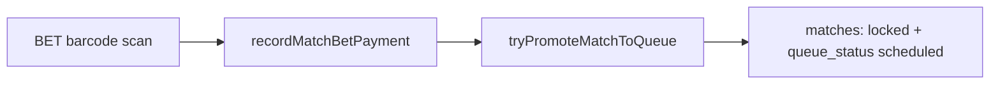

# Separate matching from palitada payments

## Current behavior (already correct for queue)

Palitada collection and auto-queue **already work** when staff use the Cashier Terminal with a **BET-** slip:



Readiness is enforced in [`features/matches/utils.ts`](features/matches/utils.ts) (`isMatchQueueReady`) and promotion in [`features/matches/promotion.ts`](features/matches/promotion.ts). No new queue logic is required.

**Gap:** scanning a **COCK-** barcode today only loads entry fees ([`resolveCashierTarget`](features/payments/service.ts) `cock_barcode` branch → `buildCashierMatch`). It does **not** surface unpaid palitada for a rooster already in a draft match.

## Changes

### 1. Remove bet Save forms from Matching board

**File:** [`features/matches/components/matching-board-client.tsx`](features/matches/components/matching-board-client.tsx)

- Delete the `BetEditForm` component (lines ~166–210) and both usages in the **Awaiting payment** list (lines ~625–647).
- Remove `updateMatchBetAction` import.
- **Keep:** bet amount display, `SidePaymentBadges` (Palitada Unpaid/Paid), BET- barcode text, **Print slips**, **Cancel match**, and palitada inputs on **Create match** form (`meronBet` / `walaBet` at pairing time).

**Dead code cleanup (same pass):**

- Remove `updateMatchBetAction` from [`features/matches/actions.ts`](features/matches/actions.ts) if no callers remain.
- Remove `updateMatchBet` from [`features/matches/service.ts`](features/matches/service.ts) and `updateMatchBetSchema` from [`features/matches/schema.ts`](features/matches/schema.ts) only if fully unused; update [`features/matches/schema.test.ts`](features/matches/schema.test.ts) accordingly.

### 2. Matching staff guidance (direct handlers to cashier)

Update the **Awaiting payment** panel copy in `matching-board-client.tsx`:

- Clarify that **matching staff do not collect payments**.
- Instruct staff to send handlers to **Events → Cashier Terminal** with either:
  - the rooster **COCK-** barcode, or
  - the printed **BET-** palitada slip (via existing **Print slips** button).
- Note that the match moves to **Fight queue** automatically once both sides pay palitada and entry fees are cleared (existing behavior).
- Add a secondary link/button to `/dashboard/events/[eventId]/payments` for convenience (visible to all staff viewing the board, not only `canManage`).

Optional panel title tweak: **Awaiting cashier payment** (keeps meaning clear without renaming DB concepts).

### 3. Cock scan detects unpaid palitada (Cashier Terminal)

**File:** [`features/payments/service.ts`](features/payments/service.ts)

Add a helper, e.g. `resolveMatchBetByRoosterRegistrationId(eventId, registrationId)`:

1. Find a **draft** match (`status = 'draft'`, `queue_status IS NULL`, not cancelled) where `meron_rooster_id` or `wala_rooster_id` equals the scanned registration.
2. Load the corresponding `match_bets` row for that side with `payment_status = 'unpaid'`.
3. If found, build a `MatchBetCashierTarget` (reuse field mapping from existing `resolveMatchBetCashierTarget`).
4. If not found (no match, or palitada already paid), return `null`.

Update the `cock_barcode` branch in `resolveCashierTarget`:

```
registration lookup
  → unpaid matchBet?  return { matchBet }   // palitada panel + entry dues (existing UI path)
  → else              return { matches: [buildCashierMatch(...)] }  // current behavior
```

**Client:** no structural change needed — [`cashier-client.tsx`](features/payments/components/cashier-client.tsx) already handles `result.matchBet` via `applyMatchBet()`, which shows the palitada panel and entry-fee panel together.

**Tests (Vitest):**

- Add cases in a new or existing service test file covering:
  - COCK scan → unpaid palitada target returned
  - COCK scan → palitada paid → entry dues only
  - COCK scan → rooster not in any match → entry dues only

### 4. Documentation

| Audience | File | Update |
|----------|------|--------|
| User (cashier) | [`docs/users/docs/cashier-terminal.md`](docs/users/docs/cashier-terminal.md) | Note that scanning a **COCK-** barcode for a matched rooster loads palitada due (same as BET- slip). |
| User (matching) | New or sibling page in `docs/users/docs/` (e.g. extend an event-day guide) | Matching creates pairs and prints slips; handlers pay at Cashier Terminal; match auto-queues when both sides are paid. |
| Admin | Closest sibling in `docs/admins/docs/` | Same workflow from operator perspective; no CLI. Update `sidebars.ts` if a new page is added. |

### 5. E2E

**File:** [`e2e/matching-palitada.spec.ts`](e2e/matching-palitada.spec.ts)

- Remove assertions/interactions for per-side Save buttons in Awaiting payment.
- Add cashier flow: after match creation, scan **COCK-** barcode (not only BET-) and expect `cashier-palitada-due`.
- Keep BET- slip path as alternate happy path.

E2E remains `@auth` / seed-dependent; update spec structure even if still skipped until seed exists.

## Out of scope

- Changing palitada amounts after match creation (would require cancel + recreate, or a separate admin override — not requested).
- Owner-barcode (`OWN-`) palitada detection (ambiguous when an entry has multiple roosters; cock scan is the precise identifier).
- New permissions — matching staff already see status badges; this change is UX + cashier lookup only.

## Manual test checklist

1. **Matching:** Create a match with palitada amounts → Awaiting payment shows amounts + Palitada Unpaid badges, **no Save inputs**.
2. **Matching:** Print slips still works; staff can point handlers to Cashier Terminal.
3. **Cashier:** Scan **COCK-** for a rooster in an unpaid match → palitada panel appears with correct amount.
4. **Cashier:** Collect palitada → side shows Paid on Matching board.
5. **Cashier:** When both sides paid and entry fees clear → match appears in Fight queue without matching-staff action.
6. **Cashier:** Scan **BET-** slip still works as before.

## Suggested commit

```
Separate palitada payments from matching desk

Matching staff no longer edit bet amounts after pairing; handlers pay
at Cashier Terminal via COCK or BET scan. Cock scan now resolves unpaid
palitada for matched roosters; auto-queue on full payment unchanged.
```
