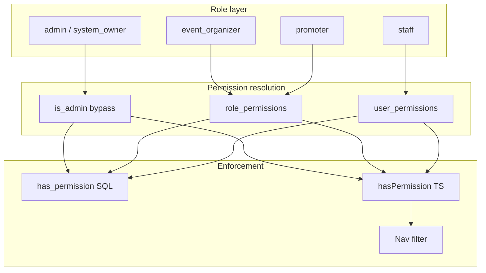

# Module-Based RBAC Simplification

## Goal

Replace the current 10-role model (with job-title staff roles like `registration_staff`, `matchmaker`, etc.) with **5 roles**:

| Role | Access model |
|------|----------------|
| `admin` | Full access (legacy alias of owner) |
| `system_owner` | Full access |
| `event_organizer` | Fixed preset — all operational modules (same breadth as today’s `event_organizer` seed) |
| `promoter` | Fixed preset — portal + read-only event/report access |
| `staff` | **Per-user module checkboxes** at invite/edit time |

Confirmed scope: **module picker applies to `staff` only**; keep both `admin` and `system_owner`.

---

## Architecture



**Key decision:** Keep existing granular permission keys (`entries.manage`, `payments.manage`, etc.) in DB and RLS. UI exposes **modules** that map to one or more permission keys — no RLS rewrite per feature module.

---

## Module catalog (staff picker)

Define a single registry in [`lib/auth/modules.ts`](e:\PROJECTS\PERSONAL\ZEEKER TECH\Mon\pitclash\lib\auth\modules.ts) (new file):

| Module ID | Label | Permissions granted |
|-----------|-------|---------------------|
| `promoters` | Promoters | `promoters.manage` |
| `events` | Events | `events.manage`, `events.view` |
| `registrations` | Registrations | `entries.manage`, `events.view` |
| `payments` | Payments | `payments.manage`, `events.view` |
| `lineups` | Lineups | `lineups.manage`, `events.view` |
| `weighing` | Weighing | `weighing.manage`, `events.view` |
| `matching` | Matching & fight queue | `matches.manage`, `events.view` |
| `results` | Results | `results.manage`, `events.view` |
| `standings` | Standings | `standings.view`, `events.view` |
| `winners` | Winners | `winners.manage`, `events.view` |
| `payouts` | Payouts | `payouts.manage`, `events.view` |
| `settlements` | Promoter settlements | `settlements.manage`, `events.view` |
| `reports` | Reports | `reports.view`, `events.view` |
| `users` | Users | `users.manage`, `users.invite` |
| `settings` | Settings | `settings.manage` |
| `audit` | Audit trail | `audit.view` |

Helper exports:
- `moduleToPermissions(moduleId)` — expand checkbox → permission keys
- `permissionsToModules(permissionIds)` — for edit form pre-check
- `ALL_MODULE_IDS` — for validation

**Staff invite validation:** require `role === 'staff'` → at least **1 module** selected.

**event_organizer preset** (unchanged intent, stored in `role_permissions`):
`events.manage`, `events.view`, `entries.manage`, `payments.manage`, `lineups.manage`, `weighing.manage`, `matches.manage`, `results.manage`, `standings.view`, `winners.manage`, `payouts.manage`, `settlements.manage`, `reports.view`, `audit.view`

**promoter preset:** `events.view`, `reports.view` (+ portal gate via existing `canAccessPortal`)

---

## Database migration (new file)

Add [`supabase/migrations/YYYYMMDD_staff_module_permissions.sql`](e:\PROJECTS\PERSONAL\ZEEKER TECH\Mon\pitclash\supabase\migrations\):

### 1. Replace `app_role` enum (Postgres cannot drop enum values safely)

```sql
-- Create new enum with 5 values
create type public.app_role_new as enum (
  'admin', 'system_owner', 'event_organizer', 'promoter', 'staff'
);

-- Migrate profiles.role with mapping
alter table public.profiles
  alter column role type public.app_role_new
  using (case role::text
    when 'admin' then 'admin'
    when 'system_owner' then 'system_owner'
    when 'event_organizer' then 'event_organizer'
    when 'promoter' then 'promoter'
    else 'staff'  -- registration_staff, finance_staff, etc. + public_viewer
  end)::public.app_role_new;
```

Repeat enum swap for `role_permissions.role`.

### 2. Add `user_permissions` table

```sql
create table public.user_permissions (
  user_id uuid not null references public.profiles (id) on delete cascade,
  permission_id text not null references public.permissions (id) on delete cascade,
  primary key (user_id, permission_id)
);
-- RLS: is_admin() or users.manage for writes; user can read own
```

### 3. Migrate old staff role grants → per-user rows

For each profile previously mapped to a job-title role, insert into `user_permissions` the permissions that role had in `role_permissions` (use a one-time SQL mapping table in migration).

Example mapping (from current seed in [`202607041000_rbac_system_settings.sql`](e:\PROJECTS\PERSONAL\ZEEKER TECH\Mon\pitclash\supabase\migrations\202607041000_rbac_system_settings.sql)):

| Old role | Modules to grant |
|----------|------------------|
| `registration_staff` | registrations |
| `finance_staff` | payments, payouts, settlements, reports |
| `weighing_staff` | lineups, weighing |
| `matchmaker` | matching |
| `result_recorder` | results, standings |
| `public_viewer` | none (stays staff, no modules, inactive or blocked at sign-in) |

### 4. Replace `role_permissions` rows

- Delete rows for removed roles
- Keep only `event_organizer` and `promoter` presets
- Remove `users.manage` / `settings.manage` from organizer preset (same as today)

### 5. Update SQL functions

[`has_permission()`](e:\PROJECTS\PERSONAL\ZEEKER TECH\Mon\pitclash\supabase\migrations\202607041000_rbac_system_settings.sql):

```sql
-- Resolve: is_admin() OR role_permissions (organizer/promoter) OR user_permissions (staff)
```

[`can_access_dashboard()`](e:\PROJECTS\PERSONAL\ZEEKER TECH\Mon\pitclash\supabase\migrations\202607041000_rbac_system_settings.sql):

```sql
-- Allow: admin, system_owner, event_organizer, promoter
-- Allow staff IF active AND exists (select 1 from user_permissions where user_id = auth.uid())
-- Deny staff with zero modules (prevents empty dashboard access)
```

### 6. Update `handle_new_user` trigger

Default role: `staff` (no permissions until admin invite completes). Update [`202607051400_bootstrap_first_admin_trigger.sql`](e:\PROJECTS\PERSONAL\ZEEKER TECH\Mon\pitclash\supabase\migrations\202607051400_bootstrap_first_admin_trigger.sql) logic — bootstrap still promotes first user to `system_owner`.

### 7. Regenerate types

Run Supabase typegen → update [`lib/supabase/database.types.ts`](e:\PROJECTS\PERSONAL\ZEEKER TECH\Mon\pitclash\lib\supabase\database.types.ts).

---

## Application layer changes

### [`lib/auth/permissions.ts`](e:\PROJECTS\PERSONAL\ZEEKER TECH\Mon\pitclash\lib\auth\permissions.ts)

- Update `DASHBOARD_ROLES`: `admin`, `system_owner`, `event_organizer`, `promoter`, `staff`
- Update `hasPermission()` for `staff`: query `user_permissions` instead of `role_permissions`
- Add `getUserModules(userId)` / `getUserPermissions(userId)` helpers
- Add `canAccessDashboardForProfile(profile)` — for staff, require ≥1 permission row

### [`features/users/schema.ts`](e:\PROJECTS\PERSONAL\ZEEKER TECH\Mon\pitclash\features\users\schema.ts)

- Replace `appRoleSchema` with 5 roles
- `inviteUserSchema`: add `modules: z.array(moduleIdSchema).optional()` — required when `role === 'staff'`
- `updateUserRoleSchema` → split into `updateUserRoleSchema` + `updateUserModulesSchema` (or combined `updateUserAccessSchema`)
- Update `ROLE_LABELS` to 5 entries

### [`features/users/service.ts`](e:\PROJECTS\PERSONAL\ZEEKER TECH\Mon\pitclash\features\users\service.ts)

- `inviteUser`: after profile role set, if `staff` → insert `user_permissions` rows (expand modules → permission keys)
- `updateUserRole`: when changing to/from `staff`, clear or seed `user_permissions` appropriately
- New `updateUserModules(actorId, userId, modules, reason?)` with audit log (`user.modules_updated`)
- Use admin/service client for `user_permissions` writes if RLS requires

### [`features/users/queries.ts`](e:\PROJECTS\PERSONAL\ZEEKER TECH\Mon\pitclash\features\users\queries.ts)

- `listUsers()`: join or secondary query for module list per staff user

### [`features/users/components/users-page-client.tsx`](e:\PROJECTS\PERSONAL\ZEEKER TECH\Mon\pitclash\features\users\components\users-page-client.tsx)

- Role dropdown: 5 roles (exclude `admin` from invite — same as today)
- When role = `staff`: show module checkbox grid (grouped, with labels from registry)
- Edit row: for staff users, show module editor instead of only role dropdown
- Hide module UI for `event_organizer` / `promoter` (presets apply automatically)

### Nav filtering — [`lib/dashboard/nav.ts`](e:\PROJECTS\PERSONAL\ZEEKER TECH\Mon\pitclash\lib\dashboard\nav.ts) + sidebar

Add optional `requiredPermission` per nav item; filter in [`components/dashboard/app-sidebar.tsx`](e:\PROJECTS\PERSONAL\ZEEKER TECH\Mon\pitclash\components\dashboard\app-sidebar.tsx) using server-passed permission set or client hook. Prevents staff from seeing links they cannot use.

### Auth sign-in — [`features/auth/actions.ts`](e:\PROJECTS\PERSONAL\ZEEKER TECH\Mon\pitclash\features\auth\actions.ts)

Replace bare `canAccessDashboard(role)` with profile-aware check that denies **staff with zero modules**.

---

## Tests

| File | Changes |
|------|---------|
| [`lib/auth/permissions.test.ts`](e:\PROJECTS\PERSONAL\ZEEKER TECH\Mon\pitclash\lib\auth\permissions.test.ts) | 5 roles; staff module resolution |
| New `lib/auth/modules.test.ts` | Module ↔ permission mapping |
| New `features/users/schema.test.ts` | Staff must pick ≥1 module |
| New `features/users/service.test.ts` | Mock user_permissions insert/update |
| [`e2e/helpers/test-users.ts`](e:\PROJECTS\PERSONAL\ZEEKER TECH\Mon\pitclash\e2e\helpers\test-users.ts) | `createStaffTestUser` → role `staff` + seed modules |
| [`e2e/users-management.spec.ts`](e:\PROJECTS\PERSONAL\ZEEKER TECH\Mon\pitclash\e2e\users-management.spec.ts) | Invite staff with modules; verify access |

---

## Documentation

Update admin Phase 1 docs (if present in nested `docs/admins/`):

- Replace job-title role list with 5 roles + module picker explanation
- Mermaid: invite flow showing role selection → module checkboxes for staff
- Note: `event_organizer` = full ops preset; `promoter` = portal preset

---

## Files touched (summary)

| Area | Files |
|------|-------|
| DB | New migration; optional follow-up to drop old enum type |
| Auth core | `lib/auth/permissions.ts`, new `lib/auth/modules.ts`, `database.types.ts` |
| Users feature | `schema.ts`, `service.ts`, `queries.ts`, `actions.ts`, `users-page-client.tsx` |
| Auth flow | `features/auth/actions.ts` |
| Nav | `lib/dashboard/nav.ts`, `app-sidebar.tsx`, possibly `dashboard/layout.tsx` |
| Tests | permissions, users schema/service, e2e helpers |
| Docs | `docs/admins/docs/phase-01-foundation/` user-management section |

**No changes** to individual feature modules (`entries`, `payments`, etc.) — they keep calling `requirePermission('…')` as today.

---

## Rollout / deploy

1. Apply Supabase migration (maps existing users automatically)
2. Deploy app code
3. Manually verify: one migrated old-role user retains equivalent access via `user_permissions`
4. System owners review staff users with empty modules (former `public_viewer`)

---

## Out of scope (this pass)

- Removing `admin` legacy role (user chose to keep both owners)
- Module picker for `event_organizer` or `promoter`
- Role templates / saved module presets (future: “Registration desk” template)
- Per-event scoping (staff sees all events they have module access to)
