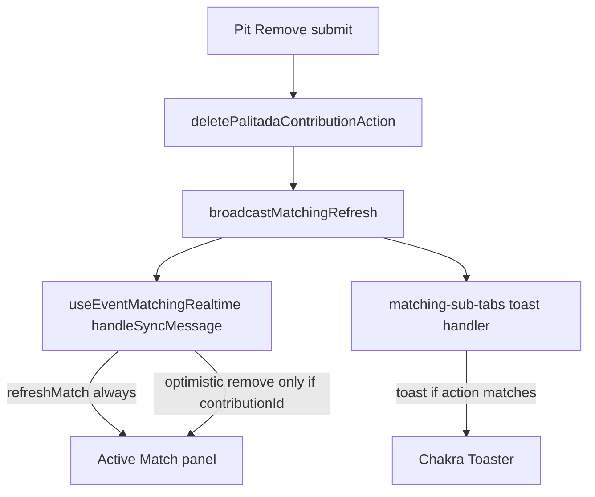

# Palitada remove, sync, and toast fixes

## Diagnosis

| Symptom | Root cause | Evidence |
|--------|------------|----------|
| All Remove buttons spin | One shared `useActionState` + `loading={deletePending}` on every row | [`match-palitada-record-form.tsx`](features/matches/components/match-palitada-record-form.tsx) L42–45, L186 |
| Add updates Active Match, no toast | Data refresh runs in [`use-event-matching-realtime.ts`](features/matches/hooks/use-event-matching-realtime.ts) `handleSyncMessage`; toast only wired in [`matching-sub-tabs.tsx`](features/matches/components/matching-sub-tabs.tsx) cross-tab handler — separate subscription/path | Add can succeed via Realtime `refreshMatch` without ever hitting sub-tabs toast code |
| Remove does not update Active Match | `handleSyncMessage` only optimistically removes when `message.contributionId` is set; otherwise a stale `refreshMatch` can re-apply the row. Broadcast uses `deleteState.contributionId`, which may be missing/stale relative to the submitted form | Hook L157–178; form effect L70–74 |
| No toast on remove | Same as add — notifications not tied to the hook path that handles remove |



---

## Fix 1 — Per-row Remove button loading

**File:** [`features/matches/components/match-palitada-record-form.tsx`](features/matches/components/match-palitada-record-form.tsx)

Extract a small client child per contribution row:

```tsx
function RemovePalitadaButton({ disabled }: { disabled?: boolean }) {
  const { pending } = useFormStatus()
  return (
    <Button type="submit" loading={pending} ...>
      Remove
    </Button>
  )
}
```

- Each `<form action={deleteAction}>` wraps its own `RemovePalitadaButton` (must be a child of the form for `useFormStatus` from `react-dom`).
- Remove shared `loading={deletePending}` from the mapped rows.
- Keep top-level `deletePending` only if needed for fieldset/disable logic (optional).

---

## Fix 2 — Reliable remove broadcast with contributionId

**File:** [`features/matches/components/match-palitada-record-form.tsx`](features/matches/components/match-palitada-record-form.tsx)

Capture the submitted ID at click time, not only from `deleteState` after the action:

- Add `pendingDeleteContributionIdRef = useRef<string | null>(null)`.
- On each delete form: `onSubmit={(e) => { pendingDeleteContributionIdRef.current = contributor.id }}` (or read from `FormData` in the submit handler).
- In the delete-success `useEffect`, broadcast with:

```ts
const contributionId =
  deleteState.contributionId ?? pendingDeleteContributionIdRef.current
if (!contributionId) return // don't broadcast incomplete remove
broadcastMatchingRefresh(eventId, match.id, {
  action: 'palitada_removed',
  fightNumber: match.fight_number,
  contributionId,
})
pendingDeleteContributionIdRef.current = null
```

This guarantees the matching tab receives `contributionId` for optimistic removal.

---

## Fix 3 — Centralize Matching-board toast + banner on the data-sync path

**Problem:** Toast/banner live in `matching-sub-tabs.tsx`, but match refresh lives in `use-event-matching-realtime.ts`. When data updates via Realtime or hook cross-tab handling, sub-tabs may not run notification code.

**Approach:** Move notification responsibility to the hook (same handler that already updates UI).

**Files:**
- [`features/matches/hooks/use-event-matching-realtime.ts`](features/matches/hooks/use-event-matching-realtime.ts)
- [`features/matches/components/matching-live-sync-provider.tsx`](features/matches/components/matching-live-sync-provider.tsx)
- [`features/matches/components/matching-sub-tabs.tsx`](features/matches/components/matching-sub-tabs.tsx)

1. Add optional `onPalitadaPitSync?: (message: MatchingSyncMessage) => void` to `MatchingLiveSyncProvider`.
2. In `handleSyncMessage`, after validating `eventId` and when `syncPagePath()` is the **matching board** (includes `/matching`, excludes `/matching/pit`):
   - Call `onPalitadaPitSync?.(message)` for the green banner (wired from `MatchingSubTabs` via provider prop).
   - Call `showPalitadaRecordedToast` / `showPalitadaRemovedToast` directly for add/remove actions.
3. Remove the duplicate `subscribeMatchingCrossTabMessages` block from `matching-sub-tabs.tsx` (keep a single cross-tab subscription in the hook to avoid double `refreshMatch` and dedup races).

**Also fire notifications from Realtime palitada handler** in the same hook when `payload.eventType` is `INSERT`/`DELETE` and pathname is matching board — covers cases where Realtime delivers the change but cross-tab does not.

---

## Fix 4 — Harden remove sync in the hook

**File:** [`features/matches/hooks/use-event-matching-realtime.ts`](features/matches/hooks/use-event-matching-realtime.ts)

For `palitada_removed` with `contributionId`:

1. `markContributionRemoved(contributionId)` (already present).
2. Optimistic `removePalitadaContributionFromMatch` on queue + awaiting lists (already present).
3. **Defer `refreshMatch` slightly** (e.g. 300ms) for remove-only cross-tab/realtime events so a fast stale fetch cannot re-insert the row before Postgres delete is visible. Keep immediate refresh for `palitada_added`.

---

## Fix 5 — Tests

**File:** [`features/matches/matching-cross-tab-sync.test.ts`](features/matches/matching-cross-tab-sync.test.ts)

- Add case: stored/broadcast remove message includes `contributionId` and is delivered to matching listener.

**Optional small unit test** for `removePalitadaContributionFromMatch` with contribution id (already in [`matching-realtime-patches.test.ts`](features/matches/matching-realtime-patches.test.ts)).

Run:

```bash
npm run test:run -- features/matches/matching-cross-tab-sync.test.ts
npm run build
```

E2E: N/A (two-window manual test).

---

## Manual verification (two windows, same origin)

1. Window A: Matching → Active Match (visible)
2. Window B: Bet Balancing pit
3. **Add** Palitada → A updates totals + toast + green banner within ~1s
4. **Remove** one row on B → only that row’s button spins; A removes payout/totals + toast + banner
5. Repeat with two contributions to confirm only clicked Remove loads

---

## Files to change

| File | Change |
|------|--------|
| [`match-palitada-record-form.tsx`](features/matches/components/match-palitada-record-form.tsx) | Per-row `useFormStatus`; submit ref for `contributionId` |
| [`use-event-matching-realtime.ts`](features/matches/hooks/use-event-matching-realtime.ts) | Single cross-tab sub; notifications; deferred remove refresh |
| [`matching-live-sync-provider.tsx`](features/matches/components/matching-live-sync-provider.tsx) | Pass `onPalitadaPitSync` callback |
| [`matching-board-client.tsx`](features/matches/components/matching-board-client.tsx) | Wire banner callback into provider |
| [`matching-sub-tabs.tsx`](features/matches/components/matching-sub-tabs.tsx) | Remove duplicate cross-tab subscription |
| [`matching-cross-tab-sync.test.ts`](features/matches/matching-cross-tab-sync.test.ts) | Remove message with `contributionId` |

No plan file edits. No `revalidatePath('/matching')` on palitada mutations.
