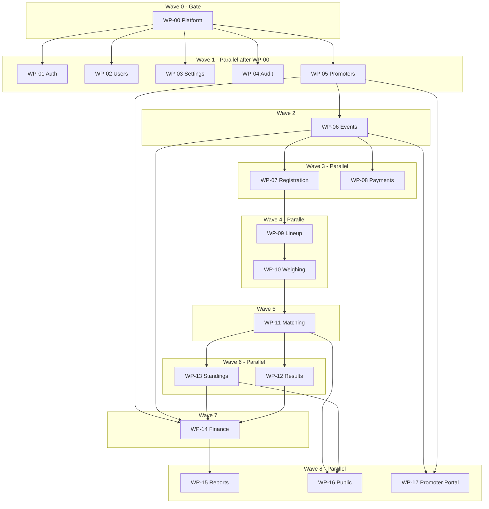

# Parallel Module Breakdown — Derby Operations Platform

## Source of truth

This plan **re-slices** the original [Official Phase Deliverables](C:\Users\Ruel Luna\.cursor\projects\e-PROJECTS-PERSONAL-ZEEKER-TECH-Mon-pitclash\uploads\phase_deliverables_list_9c98af3e.plan-L1-L616-0.md) (Dev Phases 1–10) into **independent work modules**. Each module owns a `features/{name}/` folder, its migrations, its dashboard/public routes, Vitest, E2E, and admin docs.

**Current baseline:** MVP code for all 10 phases largely exists under [`features/`](e:\PROJECTS\PERSONAL\ZEEKER TECH\Mon\pitclash\features\) and [`app/dashboard/`](e:\PROJECTS\PERSONAL\ZEEKER TECH\Mon\pitclash\app\dashboard\). Only **2 Playwright specs** exist (`auth-login`, `users-management`). Use this breakdown for **parallel hardening, gap closure, and future enhancements** — not greenfield scaffolding.

---

## Module map (original phase → work module)

| Work module | Original phase | Owns | Primary routes |
|-------------|----------------|------|----------------|
| **WP-00 Platform** | Phase 1 (shared) | `lib/auth/`, `lib/supabase/`, root `middleware.ts`, `lib/dashboard/nav.ts`, shared types | All layouts |
| **WP-01 Auth** | Phase 1 | `features/auth/` | `/login`, `/access-denied` |
| **WP-02 Users** | Phase 1 | `features/users/` | `/dashboard/users` |
| **WP-03 Settings** | Phase 1 | `features/settings/` | `/dashboard/settings` |
| **WP-04 Audit** | Phase 1 + 9 | `features/audit/` | `/dashboard/audit` |
| **WP-05 Promoters** | Phase 2 | `features/promoters/` | `/dashboard/promoters/*` |
| **WP-06 Events** | Phase 3 | `features/events/` | `/dashboard/events/*` (hub + edit) |
| **WP-07 Registration** | Phase 4 | `features/entries/` | `/dashboard/events/[id]/registrations/*` |
| **WP-08 Payments** | Phase 4 | `features/payments/` | `/dashboard/events/[id]/payments` |
| **WP-09 Lineup** | Phase 5 | `features/lineups/` | `/dashboard/events/[id]/lineups` |
| **WP-10 Weighing** | Phase 5 | `features/weighing/` | `/dashboard/events/[id]/weighing` |
| **WP-11 Matching** | Phase 6 | `features/matches/` | `/dashboard/events/[id]/matching`, `/fight-queue`, `/dashboard/fights` |
| **WP-12 Results** | Phase 7 | `features/results/` | `/dashboard/events/[id]/results` |
| **WP-13 Standings** | Phase 7 | `features/standings/` | `/dashboard/events/[id]/standings` |
| **WP-14 Finance** | Phase 8 | `features/winners/`, `features/prizes/`, `features/payouts/`, `features/promoter-settlements/` | winners, payouts, settlement, announcement tabs |
| **WP-15 Reports** | Phase 9 | `features/reports/` | `/dashboard/reports/*`, event report hub |
| **WP-16 Public** | Phase 10 | `features/public/` | `/events/*` (no auth) |
| **WP-17 Promoter Portal** | Phase 10 | `features/promoter-portal/` | `/portal/*` |



---

## Integration contracts (every module must follow)

These are the **only** touchpoints between modules. Devs must not import another module's components.

### 1. Mutation pipeline (from [`architecture.mdc`](e:\PROJECTS\PERSONAL\ZEEKER TECH\Mon\pitclash\.cursor\rules\architecture.mdc))

```
Client → actions.ts → Zod schema → requirePermission() → service.ts → Supabase → writeAuditLog() → revalidatePath
```

### 2. Cross-module reads

- Import **`features/{other}/queries.ts`** or **`features/{other}/types.ts`** only — never `components/`
- Event hub ([`features/events/components/event-detail-tabs.tsx`](e:\PROJECTS\PERSONAL\ZEEKER TECH\Mon\pitclash\features\events\components\event-detail-tabs.tsx)) is owned by **WP-06**; other modules add tab links via a shared tab config exported from Events (single PR by WP-06 or coordinated small diff)

### 3. Shared platform APIs (owned by WP-00)

| API | Location | Used by |
|-----|----------|---------|
| `requirePermission(key)` | [`lib/auth/permissions.ts`](e:\PROJECTS\PERSONAL\ZEEKER TECH\Mon\pitclash\lib\auth\permissions.ts) | All mutation actions |
| `requireDashboardAccess()` | same | Dashboard layout |
| `writeAuditLog()` | [`features/audit/service.ts`](e:\PROJECTS\PERSONAL\ZEEKER TECH\Mon\pitclash\features\audit\service.ts) | All `service.ts` mutations |
| `createAdminClient()` | `lib/supabase/admin.ts` | Auth bootstrap, Users invite, Promoters login |
| Permission keys | DB seed in [`202607041000_rbac_system_settings.sql`](e:\PROJECTS\PERSONAL\ZEEKER TECH\Mon\pitclash\supabase\migrations\202607041000_rbac_system_settings.sql) | WP-00 adds new keys; feature modules consume |

### 4. Database ownership rule

- Each module owns migrations **prefixed by domain** (e.g. `*_entries_*`, `*_matches_*`)
- **Exception — coordinated gate:** `profiles`, `permissions`, `role_permissions`, `handle_new_user` trigger → **WP-00** only (changes require platform lead review)
- FK direction: downstream modules reference upstream tables; never reverse

### 5. Event status as orchestration bus

**WP-06 Events** owns `event_status` transitions. Downstream modules **request** transitions via Events service methods — they do not UPDATE `events.status` directly.

Example contract:

```typescript
// features/events/service.ts (WP-06 owns)
export async function transitionEventStatus(eventId, toStatus, actorId, reason?)
```

WP-09/10/11 call this after lineup complete / weighing complete / matches locked.

---

## Per-module deliverables (dev assignment sheet)

Each row is a **complete ownership boundary**: one dev (or pair) can take the module end-to-end.

### WP-00 Platform (Platform lead — blocks everyone)

**Scope:** Shared infra, not business UI.

| Deliverable | Files | Status / remaining |
|-------------|-------|-------------------|
| Session middleware | Add root [`middleware.ts`](e:\PROJECTS\PERSONAL\ZEEKER TECH\Mon\pitclash\middleware.ts) using [`lib/supabase/middleware.ts`](e:\PROJECTS\PERSONAL\ZEEKER TECH\Mon\pitclash\lib\supabase\middleware.ts) | **Missing** |
| Permission-aware nav | [`lib/dashboard/nav.ts`](e:\PROJECTS\PERSONAL\ZEEKER TECH\Mon\pitclash\lib\dashboard\nav.ts) + sidebar filter | **Not filtered** |
| RBAC seed updates | New permission keys as modules need them | Partial |
| Profile trigger | [`202607051400_bootstrap_first_admin_trigger.sql`](e:\PROJECTS\PERSONAL\ZEEKER TECH\Mon\pitclash\supabase\migrations\202607051400_bootstrap_first_admin_trigger.sql) | Done |
| Shared staff-account helper | Extract from [`features/users/service.ts`](e:\PROJECTS\PERSONAL\ZEEKER TECH\Mon\pitclash\features\users\service.ts) + [`features/promoters/service.ts`](e:\PROJECTS\PERSONAL\ZEEKER TECH\Mon\pitclash\features\promoters\service.ts) → `lib/accounts/create-staff-account.ts` | **Duplicate logic** |

**Exit criteria:** Middleware merged; nav hides routes user cannot access; documented permission key registry.

---

### WP-01 Auth

**Scope:** Login, bootstrap, sign-out, access-denied.

| Deliverable | Files |
|-------------|-------|
| Sign-in / bootstrap | [`features/auth/*`](e:\PROJECTS\PERSONAL\ZEEKER TECH\Mon\pitclash\features\auth\) |
| E2E | [`e2e/auth-login.spec.ts`](e:\PROJECTS\PERSONAL\ZEEKER TECH\Mon\pitclash\e2e\auth-login.spec.ts) (exists) |
| Vitest | `service.test.ts`, `schema.test.ts`, `utils.test.ts` (exist) |
| Docs | `docs/admins/docs/phase-01-foundation/` |

**Remaining:** Password reset (out of MVP); harden bootstrap E2E (`PLAYWRIGHT_BOOTSTRAP_TEST`).

**Depends on:** WP-00 only.

---

### WP-02 Users

**Scope:** Staff user admin.

| Deliverable | Files |
|-------------|-------|
| CRUD + invite | [`features/users/*`](e:\PROJECTS\PERSONAL\ZEEKER TECH\Mon\pitclash\features\users\) |
| Route | [`app/dashboard/users/page.tsx`](e:\PROJECTS\PERSONAL\ZEEKER TECH\Mon\pitclash\app\dashboard\users\page.tsx) |
| E2E | [`e2e/users-management.spec.ts`](e:\PROJECTS\PERSONAL\ZEEKER TECH\Mon\pitclash\e2e\users-management.spec.ts) (minimal) |

**Remaining:** Reactivate user; Vitest for `service.ts`/`schema.ts`; E2E for invite + role change + audit entry; delegate `users.manage` to non-owner roles (WP-00 seed).

**Depends on:** WP-00, WP-04 (audit writes).

---

### WP-03 Settings

**Scope:** Org settings, legal disclaimer.

| Deliverable | Files |
|-------------|-------|
| Module | [`features/settings/*`](e:\PROJECTS\PERSONAL\ZEEKER TECH\Mon\pitclash\features\settings\) |
| Migration | `system_settings` in RBAC migration |

**Remaining:** E2E happy path; admin doc sections complete.

**Depends on:** WP-00.

---

### WP-04 Audit

**Scope:** Write helper + admin viewer.

| Deliverable | Files |
|-------------|-------|
| Write path | [`features/audit/service.ts`](e:\PROJECTS\PERSONAL\ZEEKER TECH\Mon\pitclash\features\audit\service.ts) |
| Read path | [`features/audit/queries.ts`](e:\PROJECTS\PERSONAL\ZEEKER TECH\Mon\pitclash\features\audit\queries.ts) |
| Viewer | [`app/dashboard/audit/page.tsx`](e:\PROJECTS\PERSONAL\ZEEKER TECH\Mon\pitclash\app\dashboard\audit\page.tsx) |

**Remaining:** Enhanced filters (Phase 9 overlap); E2E: role change produces audit row.

**Depends on:** WP-00. **Consumed by:** all modules.

---

### WP-05 Promoters

**Scope:** Promoter CRUD, optional login, commission fields.

| Deliverable | Files / migration |
|-------------|-------------------|
| Module | [`features/promoters/*`](e:\PROJECTS\PERSONAL\ZEEKER TECH\Mon\pitclash\features\promoters\) |
| DB | [`202607041100_promoters.sql`](e:\PROJECTS\PERSONAL\ZEEKER TECH\Mon\pitclash\supabase\migrations\202607041100_promoters.sql) |
| Routes | `/dashboard/promoters`, `/new`, `/[id]` |

**Remaining:** Vitest + E2E (create internal, create with login, deactivate); use shared staff-account helper when WP-00 lands.

**Depends on:** WP-00, WP-01 (login for linked promoters).

**Parallel with:** WP-02, WP-03, WP-04 after WP-00.

---

### WP-06 Events

**Scope:** Event lifecycle hub — **integration owner** for event-scoped tabs.

| Deliverable | Files / migration |
|-------------|-------------------|
| Module | [`features/events/*`](e:\PROJECTS\PERSONAL\ZEEKER TECH\Mon\pitclash\features\events\) |
| DB | [`202607041200_events.sql`](e:\PROJECTS\PERSONAL\ZEEKER TECH\Mon\pitclash\supabase\migrations\202607041200_events.sql) |
| Event hub tabs | [`event-detail-tabs.tsx`](e:\PROJECTS\PERSONAL\ZEEKER TECH\Mon\pitclash\features\events\components\event-detail-tabs.tsx) |

**Exports for other modules:** `EventStatus`, `transitionEventStatus()`, tab registry type.

**Remaining:** E2E create → assign promoter → Open; document upload if not complete.

**Depends on:** WP-00, WP-05 (optional FK).

---

### WP-07 Registration & WP-08 Payments (can split or pair)

**WP-07 Registration** — [`features/entries/*`](e:\PROJECTS\PERSONAL\ZEEKER TECH\Mon\pitclash\features\entries\), migration [`202607041300_entries_payments.sql`](e:\PROJECTS\PERSONAL\ZEEKER TECH\Mon\pitclash\supabase\migrations\202607041300_entries_payments.sql)

**WP-08 Payments** — [`features/payments/*`](e:\PROJECTS\PERSONAL\ZEEKER TECH\Mon\pitclash\features\payments\)

**Interface contract between them:**

```typescript
// WP-08 reads entry balance via queries — does not mutate entries directly
// WP-07 sets entry.registration_status; WP-08 sets payment_status
// Both call Events.transitionEventStatus when registration phase completes
```

**Remaining:** E2E register → pay → confirmed; Vitest for entry number uniqueness + payment balance.

**Parallel:** Two devs can work simultaneously if they agree on shared Zod types in `features/entries/types.ts` (payment module imports types only).

---

### WP-09 Lineup & WP-10 Weighing (parallel with tight contract)

| Module | Owns | Migration |
|--------|------|-----------|
| WP-09 | [`features/lineups/*`](e:\PROJECTS\PERSONAL\ZEEKER TECH\Mon\pitclash\features\lineups\) | [`202607041400_lineups_weighing.sql`](e:\PROJECTS\PERSONAL\ZEEKER TECH\Mon\pitclash\supabase\migrations\202607041400_lineups_weighing.sql) |
| WP-10 | [`features/weighing/*`](e:\PROJECTS\PERSONAL\ZEEKER TECH\Mon\pitclash\features\weighing\) | same migration file — **coordinate** migration edits |

**Contract:** WP-10 only marks cocks `verified` when lineup status = submitted; WP-09 exposes `getEligibleCocksForWeighing(eventId)`.

**Remaining:** E2E lineup → weigh → verify; weighing report preview.

---

### WP-11 Matching

**Scope:** Pairing board, fight queue, global fights view.

| Deliverable | Files / migration |
|-------------|-------------------|
| Module | [`features/matches/*`](e:\PROJECTS\PERSONAL\ZEEKER TECH\Mon\pitclash\features\matches\) |
| DB | [`202607041500_matches.sql`](e:\PROJECTS\PERSONAL\ZEEKER TECH\Mon\pitclash\supabase\migrations\202607041500_matches.sql), [`202607041501_match_queue_status.sql`](e:\PROJECTS\PERSONAL\ZEEKER TECH\Mon\pitclash\supabase\migrations\202607041501_match_queue_status.sql) |

**Remaining:** E2E create → lock → queue; Vitest pairing validation.

**Depends on:** WP-10 (verified cocks).

---

### WP-12 Results & WP-13 Standings (parallel)

| Module | Owns | Migration |
|--------|------|-----------|
| WP-12 | [`features/results/*`](e:\PROJECTS\PERSONAL\ZEEKER TECH\Mon\pitclash\features\results\) | [`202607041600_results_standings.sql`](e:\PROJECTS\PERSONAL\ZEEKER TECH\Mon\pitclash\supabase\migrations\202607041600_results_standings.sql) |
| WP-13 | [`features/standings/*`](e:\PROJECTS\PERSONAL\ZEEKER TECH\Mon\pitclash\features\standings\) | same — coordinate |

**Contract:**

```typescript
// WP-12 calls WP-13 recompute after result verified:
// features/standings/service.ts → recomputeStandings(eventId)
```

WP-13 owns scoring math ([`standings/utils.ts`](e:\PROJECTS\PERSONAL\ZEEKER TECH\Mon\pitclash\features\standings\utils.ts)); WP-12 owns fight result workflow.

**Optional realtime:** WP-13 adds `leaderboard:{eventId}` channel.

---

### WP-14 Finance (sub-modules for parallel dev)

Split Phase 8 into **4 sub-owners** sharing one migration [`202607041700_winners_payouts.sql`](e:\PROJECTS\PERSONAL\ZEEKER TECH\Mon\pitclash\supabase\migrations\202607041700_winners_payouts.sql):

| Sub-module | Folder | Route |
|------------|--------|-------|
| WP-14a Winners | `features/winners/` | `/events/[id]/winners` |
| WP-14b Prizes | `features/prizes/` | (service-only; pool math) |
| WP-14c Payouts | `features/payouts/` | `/events/[id]/payouts` |
| WP-14d Settlements | `features/promoter-settlements/` | `/events/[id]/promoter-settlement` |

**Contract:** WP-14a finalization locks results → calls WP-14b pool calc → WP-14c records payouts → WP-14d settlement if event has promoter.

**Depends on:** WP-06, WP-05, WP-12, WP-13.

---

### WP-15 Reports

**Scope:** Report hub, CSV/PDF export, cross-event promoter report.

| Deliverable | Files |
|-------------|-------|
| Module | [`features/reports/*`](e:\PROJECTS\PERSONAL\ZEEKER TECH\Mon\pitclash\features\reports\) |
| Routes | `/dashboard/reports`, `/dashboard/events/[id]/reports` |

**Contract:** Read-only aggregation across other modules' tables — **no writes**.

**Depends on:** All upstream modules (can stub queries with fixtures until they land).

**Parallel with:** WP-16, WP-17 after WP-14.

---

### WP-16 Public & WP-17 Promoter Portal (parallel)

| Module | Owns | Routes |
|--------|------|--------|
| WP-16 | [`features/public/*`](e:\PROJECTS\PERSONAL\ZEEKER TECH\Mon\pitclash\features\public\) | `/events`, `/events/[id]/*` |
| WP-17 | [`features/promoter-portal/*`](e:\PROJECTS\PERSONAL\ZEEKER TECH\Mon\pitclash\features\promoter-portal\) | `/portal/*` |

**Contract:** Public RLS/views exclude PII; publish flags owned by WP-06 Events (`is_public`, field-level publish).

**Remaining:** E2E public standings (no phone numbers); E2E promoter sees only assigned events.

---

## Suggested team assignment (4–6 devs)

| Dev | Modules | Can start |
|-----|---------|-----------|
| **Platform lead** | WP-00 | Immediately |
| **Dev A — Identity** | WP-01, WP-02, WP-04 | After WP-00 middleware |
| **Dev B — Config** | WP-03, WP-04 viewer filters | After WP-00 |
| **Dev C — Promoters & Events** | WP-05 → WP-06 | After WP-00 |
| **Dev D — Registration** | WP-07 + WP-08 | After WP-06 event schema frozen |
| **Dev E — Fight ops** | WP-09 → WP-10 → WP-11 | After WP-08 confirmed entry contract |
| **Dev F — Scoring** | WP-12 + WP-13 | After WP-11 match lock |
| **Dev G — Finance** | WP-14a–d | After WP-13 |
| **Dev H — External** | WP-15, WP-16, WP-17 | WP-15 stubs early; full E2E after WP-14 |

With **4 devs**, merge roles: Platform (WP-00) + Identity (WP-01–04) | Events graph (WP-05–08) | Fight pipeline (WP-09–13) | Finance + Public (WP-14–17).

---

## Cross-module checklist (every PR)

- [ ] Mutations go through `service.ts` + `writeAuditLog()`
- [ ] `requirePermission()` on every action
- [ ] Vitest for schema + service (mock Supabase)
- [ ] At least one Playwright happy path per module
- [ ] Admin doc section under `docs/admins/docs/phase-XX-*/` with Mermaid flow
- [ ] Breakdown in `.cursor/breakdowns/` (per module PR)
- [ ] No imports from other features' `components/`
- [ ] Migration FKs only reference upstream tables

---

## Priority order for **remaining gaps** (post-MVP hardening)

1. **WP-00** — middleware + permission-aware nav (unblocks safe multi-user)
2. **WP-02** — users Vitest + invite/role E2E + reactivate
3. **WP-05–WP-17** — one E2E happy path each (largest test debt today)
4. **WP-00** — shared `createStaffAccount()` (dedupe users + promoters)
5. **WP-04 + WP-15** — audit/report filters

---

## What stays sequential (do not parallelize)

- `handle_new_user` trigger changes (WP-00 only)
- `event_status` enum additions (WP-06 lead, others propose)
- Shared migration files split across modules (lineups/weighing, results/standings, winners/payouts) — one dev coordinates per file
- [`event-detail-tabs.tsx`](e:\PROJECTS\PERSONAL\ZEEKER TECH\Mon\pitclash\features\events\components\event-detail-tabs.tsx) — WP-06 merges tab PRs
