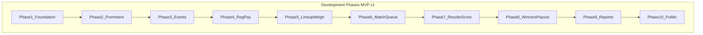

# Official Phase Deliverables — Derby Operations Digital Platform

## Current baseline (pre–Phase 1 completion)

The repo at [`e:\PROJECTS\PERSONAL\ZEEKER TECH\Mon\pitclash`](e:\PROJECTS\PERSONAL\ZEEKER TECH\Mon\pitclash) is an **admin auth shell**, not yet a derby ops platform.

| Area | Shipped | Gap |
|------|---------|-----|
| Auth | Login, first-admin bootstrap, session middleware, sign-out | Password reset, multi-user invite |
| Roles | Binary `admin` only (`app_role` enum) | Staff roles from doc §3 |
| Dashboard | Shell + placeholder home | Operational widgets, real routes |
| Audit | `audit_logs` table (insert-only RLS) | Write helper, admin read policy, viewer |
| Domain | None | Promoters through payouts |

**Phase 1 must finish foundation gaps before domain work scales safely** (especially: non-admin default role, RBAC framework, audit write/read path).

---

## Deliverable template (used in every phase)

Each phase below lists:

- **Exit criteria** — phase is done when these pass
- **Database** — migrations, enums, RLS
- **Features** — `features/{module}/` per [architecture.mdc](e:\PROJECTS\PERSONAL\ZEEKER TECH\Mon\pitclash\.cursor\rules\architecture.mdc)
- **App routes** — under `app/dashboard/` (admin) or `app/` (public)
- **Tests** — Vitest for schema/service; Playwright for user flows
- **Docs** — admin guide in `docs/admins/docs/` when organizer/staff workflows change; user guide in `docs/users/docs/` when player/public UX changes
- **Business phases covered** — cross-reference to your spec §4–§14

---

## Dev Phase 1 — Core Admin Foundation

**Business mapping:** Enables **System Owner** (doc §3); prerequisite for all business phases.

### Exit criteria

- System Owner can log in, manage users/roles, view audit trail, configure baseline settings
- All new users default to least privilege; admin promotion is explicit
- Sensitive mutations write to `audit_logs` and are readable by admins

### Database deliverables

| Deliverable | Details |
|-------------|---------|
| Extend `app_role` enum | Add: `system_owner`, `event_organizer`, `registration_staff`, `finance_staff`, `weighing_staff`, `matchmaker`, `result_recorder`, `promoter` (linked-user only), `public_viewer` (optional app account) |
| `permissions` + `role_permissions` | Granular action keys (e.g. `events.create`, `payments.record`) |
| Fix profile trigger | New auth users → default non-admin role; admin only via bootstrap/promotion |
| `system_settings` | Key/value store for org name, legal disclaimer acceptance, feature flags |
| Audit RLS | Admin SELECT on `audit_logs`; retain authenticated INSERT with `actor_id = auth.uid()` |

### Feature module deliverables

| Module | Files / capabilities |
|--------|---------------------|
| `features/users/` | List, invite, deactivate, assign role, link to profile |
| `features/roles/` or `lib/auth/permissions.ts` | `requirePermission()`, permission checks for actions |
| `features/audit/` | `writeAuditLog()` service; query helpers for admin viewer |
| `features/settings/` | Read/update system settings (server actions + service) |

### App route deliverables

| Route | Screen |
|-------|--------|
| `/dashboard` | Operational summary cards (placeholder counts OK initially: users, events later) |
| `/dashboard/users` | User list, invite, role assignment |
| `/dashboard/settings` | System settings form |
| `/dashboard/audit` | Filterable audit log viewer |
| Enable nav in [`lib/dashboard/nav.ts`](e:\PROJECTS\PERSONAL\ZEEKER TECH\Mon\pitclash\lib\dashboard\nav.ts) | Users, Settings, Audit |

### Tests

- Vitest: permission helper, settings schema, audit service
- E2E: admin invites user; non-admin denied dashboard; audit entry on user role change

### Docs

- Admin: user management and roles guide (new page)
- User: N/A

---

## Dev Phase 2 — Promoter Management

**Business mapping:** **Business Phase 1** — Promoter Management (doc §4)

### Exit criteria

- System Owner can CRUD promoters with or without login
- Optional “Give this promoter login access” creates/links user with `promoter` role
- Promoter history visible; commission fields stored for later settlement

### Database deliverables

| Table / object | Key columns |
|----------------|-------------|
| `promoters` | Per doc §20: `user_id` nullable, contact fields, `status`, `commission_type`, `commission_value`, `notes`, `created_by`, soft delete |
| RLS | System Owner full access; linked promoter read-only on own profile + assigned events (future-scoped) |

### Feature module: `features/promoters/`

| Deliverable | Description |
|-------------|-------------|
| `schema.ts` | Promoter CRUD + optional user-link Zod schemas |
| `service.ts` | Create internal-only vs create-with-login; link/unlink user; activate/deactivate/suspend |
| `queries.ts` | List, detail, event history (empty until Phase 3) |
| `actions.ts` | Server actions wired to permissions |
| `components/` | Promoter list, add/edit form with login checkbox |

### App routes

| Route | Screen |
|-------|--------|
| `/dashboard/promoters` | List + filters (status) |
| `/dashboard/promoters/new` | Add promoter |
| `/dashboard/promoters/[id]` | Edit, link user, commission, notes, event history tab |

### Tests

- Vitest: commission type validation; user-link rules (one user ↔ one promoter)
- E2E: create internal promoter; create promoter with login; deactivate promoter

### Docs

- Admin: promoter management guide

---

## Dev Phase 3 — Event Management

**Business mapping:** **Business Phase 2** — Event Setup (doc §5)

### Exit criteria

- Organizer/System Owner can create derby event in Draft, configure rules/prizes, optionally assign promoter
- Event status follows doc §5 flow through at least `Draft → Open → Registration Closed` (later phases extend)

### Database deliverables

| Table | Notes |
|-------|-------|
| `events` | Per doc §20 + `registration_deadline`, prize/scoring/tie-breaker fields |
| `event_rules` or JSON on `events` | Scoring system, draw rule, tie-breaker, weight range, cocks per entry |
| `prize_structures` | Percentage or fixed; linked 1:1 to event |
| `event_documents` | Optional permit uploads (Storage bucket + metadata) |
| Enums | `event_status`, `event_type`, `derby_type` |

### Feature module: `features/events/`

| Deliverable | Description |
|-------------|-------------|
| Event CRUD | Create/edit with validation against derby type and entry limits |
| Promoter assignment | Optional FK; house event type skips promoter |
| Status transitions | Service methods with audit + permission checks |
| Prize configuration | Embedded or related `prize_structures` |
| Document upload | Supabase Storage + metadata row |

### App routes

| Route | Screen |
|-------|--------|
| `/dashboard/events` | Event list with status badges |
| `/dashboard/events/new` | Create event wizard/form |
| `/dashboard/events/[id]` | Event detail hub (tabs stubbed for later phases) |
| `/dashboard/events/[id]/edit` | Rules, fees, schedule, prize, promoter |
| Enable Events nav | Remove “Soon” from [`nav.ts`](e:\PROJECTS\PERSONAL\ZEEKER TECH\Mon\pitclash\lib\dashboard\nav.ts) |

### Tests

- Vitest: status transition rules; prize structure validation
- E2E: create event, assign promoter, publish to Open

### Docs

- Admin: event setup guide
- User: N/A (registration is Phase 4)

---

## Dev Phase 4 — Registration and Payments

**Business mapping:** **Business Phase 3** Registration (doc §6) + **Business Phase 4** Payments (doc §7)

### Exit criteria

- Staff can register entries for an open event; approve/reject; track payment status
- Only Paid/approved entries eligible for lineup (enforced in Phase 5)
- All payment changes audited; refunds require approval

### Database deliverables

| Table | Notes |
|-------|-------|
| `entries` | Per doc §20 + registration/payment status enums |
| `payments` | Per doc §7; link to entry; receipt Storage path |
| `payment_audit` or use `audit_logs` | Required for payment mutations |

### Feature modules

| Module | Deliverables |
|--------|--------------|
| `features/entries/` | CRUD, entry number generation (unique per event), promoter referral, approval workflow |
| `features/payments/` | Record payment, partial/paid/refund, receipt upload, export CSV |

### App routes

| Route | Screen |
|-------|--------|
| `/dashboard/events/[id]/registrations` | Entry list, filters |
| `/dashboard/events/[id]/registrations/new` | Assisted registration |
| `/dashboard/events/[id]/payments` | Payment ledger, record payment modal |
| Event detail tab | Registrations + Payments |

### Tests

- Vitest: entry number uniqueness; payment balance; confirm-without-pay guard
- E2E: register entry → record payment → status Confirmed

### Docs

- Admin: registration and payment guide
- User: how to register (assisted/online if exposed later)

---

## Dev Phase 5 — Lineup and Weighing

**Business mapping:** **Business Phase 5** Lineup (doc §8) + **Business Phase 6** Weighing (doc §9)

### Exit criteria

- Confirmed entries submit full lineup (cock count = event rule)
- Weighing staff records official weights; only Verified cocks eligible for matching
- Duplicate band numbers blocked per event; post-verify edits require admin + reason

### Database deliverables

| Table | Notes |
|-------|-------|
| `lineups` / `rooster_records` | Cock number, band, declared weight, category, status |
| `weighings` | Official weight, pass/fail/for review, verified_by, timestamps |
| Event status hooks | `Ready for Weighing` transitions |

### Feature modules

| Module | Deliverables |
|--------|--------------|
| `features/lineups/` | Draft/submit/verify/reject; amendment with audit |
| `features/weighing/` | Record official weight, eligibility flag, lock verified lineup, weighing report query |

### App routes

| Route | Screen |
|-------|--------|
| `/dashboard/events/[id]/lineups` | Lineup management |
| `/dashboard/events/[id]/weighing` | Weighing station UI |
| `/dashboard/events/[id]/reports/weighing` | Weighing report (preview of Phase 9) |

### Tests

- Vitest: cock count validation; duplicate band; weight pass/fail rules
- E2E: submit lineup → weigh → verify → eligible flag set

### Docs

- Admin: lineup and weighing guide

---

## Dev Phase 6 — Matching and Fight Queue

**Business mapping:** **Business Phase 7** Matching (doc §10) + **Fight queue portion** of Phase 8 (doc §11)

### Exit criteria

- Matchmaker creates manual pairings with Meron/Wala, fight numbers, weights
- Validation: one cock per fight, no self-match, verified cocks only
- Match list lockable; fight queue shows Scheduled → Called → Ready

### Database deliverables

| Table | Notes |
|-------|-------|
| `matches` | Meron/Wala entry + cock FKs, weights, round, status |
| `match_status` enum | Draft → Confirmed → Locked → Ready for Fight |
| Event status | `Ready for Matching`, `Ongoing` |

### Feature module: `features/matches/`

| Deliverable | Description |
|-------------|-------------|
| Manual pairing UI | Select entries/cocks, assign sides |
| Fight order | Reorder fight numbers |
| Lock match list | Admin approval + audit on post-lock edits |
| Fight queue | List fights by status for fight-day |

### App routes

| Route | Screen |
|-------|--------|
| `/dashboard/events/[id]/matching` | Pairing board |
| `/dashboard/events/[id]/fight-queue` | Queue operations |
| Enable Fights nav | Event-scoped or global fight queue entry |

### Tests

- Vitest: pairing validation rules; lock immutability
- E2E: create matches → lock → queue shows fights

### Docs

- Admin: matching and fight queue guide

---

## Dev Phase 7 — Results and Scoring

**Business mapping:** **Results portion** of Business Phase 8 (doc §11) + **Business Phase 9** Scoring/Standings (doc §12)

### Exit criteria

- Result recorder submits results; verifier confirms before standings update
- Standings auto-recalculate (win/loss/draw/points per event rules)
- Live leaderboard visible to staff; tie detection works

### Database deliverables

| Table | Notes |
|-------|-------|
| `fight_results` | Result type, recorded_by, verified_by, status |
| `standings` | Per entry per event: W/L/D, points, rank, status |
| Triggers or service | Recompute standings on verified result |

### Feature modules

| Module | Deliverables |
|--------|--------------|
| `features/results/` | Record result, verification workflow, protest flag |
| `features/standings/` | Score engine, ranking logic, tie detection, optional override with approval |

### App routes

| Route | Screen |
|-------|--------|
| `/dashboard/events/[id]/results` | Result entry per fight |
| `/dashboard/events/[id]/standings` | Live standings table |
| Realtime (optional MVP+) | Channel `leaderboard:{eventId}` per [realtime.mdc](e:\PROJECTS\PERSONAL\ZEEKER TECH\Mon\pitclash\.cursor\rules\realtime.mdc) |

### Tests

- Vitest: scoring rules (win/draw/loss/no contest); ranking + tie-breaker
- E2E: record result → verify → standings update

### Docs

- Admin: results and scoring guide

---

## Dev Phase 8 — Winners, Payouts, Promoter Settlement, Announcement (internal)

**Business mapping:** **Phase 10** Winners (doc §13) + **Phase 11** Prizes/Payouts (doc §14) + **Phase 12** Promoter Settlement (doc §15) + **internal portion** of Phase 13 Announcement (doc §16)

### Exit criteria

- Winners finalized after all fights resolved; results read-only after lock
- Prize pool computed from entries, deductions, promoter commission rules
- Payouts recorded per rank; promoter settlement generated when event has promoter
- Internal winner announcement generated (public publish in Phase 10)

### Database deliverables

| Table | Notes |
|-------|-------|
| `event_finalization` | Locked timestamp, approved_by |
| `prize_payouts` | Per doc §11 payout fields |
| `promoter_settlements` | Per doc §20; skipped when no promoter |

### Feature modules

| Module | Deliverables |
|--------|--------------|
| `features/winners/` | Auto-detect top ranks, tie-breaker application, finalize + lock |
| `features/prizes/` | Pool calculation, rank distribution, split tied prizes |
| `features/payouts/` | Record payout, receipt reference |
| `features/promoter-settlements/` | Commission, advances, expenses, settle/dispute |

### App routes

| Route | Screen |
|-------|--------|
| `/dashboard/events/[id]/winners` | Finalization workflow |
| `/dashboard/events/[id]/payouts` | Prize payout ledger |
| `/dashboard/events/[id]/promoter-settlement` | Settlement (hidden if no promoter) |
| `/dashboard/events/[id]/announcement` | Generate internal announcement text |

### Tests

- Vitest: prize pool math; tied winner split; settlement balance
- E2E: finalize winners → record payout → settlement marked settled

### Docs

- Admin: winners, payouts, promoter settlement guide
- User: N/A until Phase 10 public winners page

---

## Dev Phase 9 — Reports and Compliance

**Business mapping:** **Business Phase 14** Final Reports and Audit Trail (doc §17) + **Compliance** (doc §25)

### Exit criteria

- All eight report types exportable (PDF and/or CSV)
- Audit trail report covers actions listed in doc §17
- Legal authorization checkbox on event; terms/disclaimer in settings

### Report deliverables (each: query + export + admin UI)

| Report | Source modules |
|--------|------------------|
| Event summary | events, winners |
| Promoter | promoters, settlements, referrals |
| Registration | entries |
| Weighing | weighings |
| Match | matches |
| Result | fight_results |
| Financial | payments, payouts, settlements |
| Audit trail | audit_logs |

### App routes

| Route | Screen |
|-------|--------|
| `/dashboard/events/[id]/reports` | Report hub |
| `/dashboard/reports/promoters` | Cross-event promoter report |
| `/dashboard/audit` | Enhanced filters (from Phase 1) |

### Tests

- Vitest: report query aggregations
- E2E: generate financial report for completed event

### Docs

- Admin: reports and compliance guide

---

## Dev Phase 10 — Public Display and Promoter Portal (MVP v1 finish)

**Business mapping:** **Public portion** of Phase 13 (doc §16) + **Promoter portal** (doc §21, optional login) + selected **Future Enhancements** (doc §26) scoped for v1

### Exit criteria

- Public viewer can see published events, match list, standings, winners without auth
- No private data (contact, payment, settlement) exposed
- Linked promoters can log in to read-only portal for assigned events
- Display-board friendly public standings page

### Public app routes (no auth)

| Route | Content |
|-------|---------|
| `/events` | Public event list |
| `/events/[slugOrId]` | Event details (if public) |
| `/events/[id]/matches` | Published match list |
| `/events/[id]/standings` | Live/final standings |
| `/events/[id]/winners` | Published winners |

### Promoter portal routes (auth: `promoter` role)

| Route | Content |
|-------|---------|
| `/portal` | Promoter dashboard |
| `/portal/events` | Assigned events |
| `/portal/events/[id]` | Referred entries count, standings, settlement summary (read-only) |

### Feature modules

| Module | Deliverables |
|--------|--------------|
| `features/public/` | Publish flags on event; public queries with RLS-safe views |
| `features/promoter-portal/` | Scoped queries — assigned events only |

### Database / security

- Public read policies or `public_*` views excluding PII
- `events.is_public`, per-field publish flags per doc §16 table

### Tests

- E2E: public page shows standings; does not show owner phone
- E2E: promoter sees only assigned event settlement summary

### Docs

- User: viewing public results and schedules
- Admin: publishing results and public visibility settings

---

## Cross-phase deliverables (every phase)

These apply continuously, not once:

| Category | Requirement |
|----------|-------------|
| **Audit** | Every mutation in `service.ts` calls `writeAuditLog()`; overrides require `reason` |
| **RLS** | Role-scoped policies on every new table; financial tables restricted to finance/admin |
| **Soft delete** | `deleted_at` on business entities per doc §22 |
| **Breakdown** | `.cursor/breakdowns/YYYYMMDD-HHMM-{slug}-breakdown.md` per implementation |
| **Layering** | Client → Action → Zod → Permission → Service → Supabase → Audit → revalidate |

---

## MVP v1 summary matrix

| Dev Phase | Business Phases | MVP v1 |
|-----------|-----------------|--------|
| 1 Foundation | (System Owner) | Yes |
| 2 Promoters | 1 | Yes |
| 3 Events | 2 | Yes |
| 4 Reg + Pay | 3, 4 | Yes |
| 5 Lineup + Weigh | 5, 6 | Yes |
| 6 Match + Queue | 7, 8 (partial) | Yes |
| 7 Results + Score | 8, 9 | Yes |
| 8 Winners + Payout + Settlement | 10, 11, 12, 13 (internal) | Yes |
| 9 Reports | 14 | Yes |
| 10 Public + Portal | 13 (public), §21 portal | Yes |

**Explicitly out of MVP v1** (doc §23): betting, odds, streaming, native mobile app, AI matching, QR check-in, SMS, offline mode, digital signatures.

---

## Suggested implementation order (first 3 sprints)

1. **Complete Phase 1 gaps** — roles, permissions, users UI, audit read/write, settings (unblocks safe multi-user)
2. **Phases 2–3** — promoters + events (establishes core entity graph)
3. **Phase 4** — registration + payments (first end-to-end organizer workflow)

Phases 5–10 follow sequentially; each phase should ship with Vitest + at least one Playwright happy path before the next phase starts.

---

## Navigation evolution

Update [`lib/dashboard/nav.ts`](e:\PROJECTS\PERSONAL\ZEEKER TECH\Mon\pitclash\lib\dashboard\nav.ts) as phases land:

| Phase | Nav additions |
|-------|---------------|
| 1 | Users, Settings, Audit |
| 2 | Promoters |
| 3 | Events (enable) |
| 6 | Fights / Fight Queue (enable) |
| 9 | Reports (top-level or under Events) |
| 10 | Public site linked from marketing [`app/page.tsx`](e:\PROJECTS\PERSONAL\ZEEKER TECH\Mon\pitclash\app\page.tsx) |

Event-scoped sub-nav (Registrations, Payments, Lineups, etc.) lives under `/dashboard/events/[id]/…` to keep the sidebar stable.
