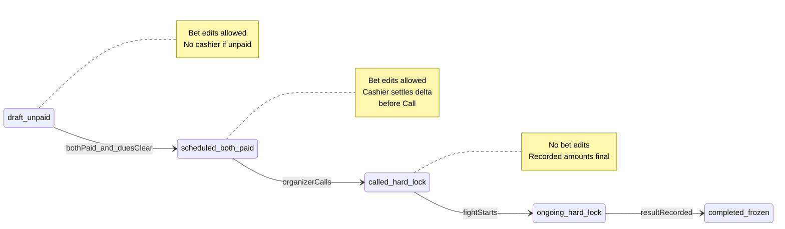

# Post-Payment Palitada Change Policy

## Current behavior (baseline)

ClashPoint already separates **matching** from **cashier collection**:

- Matchmaker creates match with Meron/Wala palitada on the [matching board](features/matches/components/matching-board-client.tsx); amounts live in `match_bets.amount`.
- Cashier collects per side via `BET-` barcode ([cashier terminal](docs/users/docs/cashier-terminal.md)).
- When both sides are `paid` **and** entry dues are zero, [tryPromoteMatchToQueue](features/matches/promotion.ts) sets `status=locked`, `queue_status=scheduled`.
- **No bet edit API exists today.** [canEditMatchBets](features/matches/utils.ts) only allows edits when match is `draft|for_review|confirmed` and **all** bets are `unpaid` — but it is unused outside tests.
- Refund resets a side to `unpaid` and can demote a `scheduled` match back to `draft`; refund is blocked once queue is `called|ready|ongoing`.



---

## Recommended restriction matrix

Your choices: **independent Meron/Wala amounts**, **hard lock at Called**.

| Lifecycle gate | `queue_status` | Palitada edit | Cashier required | Queue / Call |
|---|---|---|---|---|
| **Pre-payment** | `null` | Yes — edit either/both sides freely | No | Cannot queue until both paid |
| **One side paid** | `null` | Yes — per-side rules below | Only for paid side if its amount changes | Cannot queue until both paid + settled |
| **Queued, not at pit** | `scheduled` | Yes — per-side independent edit | Yes — settle delta per affected side | **Block Call** until all sides settled |
| **At pit** | `called`, `ready`, `ongoing` | **No** | N/A | Proceed on recorded amounts |
| **After fight** | any + `completed` | **No** | N/A | Frozen for results/payout |

### Per-side rules (independent amounts)

When a side’s new amount differs from what was collected:

| Delta | Paid side behavior | Unpaid side behavior |
|---|---|---|
| **Increase** | Mark side `adjustment_pending`; cashier collects top-up | Update `amount`; collect full new amount at cashier |
| **Decrease** | Mark side `adjustment_pending`; cashier issues partial refund | Update `amount`; collect full new amount at cashier |
| **No change** | No action | No action |

**Match-level gates:**

- **Promote to queue** (`tryPromoteMatchToQueue`): require each side `payment_status=paid` **and** `collected_amount === agreed_amount` (no pending adjustment).
- **Advance to Called** (`updateFightQueueStatus` scheduled → called): same settlement check — this is the operational deadline before handlers commit at the pit.
- **Hard lock**: reject any bet amount mutation when `queue_status ∈ {called, ready, ongoing}` or `status=completed`.

This gives staff a **correction window while the match is still `scheduled`**, without forcing a trip to the cashier *during* the fight. Renegotiation at the pit is an operational “too late” case — the system enforces that by blocking Call until settled, and blocking edits after Call.

---

## Settlement model (keep cashier as source of financial truth)

Avoid silently changing `match_bets.amount` without a ledger row. Introduce explicit settlement tracking per side:

**Option A (recommended — minimal schema):**

Add to `match_bets`:

- `collected_amount numeric` — snapshot of cash received (set on payment, adjusted on partial refund/top-up)
- `adjustment_status enum`: `none | pending_increase | pending_decrease` (or derive from `amount !== collected_amount`)

**Cashier flows (extend existing BET- scan):**

1. **Top-up** (`recordMatchBetTopUp`): insert supplementary `payments` row (`payment_category: match_bet_adjustment` or reuse `match_bet` with link to original), post RF `collection`, bump `collected_amount`.
2. **Partial refund** (`recordMatchBetPartialRefund`): partial refund against original payment, RF `refund`, lower `collected_amount`.
3. Clear `adjustment_status` when `collected_amount === amount`.

Reuse patterns from [recordMatchBetPayment](features/payments/service.ts) and [revertPalitadaPaymentSideEffects](features/matches/promotion.ts) — do **not** full-refund to `unpaid` for a simple amount decrease (that demotes the whole match unnecessarily).

**Matching staff flow:**

- New action `updateMatchBetAmountsAction` (permission: `matches.manage`):
  - Validates `canEditMatchBetSide(match, side)` (not called+, not completed)
  - Updates `match_bets.amount` for requested side(s) only
  - Sets adjustment flags where `amount !== collected_amount`
  - Audit: `match_bet.amount_updated` with old/new values
  - If match was `scheduled` and now unsettled → optionally demote to `draft` **or** keep in queue with “unsettled” badge (recommend: **stay scheduled**, block Call only — avoids fight-order churn)

---

## UX recommendations

### Matching board ([matching-board-client.tsx](features/matches/components/matching-board-client.tsx))

- **Awaiting payment list**: show “Edit palitada” when no side is paid; once any side is paid, show “Adjust palitada” (per-side form).
- **Fight queue (`scheduled`)**: show badges per side:
  - `Paid` / `Unpaid`
  - `Adjustment due: +₱X collect` / `Refund due: ₱X`
- **Call button**: disable with message *“Settle palitada adjustments at Cashier Terminal before calling this fight.”*
- Print **updated BET- slips** after amount change (barcode unchanged; amount on slip must match `match_bets.amount`).

### Cashier terminal ([cashier-client.tsx](features/payments/components/cashier-client.tsx))

When scanning `BET-` for a paid side with pending adjustment:

- Show **current agreed amount**, **collected so far**, **delta** (collect or refund)
- Primary action: “Collect additional palitada” or “Refund palitada difference”
- Do not require handlers to leave the pit area if a **roving device** runs the same Cashier Terminal — same backend, different physical location (document as ops guidance, not a new product surface).

### What staff should do at the pit (policy copy)

> Palitada can be changed only while the fight is **Scheduled** and not yet **Called**. After Call, amounts are final. If owners renegotiate, settle at Cashier Terminal **before** the organizer calls the fight.

---

## Utils to implement (replace unused `canEditMatchBets`)

Extend [features/matches/utils.ts](features/matches/utils.ts):

```ts
// Pseudocode — independent sides, hard lock at called+
canEditMatchBetAmount(queueStatus, matchStatus): boolean
isMatchBetSideSettled(amount, collectedAmount, paymentStatus): boolean
canPromoteOrCallMatch(meron, wala): boolean // paid + settled + dues clear
getMatchBetAdjustmentDelta(amount, collectedAmount): number
```

Wire these into service boundaries (not UI-only checks).

---

## Implementation phases

### Phase 1 — Policy gates (no edit UI yet)

- Add settlement helpers + hard-lock checks in [features/matches/service.ts](features/matches/service.ts) and [features/matches/promotion.ts](features/matches/promotion.ts)
- Block `scheduled → called` in `updateFightQueueStatus` when any side unsettled
- Tighten `tryPromoteMatchToQueue` to require settlement equality
- Vitest: [features/matches/utils.test.ts](features/matches/utils.test.ts), promotion tests

### Phase 2 — Bet amount updates + cashier delta

- Migration: `match_bets.collected_amount`, optional `adjustment_status`
- `updateMatchBetAmountsAction` + service
- `recordMatchBetTopUp` / `recordMatchBetPartialRefund` in payments service
- Update [lib/supabase/database.types.ts](lib/supabase/database.types.ts)
- Vitest for payments + matches services

### Phase 3 — UI + docs

- Matching board: adjust form, settlement badges, disabled Call
- Cashier: delta panel on BET- scan
- User doc: extend [cashier-terminal.md](docs/users/docs/cashier-terminal.md); admin doc for match-day correction workflow
- E2E: extend [e2e/matching-palitada.spec.ts](e2e/matching-palitada.spec.ts) (currently skipped) — create → pay both → adjust one side → cashier settle → call

---

## What we explicitly do NOT build (per your choices)

- No bet edits after **Called** (even admin override)
- No “defer settlement until after fight” — avoids RF/cash drawer drift and payout disputes
- No symmetric-only constraint — Meron and Wala can differ, but each side settles independently

---

## Risk notes

| Risk | Mitigation |
|---|---|
| Slip shows old amount after edit | Reprint prompt after adjustment; cashier shows authoritative delta |
| Match demoted on partial refund today | Use partial refund/top-up instead of full `revertPalitadaPaymentSideEffects` for decreases |
| Organizer calls fight before settlement | Disable Call + visible unsettled badges |
| Two cashiers settle same delta | Idempotent payment rows; reject if already settled |

---

## Key files

| Area | Files |
|---|---|
| Rules | [features/matches/utils.ts](features/matches/utils.ts) |
| Queue / demotion | [features/matches/promotion.ts](features/matches/promotion.ts), [features/matches/service.ts](features/matches/service.ts) |
| Cashier | [features/payments/service.ts](features/payments/service.ts), [features/payments/components/cashier-client.tsx](features/payments/components/cashier-client.tsx) |
| UI | [features/matches/components/matching-board-client.tsx](features/matches/components/matching-board-client.tsx) |
| Schema/DB | [features/matches/schema.ts](features/matches/schema.ts), new migration under `supabase/migrations/` |
