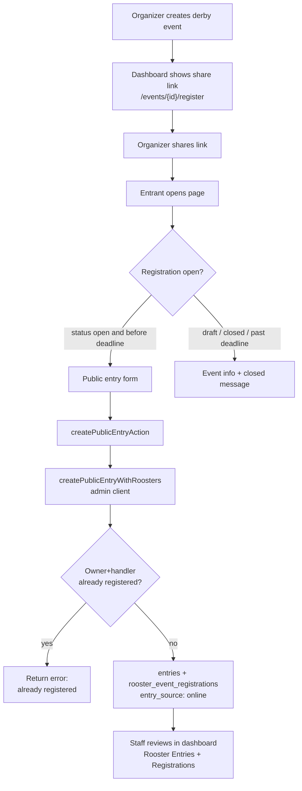

# Public Derby Registration Page

## Current state

- Staff-only intake exists at [`app/dashboard/events/[id]/rooster-entries/new/page.tsx`](app/dashboard/events/[id]/rooster-entries/new/page.tsx) via [`features/entries/`](features/entries/) (`entries.manage` permission).
- Public event pages at [`app/events/[id]/page.tsx`](app/events/[id]/page.tsx) are **read-only** and require `is_public = true` ([`features/public/queries.ts`](features/public/queries.ts)).
- `entry_source: 'online'` exists in DB/schema but is unused.
- No competitor/player auth role exists — anonymous submission fits the current stack.
- [`createEntry()`](features/entries/service.ts) already gates on `status === 'open'` and `max_entries`, but does **not** check `registration_deadline` yet.

## Target behavior



**Your choices (locked in):**
- **Anonymous** — no sign-in required
- **Direct link** — works for any non-deleted derby event by UUID (does not require `is_public`); submissions only when `status === 'open'` and before `registration_deadline`
- **No duplicate registrations** — same **owner + handler** pair cannot register twice for the same event, even if the prior entry was rejected or cancelled

---

## 1. Registration URL and dashboard share link

**URL pattern:** `/events/{eventId}/register` (UUID, no slug migration in this pass)

**Dashboard UX** — new component on derby event detail ([`app/dashboard/events/[id]/page.tsx`](app/dashboard/events/[id]/page.tsx)):

- Panel: **Registration link** with full URL and **Copy link** button
- Visible for all derby events immediately after creation (including `draft`)
- Short helper text: link is shareable now; submissions accepted only when event is **Open** and before deadline
- Optional: same panel on event edit page footer for discoverability

Use `window.location.origin` client-side or a small env-based helper for SSR display (`NEXT_PUBLIC_SITE_URL` if already present, else relative path shown with copy using full origin in client component).

---

## 2. Public registration page

**New route:** [`app/events/[id]/register/page.tsx`](app/events/[id]/register/page.tsx)

**New query:** `getPublicRegistrationEvent(eventId)` in [`features/public/queries.ts`](features/public/queries.ts)

- Select derby events where `deleted_at IS NULL` and `event_type = 'derby'`
- **Do not** require `is_public` (unlisted direct-link access)
- Return fields needed for the page: name, venue, event_date, status, registration_deadline, entry_fee, cocks_per_entry, registration_rules, weight limits (via existing [`resolveEventWeightLimitsGrams`](features/entries/weight-utils.ts)), `require_rooster_entry_approval`, `max_entries`

**Extend types** in [`features/public/types.ts`](features/public/types.ts): `PublicRegistrationEvent`

**Page states:**

| Condition | UI |
|-----------|-----|
| Not found / not derby | `notFound()` |
| Not registration-open | Event summary + rules + **Registration closed** (reason: not open yet / deadline passed / registration_closed status) |
| Open + before deadline | Registration form |

**Nav:** Add **Register** tab to [`features/public/components/public-event-nav.tsx`](features/public/components/public-event-nav.tsx) when `isRegistrationOpen(event)` is true (same helper as form gate).

---

## 3. Public registration form (UI)

**New component:** `features/public/components/public-entry-form-client.tsx`

Reuse field components from entries where possible:
- [`ContactNumberField`](features/entries/components/contact-number-field.tsx)
- [`RoosterEntrySlots`](features/entries/components/rooster-entry-slots.tsx)

**Public form fields** (subset of staff form — no owner picker, promoter, or entry source):

| Field | Required |
|-------|----------|
| Owner / game farm name | Yes |
| Handler name | No |
| Contact number (+63) | No |
| Email | No |
| Per-rooster: name, band #, weight, color marking | Yes (name/band/weight) |
| Entry notes | No |

Hidden: `eventId`, forced `entrySource = online`.

**Success UX:** After submit, show confirmation inline (entry number, “submitted — staff will review if approval required”) via `useActionState`; do not redirect to dashboard.

Styling: match public layout in [`app/events/layout.tsx`](app/events/layout.tsx) (Chakra `Stack`, not dashboard `PageStack`).

---

## 4. Server action and service (admin-client writes)

**Why admin client:** Staff `createEntry` uses [`createClient()`](lib/supabase/server.ts) + RLS (`entries.manage`). Anonymous users have no insert policy. Follow existing pattern from [`features/public/queries.ts`](features/public/queries.ts) and [`features/auth/service.ts`](features/auth/service.ts): **server-only** `createAdminClient()` after strict Zod + business-rule validation.

**New files:**

| File | Responsibility |
|------|----------------|
| [`features/public/schema.ts`](features/public/schema.ts) | `createPublicEntrySchema` — wraps/reuses [`entryMetadataSchema`](features/entries/schema.ts) + rooster slots; forces `entrySource: 'online'`; strips staff-only fields |
| [`features/public/actions.ts`](features/public/actions.ts) | `createPublicEntryAction` — parse FormData, Zod, call service, revalidate `/events/{id}/register` |
| [`features/public/service.ts`](features/public/service.ts) | `createPublicEntryWithRoosters()` — admin-client inserts |

**Service logic** (mirror staff path, minimal duplication):

1. Load event; assert `event_type === 'derby'`
2. Call shared `isRegistrationOpen(event)` helper (new in [`features/events/utils.ts`](features/events/utils.ts))
3. Call `assertOwnerHandlerNotAlreadyRegistered()` — see §4b
4. Enforce `max_entries`, band uniqueness, weight policy (reuse [`validateRoosterAgainstPolicy`](features/entries/policy-validation.ts) weight-only path from [`createEntryAction`](features/entries/actions.ts))
5. Insert `entries` with `entry_source: 'online'`, `created_by: null`, `registration_status: 'submitted'`
6. For each cock → insert registry + `rooster_event_registrations` + `weighings` (same shape as [`createRoosterForEntry`](features/weighing/service.ts))
7. Audit via admin client: `action: 'entry.created'`, `actor_id: null`, `newValues` includes `source: 'online'`

**Refactor (small, targeted):** Extract `isRegistrationOpen()` and optionally `assertRegistrationAccepting(event)` into [`features/events/utils.ts`](features/events/utils.ts); call from both staff [`createEntry`](features/entries/service.ts) and public service so deadline is enforced consistently.

---

## 4b. Duplicate registration prevention

**Rule (locked in):** Block a new entry when the same **owner name + handler name** pair already exists for that event — including entries with `registration_status` of `rejected` or `cancelled`. Soft-deleted entries (`deleted_at IS NOT NULL`) are ignored.

**Normalization** (shared helper in [`features/entries/utils.ts`](features/entries/utils.ts) or [`features/entries/service.ts`](features/entries/service.ts)):

```ts
normalizeEntryIdentity(name: string | null | undefined): string | null
// trim → collapse internal whitespace → lowercase
// empty string → null (handler optional)
```

**Match logic:** Two entries are duplicates when:

- `normalizeEntryIdentity(ownerName)` values are equal, **and**
- `normalizeEntryIdentity(handlerName)` values are equal (both `null` counts as a match — e.g. two entries with same owner and no handler are blocked)

**Guard:** `assertOwnerHandlerNotAlreadyRegistered(eventId, ownerName, handlerName)` in [`features/entries/service.ts`](features/entries/service.ts)

- Query `entries` for `event_id` + non-deleted rows
- Compare normalized owner + handler in application code (or SQL `lower(trim(...))` + `coalesce` in query)
- Return user-facing error: *"An entry for this owner and handler is already registered for this event."*

**Apply in both paths:**

| Path | When |
|------|------|
| Staff [`createEntry()`](features/entries/service.ts) | Before insert — prevents staff from accidentally encoding duplicates |
| Public [`createPublicEntryWithRoosters()`](features/public/service.ts) | Before insert — primary abuse prevention |

**UI:** Surface the error via `useActionState` on the public form (same pattern as other validation errors). No separate client-side pre-check required for MVP.

**Tests** (add to Vitest + E2E):

- Same owner + same handler → second submit fails
- Same owner + different handler → allowed
- Prior entry `rejected` → second submit still fails (`block_always`)
- Empty handler on both entries → treated as duplicate pair

**No DB unique index in this pass** — app-level check first; note race-condition risk (two simultaneous submits) in breakdown; optional follow-up partial unique index on `(event_id, normalized_owner, normalized_handler)`.

**No new RLS migration** in this pass — all public writes stay server-side behind the action. Document rate limiting / CAPTCHA as a follow-up in breakdown.

---

## 5. Staff workflow (unchanged, but visible)

Online entries appear in existing dashboard lists with source **Online** ([`ENTRY_SOURCE_LABELS`](features/entries/schema.ts) already maps `online`).

Organizers continue review under **Registrations** tab when `require_rooster_entry_approval` is enabled — no change to [`features/registrations/`](features/registrations/) workflow required for MVP.

---

## 6. Tests

**Vitest** (required per rules — schema + service):

- [`features/public/schema.test.ts`](features/public/schema.test.ts) — public schema rejects staff fields, forces `online`
- [`features/events/utils.test.ts`](features/events/utils.test.ts) or extend existing — `isRegistrationOpen` cases (open + deadline, past deadline, wrong status)
- [`features/public/service.test.ts`](features/public/service.test.ts) — mock admin client; happy path + closed event + max entries + duplicate owner+handler rejection
- [`features/entries/service.test.ts`](features/entries/service.test.ts) — extend with duplicate guard cases (or dedicated `entries/utils.test.ts` for normalization)

**E2E** (required — form submit + validation):

- [`e2e/public-registration.spec.ts`](e2e/public-registration.spec.ts)
  - Seed/create derby event in `open` status
  - Visit `/events/{id}/register`
  - Submit valid entry → success message
  - Submit again with same owner + handler → error shown, no second entry
  - Visit when `draft` → closed message, no submit

---

## 7. Documentation and breakdown

| Audience | File |
|----------|------|
| Organizers | [`docs/users/docs/registering-for-a-derby.md`](docs/users/docs/registering-for-a-derby.md) — how to use the share link, what entrants fill in; note one registration per owner+handler pair |
| Operators | [`docs/admins/docs/event-registration-admin.md`](docs/admins/docs/event-registration-admin.md) — extend sibling or new page: share link on event detail, reviewing online entries (in-app paths only, no CLI) |

Update `sidebars.ts` in both nested doc repos.

Create breakdown: `.cursor/breakdowns/20260712-HHMM-public-derby-registration-breakdown.md`

---

## Key files to touch

```
app/events/[id]/register/page.tsx          (new)
app/dashboard/events/[id]/page.tsx           (share link panel)
features/public/
  queries.ts, types.ts, schema.ts, actions.ts, service.ts
  components/public-entry-form-client.tsx
  components/public-event-nav.tsx          (Register tab)
features/events/
  utils.ts                                   (isRegistrationOpen)
  components/registration-share-link.tsx     (new, dashboard)
features/entries/
  service.ts                                 (deadline + duplicate guard in staff path)
  utils.ts                                   (normalizeEntryIdentity — new or extend)
e2e/public-registration.spec.ts            (new)
```

---

## Out of scope (defer)

- Event slugs / friendly URLs
- Sign-in / competitor accounts
- Online payment at registration
- Public edit/cancel of submitted entries
- Rate limiting / CAPTCHA (note in breakdown)

## Deploy

No Supabase migration required. Deploy app code only; run `npm run build` to verify types.
