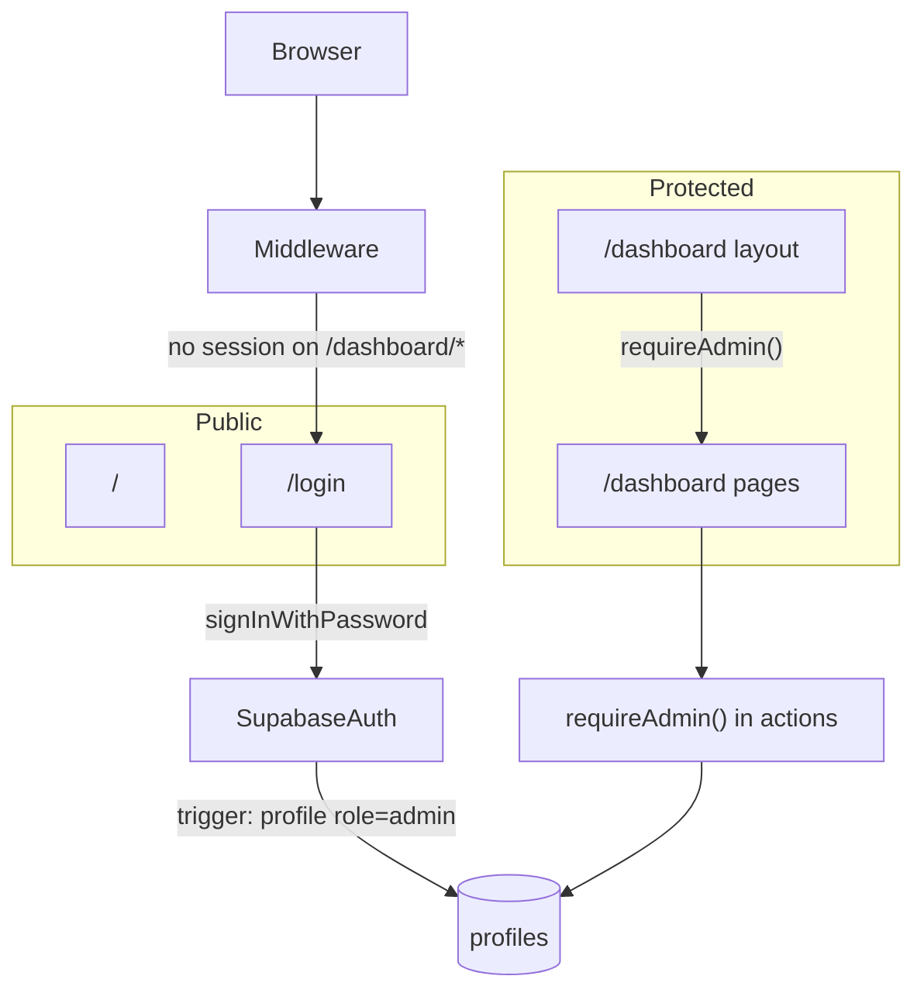

# RBAC and Login-Only Auth Plan

## Clarification: where organizer/player came from

Those roles were **not** from your request. They appeared because:

- ClashPoint workspace rules ([`e2e-testing.mdc`](.cursor/rules/e2e-testing.mdc), [`documentation.mdc`](.cursor/rules/documentation.mdc)) describe a future **player / organizer / admin** split for event/fight features
- The exploration pass surfaced that template and I carried it into the plan as “future extensibility”

**Your model is different and simpler:**

- **One role:** `admin` (stored on `profiles.role`, default on provision)
- **No registration** — login only; users created by you (Dashboard / seed)
- **Mixed routes:** `/` public, `/dashboard/*` requires signed-in admin
- **No organizer/player** in this plan or schema design

---

## Current state

Supabase SSR exists ([`lib/supabase/server.ts`](lib/supabase/server.ts), [`middleware.ts`](middleware.ts)). [`lib/auth/index.ts`](lib/auth/index.ts) has `getUser()` / `requireUser()` but no `/login`, no profiles, no guards. Signup is enabled in [`supabase/config.toml`](supabase/config.toml).

---

## Target model



| Decision | Choice |
|----------|--------|
| Role | **`admin` only** — `profiles.role` defaults to `admin` |
| Registration | **Disabled** — no signup UI or action |
| Public routes | `/`, `/login` |
| Protected routes | `/dashboard/*` |
| Auth store | `public.profiles.role` (not JWT `user_metadata`) |

---

## 1. Database migration

File: `supabase/migrations/<timestamp>_profiles_admin_role.sql`

- `create type public.app_role as enum ('admin');`
- `public.profiles`:
  - `id uuid primary key references auth.users(id) on delete cascade`
  - `role app_role not null default 'admin'`
  - `display_name text`, `created_at`, `updated_at`
- Trigger on `auth.users` insert → create profile with `role = 'admin'`
- Helpers: `get_user_role()`, `is_admin()`
- RLS: users read/update own profile (`display_name` only); no client insert (trigger only)

No enum values or policies for other roles.

---

## 2. Disable signup

[`supabase/config.toml`](supabase/config.toml):

- `[auth] enable_signup = false`
- `[auth.email] enable_signup = false`

Also disable signup on hosted Supabase (documented in breakdown, not admin Docusaurus doc).

Users provisioned via Dashboard → Authentication → Add user (or local seed for dev/E2E).

---

## 3. Auth helpers — [`lib/auth/`](lib/auth/)

| File | Purpose |
|------|---------|
| `types.ts` | `AppRole = 'admin'`, `Profile` |
| `queries.ts` | `getProfile(userId)` |
| `get-profile.ts` | `getProfileForUser()` |
| `require-role.ts` | `requireAdmin()` — must be signed in with `profiles.role = 'admin'` |

Export from `lib/auth/index.ts`.

Future Server Actions: `Zod → requireAdmin() → service → Supabase`.

---

## 4. Auth feature — [`features/auth/`](features/auth/)

- `schema.ts` — email + password Zod schema
- `actions.ts` — `signInAction` (redirect `/dashboard` or `redirectTo`), `signOutAction`
- `components/login-form.tsx`

No signup action. No registration links.

---

## 5. Routes and middleware

**Public**

- [`app/page.tsx`](app/page.tsx) — unchanged, public landing
- `app/login/page.tsx` — if already admin → redirect `/dashboard`

**Protected**

- `app/dashboard/layout.tsx` — `requireAdmin()`
- `app/dashboard/page.tsx` — minimal signed-in shell

**Middleware** ([`middleware.ts`](middleware.ts))

- `/dashboard/*` without session → `/login?redirectTo=...`
- `/login` with session → `/dashboard`
- Session refresh unchanged; no DB role checks in middleware

**Removed from plan:** `/unauthorized` for “non-admin roles” — not applicable while only `admin` exists. If profile missing or role mismatch, redirect `/login` or show generic error.

---

## 6. Dev provisioning and E2E

- Breakdown documents: create user in Supabase Dashboard, apply migration, login flow
- E2E env: `PLAYWRIGHT_ADMIN_EMAIL`, `PLAYWRIGHT_ADMIN_PASSWORD`
- [`e2e/auth-login.spec.ts`](e2e/auth-login.spec.ts): login → `/dashboard`; unauthenticated `/dashboard` → `/login`; bad password → error
- [`e2e/fixtures/auth.ts`](e2e/fixtures/auth.ts): shared login helper

---

## 7. Types

Generate `lib/supabase/database.types.ts` after migration.

---

## 8. Documentation

- **Admin:** [`docs/admins/docs/user-access-admin.md`](docs/admins/docs/user-access-admin.md) — sign in to Dashboard, accounts provisioned by organization, no self-registration (in-app language only, no CLI)
- **User doc:** N/A
- **Breakdown:** migration, hosted signup disable, manual + Playwright test steps

---

## Out of scope

- Organizer, player, or any multi-role hierarchy
- Public “player” personas or role-gated public pages
- In-app user invite / role management UI
- OAuth / magic link
- `/admin` route (use `/dashboard`)

---

## Suggested commit

```
Add admin login and dashboard access control

Profiles default to admin, signup disabled, login-only flow, and /dashboard protection.
```

## Implementation order

1. Migration (profiles + admin role + trigger + RLS)
2. Disable signup in config
3. `lib/auth/*` + generated types
4. `features/auth/*`
5. `app/login`, `app/dashboard/*`, middleware
6. E2E specs + fixtures
7. Admin doc + breakdown
