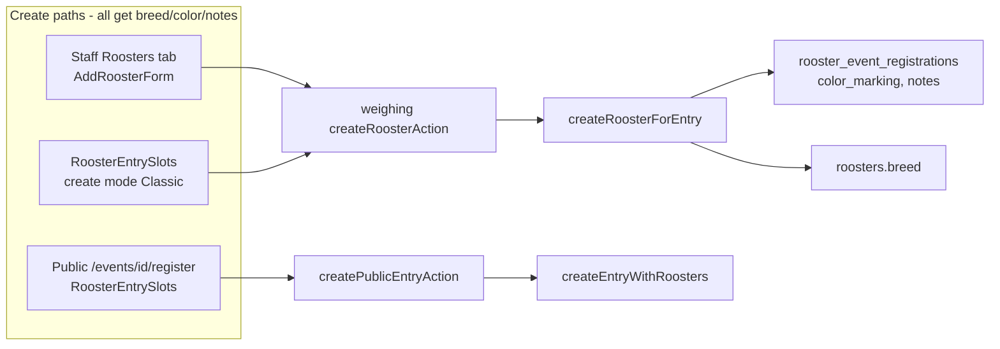

# Rooster breed, color, and notes (required on add)

## Current state

| Field | DB column | Create UI today | Validation |
|-------|-----------|-----------------|------------|
| **Breed** | `roosters.breed` | Edit entry only (`RoosterProfileFields`); missing from staff **Add rooster** and create slots | Optional |
| **Color** | `rooster_event_registrations.color_marking` | Free-text `ReferenceValueCombobox` in [`rooster-entry-slots.tsx`](features/entries/components/rooster-entry-slots.tsx) | Optional |
| **Notes** | `rooster_event_registrations.notes` | Textarea in slots; missing from staff **Add rooster** | Optional |

Staff add flow ([`event-roosters-client.tsx`](features/event-roosters/components/event-roosters-client.tsx) `AddRoosterForm`) only collects band, optional weight, and handler — the main gap.

Public derby registration already uses `RoosterEntrySlots` but defers breed to edit (helper text at line 235).



## UX design

### Breed
- Reuse existing [`ReferenceValueCombobox`](features/reference-values/components/reference-value-combobox.tsx) (`kind="breed"`, `required`).
- Examples: Talisayon, Buyugon — searchable catalog + “Add New”.
- Stored on linked registry rooster via existing `catalogReferenceValues` + `createRooster` path in [`weighing/service.ts`](features/weighing/service.ts).

### Color
- New client component **`RoosterColorField`** in `features/entries/components/rooster-color-field.tsx`:
  - `NativeSelect`: **Black**, **Red**, **Other**
  - When **Other** is selected, show a required text input (max 200 chars)
  - Emit a single hidden `colorMarking` value (e.g. `"Black"`, `"Red"`, or custom text)
  - For edit defaults: if stored value is Black/Red, select preset; otherwise preset = Other + text prefilled
- Replace `ReferenceValueCombobox` for color on entry rooster forms (preset UX is intentional; custom “Other” values still cataloged server-side via existing `catalogReferenceValues`).

### Notes
- Required `Textarea` per rooster (max 2000), on both create slots and staff add form.

### Constants
- Add `ROOSTER_COLOR_PRESETS` and a small `resolveRoosterColorMarking(preset, otherText)` helper in e.g. [`features/entries/rooster-color.ts`](features/entries/rooster-color.ts) (used by Zod + form parsing + Vitest).

## Validation (Zod)

Update [`features/entries/schema.ts`](features/entries/schema.ts):

1. Add `requiredText(max, message)` helper (distinct from optional `optionalText`).
2. Extend **`roosterEntryItemSchema`**:
   - `breed`: `requiredText(100, 'Breed is required')`
   - `colorMarking`: refine via `resolveRoosterColorMarking` — preset Black/Red or non-empty custom when Other
   - `notes`: `requiredText(2000, 'Notes are required')`
3. Move **`breed`** from registry-only extension into the base rooster item schema (still written to registry on create via existing service mapping).
4. Update form parsers (`parseRoosterSlotFromForm`, `parseCreateEntryFromFormData`, `parseUpdateEntryRosterFromForm`) to read:
   - `breed_rooster_{N}` / `breed_{roosterId}` / `breed` (staff add form)
   - `colorPreset_rooster_{N}` + `colorOther_rooster_{N}` (or shared prefix pattern) → resolved `colorMarking`
5. Update **`slotHasContent`** to treat breed/color/notes as slot content signals (optional, for derby partial slots).

Mirror required fields in [`features/weighing/schema.ts`](features/weighing/schema.ts) `createRoosterSchema`.

Update [`features/weighing/actions.ts`](features/weighing/actions.ts) to parse `breed`, color preset/other, and `notes` from `FormData` (today only band/handler/optional color are passed).

**Scope note:** Requirement applies to **add/create** flows per your request. Edit/update schemas can keep the same required rules so staff must fill missing values when saving an entry; flag in breakdown that any pre-existing empty rows will need one-time fill-in on next edit.

## UI changes

### Shared core fields (avoid duplication)
Extract **`RoosterEntryCoreFields`** (breed combobox + color field + notes textarea) used by:
- [`rooster-entry-slots.tsx`](features/entries/components/rooster-entry-slots.tsx) — **create mode** for Classic and Derby; keep edit mode fields required when slot is active
- [`event-roosters-client.tsx`](features/event-roosters/components/event-roosters-client.tsx) `AddRoosterForm` — insert after handler, before submit

Remove derby helper text that says breed is deferred to edit (line 235).

On create slots, add **`ReferenceValueCombobox`** for breed with field name `breed_rooster_{N}`.

### Classic availability
Classic already uses:
- `RoosterEntrySlots` (if combined entry form is wired later)
- **`AddRoosterForm`** on `/dashboard/events/[id]/roosters` — adding fields here covers Classic staff add

No public Classic path exists (by design).

### Display (Classic + staff visibility)
- [`owner-rooster-check-panel.tsx`](features/entries/components/owner-rooster-check-panel.tsx): extend registration pick to include `color_marking`, `notes`, and registry `breed`; show in the per-cock summary line.
- [`registrations/queries.ts`](features/registrations/queries.ts) `listRegistrationsByEvent`: join `color_marking`, `notes`, and `registry_rooster_id → breed` for list/check panel.
- Event roosters table ([`event-roosters-client.tsx`](features/event-roosters/components/event-roosters-client.tsx)): optional muted subtitle under band — `{breed} · {color}` (notes truncated or tooltip if needed).

Print slip unchanged unless you want breed/color on the barcode slip later (out of scope).

## Reference catalog seed (optional, recommended)

New migration `supabase/migrations/YYYYMMDD_rooster_color_breed_presets.sql`:
- Insert seed `reference_values` for breeds: `Talisayon`, `Buyugon` (and any other common local breeds you confirm)
- No DB enum for color presets — UI constants only

No change to [`database.types.ts`](lib/supabase/database.types.ts) (columns already exist). Fix type drift: add `notes` to [`features/registrations/types.ts`](features/registrations/types.ts) `RoosterEventRegistrationRow` while touching registrations types.

## Tests

### Vitest
- New `features/entries/rooster-color.test.ts` — preset resolution + Other validation
- Update [`features/entries/schema.test.ts`](features/entries/schema.test.ts) — required breed/color/notes on `roosterEntryItemSchema` and form parsing
- Update [`features/weighing/schema.test.ts`](features/weighing/schema.test.ts) — `createRoosterSchema` required fields

### Playwright (same pass)
- [`e2e/public-registration.spec.ts`](e2e/public-registration.spec.ts) — fill breed, color, notes on cock slot
- [`e2e/event-roosters-owner-scan.spec.ts`](e2e/event-roosters-owner-scan.spec.ts) — staff add with new fields
- [`e2e/rooster-entries-weighing-matching.spec.ts`](e2e/rooster-entries-weighing-matching.spec.ts) — staff add rooster step

Use stable selectors: `getByLabel('Breed')`, color select role, notes textarea; combobox may use `data-testid="reference-value-breed"`.

## Documentation

Update closest admin guide (e.g. event/rooster entry doc under `docs/admins/docs/` if present) with:
- Breed, color (Black/Red/Other), and notes are **required** when adding a cock (staff Roosters tab and public derby registration)
- Classic uses the same fields on staff add

No CLI or `.cursor/` references in published docs.

## Verification

```bash
npm run test:run -- features/entries/rooster-color.test.ts features/entries/schema.test.ts features/weighing/schema.test.ts
npm run build
npx playwright test e2e/public-registration.spec.ts e2e/event-roosters-owner-scan.spec.ts
```

Manual: Classic event → register owner → Roosters tab → add cock with breed/color/notes; Derby public register with same fields; confirm values appear on owner check panel and edit entry.
