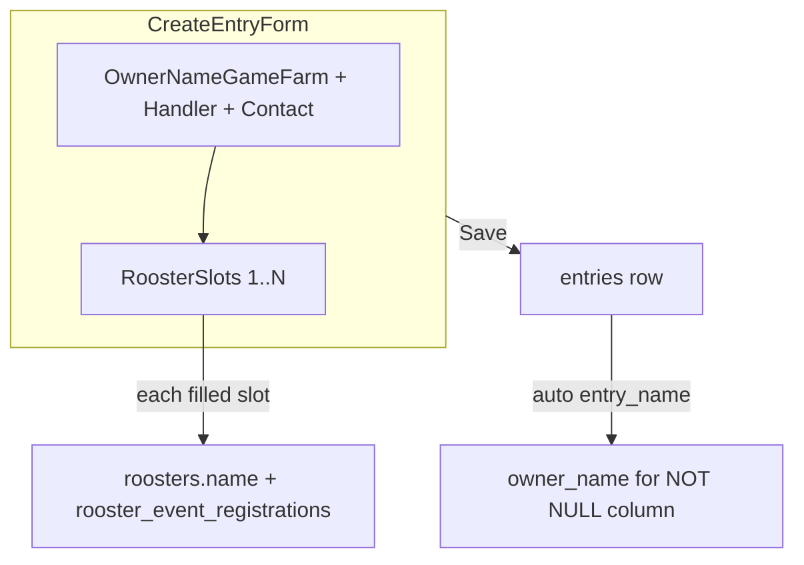

# Rooster Entries: Classic vs Derby Flow Redesign

## Current state

- Create form ([`features/entries/components/entry-form-client.tsx`](features/entries/components/entry-form-client.tsx)) collects **one** rooster regardless of `cocksPerEntry`; `entryName` sits at entry level.
- Derby multi-cock completion today relies on the weighing station ([`features/weighing/components/weighing-station-client.tsx`](features/weighing/components/weighing-station-client.tsx)) or legacy lineups.
- Owner picker ([`features/entries/components/owner-picker-field.tsx`](features/entries/components/owner-picker-field.tsx)) searches `competitors` but has no popup create; `createCompetitor` exists in service only.
- Registry rooster `name` ([`features/roosters/schema.ts`](features/roosters/schema.ts)) is supported in DB but **not** passed from entry/weighing flows ([`features/weighing/service.ts`](features/weighing/service.ts) ~L136).

## Target UX (confirmed)

| Aspect | Classic | Derby |
|--------|---------|-------|
| Game farm / handler | Top section first | Same |
| Rooster slots on create | Exactly **1** (required) | **N** slots from format (`cocksPerEntry`); **min 1** on Save; fill rest on edit |
| "Entry name" | Per-rooster (rooster name) | Per-rooster |
| List "Entry" column | Entry **number** only | Entry **number** only |
| List "Owner" column | Owner Name / Game Farm | Same |
| Address | Hidden | Hidden |

## 1. Schema and validation

**File:** [`features/entries/schema.ts`](features/entries/schema.ts)

- Extract `entryMetadataSchema` (eventId, ownerName, handlerName, contactNumber, email, entrySource, notes, competitorId, saveOwner) — **remove `entryName` from user input** and **drop address from UI validation** (keep optional in DB).
- Add `roosterEntryItemSchema`:
  - `entryName` (required when slot submitted) — rooster display name
  - `bandNumber`, `weight`, policy fields (reuse `entryRoosterPolicyFieldsSchema`)
- Add `createEntrySchema` as metadata + `roosters: roosterEntryItemSchema[]` with superRefine:
  - Classic: `roosters.length === 1`
  - Derby: `1 <= roosters.length <= cocksPerEntry` (action fetches event for limit)
- Add shared **`contactNumberSchema`**: 10 digits, must match `^69\d{8}$` (store full value including `69` prefix). Apply to entry + competitor create schemas.
- Add helper `parseRosterFromFormData(formData, cocksPerEntry)` for indexed fields (`entryName_1`, `bandNumber_1`, … or `roosterCount` hidden field).

**File:** [`features/competitors/schema.ts`](features/competitors/schema.ts) — reuse contact validation on create.

**Vitest:** extend [`features/entries/schema.test.ts`](features/entries/schema.test.ts) for multi-rooster arrays, classic=1 enforcement, contact `69` rule.

## 2. Service layer

**File:** [`features/entries/service.ts`](features/entries/service.ts)

- Replace `createEntryWithRooster` with **`createEntryWithRoosters`**:
  1. `createEntry` with `entry_name: input.ownerName` (auto-mirror game farm for NOT NULL column; list will not display it per your choice).
  2. Loop filled roosters → `createRoosterForEntry`; rollback entry + prior roosters on any failure.
- Add **`addEntryRoosters`** for edit-page new slots (same loop, no new entry row).

**File:** [`features/weighing/schema.ts`](features/weighing/schema.ts) + [`features/weighing/service.ts`](features/weighing/service.ts)

- Add optional `entryName` / `roosterName` to `createRoosterSchema`.
- Pass `name: input.entryName` into `registryRoosterSchema.parse({ name, ageClass, … })` in `createRoosterForEntry`.
- Extend `updateEntryRoosters` to update registry `roosters.name` when entry name changes on edit.

## 3. Server actions

**File:** [`features/entries/actions.ts`](features/entries/actions.ts)

- Update `createEntryAction` to parse rooster array, validate count against event (`getEvent` → `event_type`, `cocks_per_entry`), run policy validation **per rooster**, call `createEntryWithRoosters`.
- Extend `updateEntryAction` (or add `addEntryRoostersAction`) to parse **new** rooster slots from edit form and call `addEntryRoosters`.
- Update owner field error messages to "Owner Name/Game Farm".

**File:** [`features/competitors/actions.ts`](features/competitors/actions.ts)

- Add **`createCompetitorAction`** (Zod → `createCompetitor` service → return `{ competitorId, displayName, contactNumber, email }` for client fill).

## 4. UI components

### Owner / game farm picker

**File:** [`features/entries/components/owner-picker-field.tsx`](features/entries/components/owner-picker-field.tsx)

- Rename label to **"Owner Name/Game Farm"**; update help text and placeholder.
- Add **"Add new"** button opening a Chakra `Dialog` (pattern from [`components/ui/rich-text-editor.tsx`](components/ui/rich-text-editor.tsx)).
- New [`features/entries/components/create-owner-dialog.tsx`](features/entries/components/create-owner-dialog.tsx): fields display name, contact (69 prefix field), email; on success sets combobox value + `competitorId` + fills contact/email via `onOwnerProfileChange`.

### Contact number field

**New:** [`features/entries/components/contact-number-field.tsx`](features/entries/components/contact-number-field.tsx)

- Visual prefix `69` (InputGroup / addon); user enters remaining 8 digits; hidden input submits full 10-digit value.
- Use in create/edit forms and create-owner dialog.

### Rooster slots (create + edit)

**New:** [`features/entries/components/rooster-entry-slots.tsx`](features/entries/components/rooster-entry-slots.tsx)

- Renders `PanelCard` per cock index with:
  - **Entry name** (rooster name, required when slot active)
  - Band number, weight, `RoosterPolicyFields` with `fieldPrefix={cockIndex}`
- **Create mode:** Classic = 1 fixed slot; Derby = N slots, empty slots skipped on submit (only filled slots parsed).
- **Edit mode:** existing roosters editable; render empty slots for missing `cock_number` up to `cocksPerEntry` with "New cock #N" panels.

### Form pages

**[`features/entries/components/entry-form-client.tsx`](features/entries/components/entry-form-client.tsx)**

- Props: add `eventType: 'classic' | 'derby'`.
- Section order: **Owner / handler** (no top-level entry name, no address) → **Roosters** (`RoosterEntrySlots`) → submit.
- Update page description copy per event type.

**[`features/entries/components/entry-edit-client.tsx`](features/entries/components/entry-edit-client.tsx)**

- Same owner/contact changes; remove address.
- Remove top-level entry name field.
- Show rooster entry names in rooster panels; empty slots for incomplete derby entries.
- Props: add `cocksPerEntry`, `eventType`.

**[`features/entries/components/rooster-entries-client.tsx`](features/entries/components/rooster-entries-client.tsx)**

- Entry column: show **`entry_number`** as primary (drop `entry_name` subtitle).
- Owner column: game farm / handler (unchanged source: `owner_name`).
- Add optional **rooster count** subtitle (`2/3 cocks`) — extend [`features/entries/queries.ts`](features/entries/queries.ts) `listEntriesByEvent` with a count subquery or join.

### Route props

- [`app/dashboard/events/[id]/rooster-entries/new/page.tsx`](app/dashboard/events/[id]/rooster-entries/new/page.tsx): pass `eventType={event.event_type}`.
- [`app/dashboard/events/[id]/rooster-entries/[entryId]/edit/page.tsx`](app/dashboard/events/[id]/rooster-entries/[entryId]/edit/page.tsx): pass `cocksPerEntry`, `eventType`.

### Queries

**[`features/entries/queries.ts`](features/entries/queries.ts)**

- `listEntryRoostersForEdit`: join `roosters.name` as `entry_name` / `rooster_name` on `EntryRoosterEditItem`.
- `listEntriesByEvent`: add `rooster_count` and `cocks_per_entry` (from event) for list badge.

## 5. Tests and docs

| Layer | Work |
|-------|------|
| Vitest | Schema + contact validation + create parse helper |
| E2E | Update [`e2e/rooster-entries-weighing-matching.spec.ts`](e2e/rooster-entries-weighing-matching.spec.ts) and [`e2e/rooster-entry-eligibility.spec.ts`](e2e/rooster-entry-eligibility.spec.ts): new labels, move entry name to rooster slot, 69 contact, derby partial multi-cock create + complete on edit |
| User docs | New [`docs/users/docs/rooster-entries.md`](docs/users/docs/rooster-entries.md) + `sidebars.ts` entry (organizer workflow, no CLI) |
| Breakdown | Standard `.cursor/breakdowns/` file on implementation |

## 6. Out of scope (this pass)

- No DB migration (reuse `entries.entry_name` auto-set from owner; rooster names in `roosters.name`).
- No separate `gamefarms` module — owner/game farm continues via `competitors` + denormalized `owner_name`.
- Weighing station "Add rooster" form unchanged unless time permits (optional follow-up: add entry name field there too).

## Key implementation notes

- Reuse existing `fieldPrefix` pattern from [`rooster-policy-fields.tsx`](features/entries/components/rooster-policy-fields.tsx) and edit form's `bandNumber_${roosterId}` pattern — for **create**, use stable indices `1..N`.
- Derby partial save: validate only non-empty slots; reject if zero complete roosters.
- Classic remains `cocks_per_entry = 1` at DB level ([`supabase/migrations/202607121702_event_eligibility_config.sql`](supabase/migrations/202607121702_event_eligibility_config.sql)); UI enforces single slot.
- Run `npm run build` after schema/service changes; run `npm run test:run` for Vitest.
